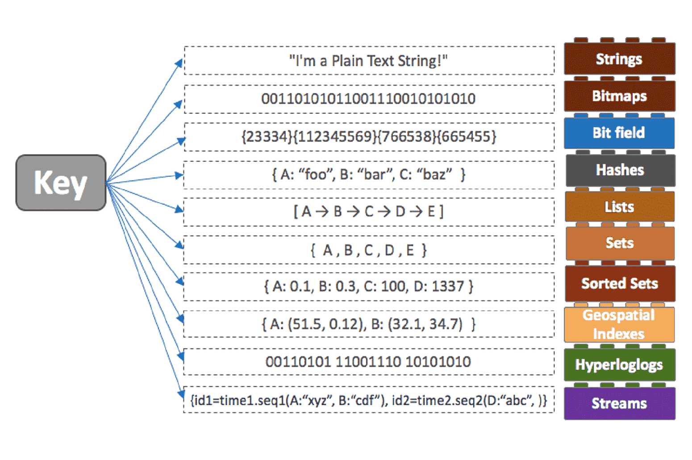
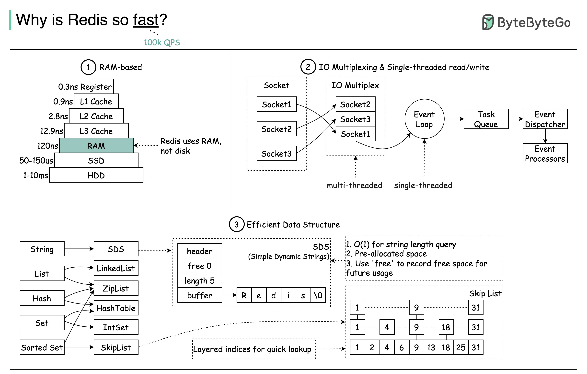
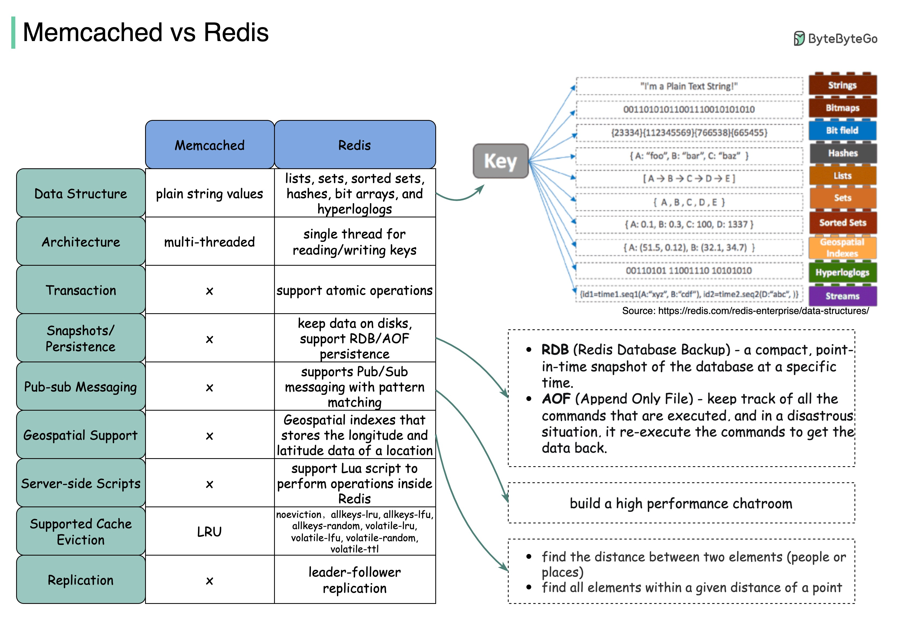

## 基础知识

### Redis 的数据结构

出自 [Redis Data Structures](https://redis.com/redis-enterprise/data-structures/)，原图在[这里](https://redis.com/wp-content/uploads/2020/06/key-value-data-stores-2-v2.png)

### Redis 速度很快

出自 [Why is redis so fast?](https://blog.bytebytego.com/p/why-is-redis-so-fast)，原图在[这里](https://substackcdn.com/image/fetch/f_auto,q_auto:good,fl_progressive:steep/https%3A%2F%2Fbucketeer-e05bbc84-baa3-437e-9518-adb32be77984.s3.amazonaws.com%2Fpublic%2Fimages%2F0b01e080-d346-48d6-aad1-5fad59cd4f56_3573x2280.jpeg)

### 选择 Redis 的理由

出自 [Redis vs Memcached](https://blog.bytebytego.com/p/redis-vs-memcached)，原图在[这里](https://substackcdn.com/image/fetch/f_auto,q_auto:good,fl_progressive:steep/https%3A%2F%2Fbucketeer-e05bbc84-baa3-437e-9518-adb32be77984.s3.amazonaws.com%2Fpublic%2Fimages%2F7591f8fc-5855-4821-90dc-ede7deb7339a_3342x2310.jpeg)
