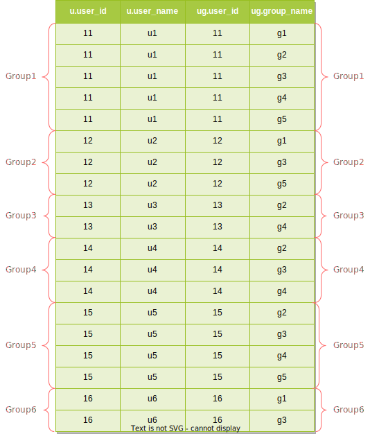
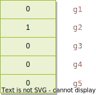
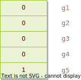
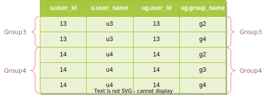

# SQL 使用场景（一）

## 场景描述

假设有用户 u1、u2、u3、u4、u5、u6、u7，他们可以根据自己的喜好加入小组 g1、g2、g3、g4、g5，现在要找出加入了 g2 但是没有加入 g5 的用户。

## 理论分析

假设用户 u1、u3、u4、u5 加入了小组 g2，用户 u1、u2、u5 加入了小组 g5。把加入了 g2 的用户记为集合 A，则 A = (u1, u3, u4, u5)，把加入了 g5 的用户记为集合 B，则 B = (u1, u2, u5)。上面的场景就可以表示为求集合 A 和集合 B 的差集，即 C = A - B。


从图示可知 C = (u3, u4)。

## 场景建模

为了使用 SQL 对数据进行查询和分析建立用户表 `t_user` 和用户加入的小组表 `t_user_group` 并填充一些数据

```sql
-- 用户表
CREATE TABLE t_user (
  user_id int DEFAULT NULL,
  user_name varchar(255) DEFAULT NULL
);

-- 用户加入的小组表
CREATE TABLE t_user_group (
  user_id int DEFAULT NULL,
  group_name varchar(255) DEFAULT NULL
);

-- 用户数据
INSERT INTO t_user (user_id, user_name) VALUES (11, 'u1');
INSERT INTO t_user (user_id, user_name) VALUES (12, 'u2');
INSERT INTO t_user (user_id, user_name) VALUES (13, 'u3');
INSERT INTO t_user (user_id, user_name) VALUES (14, 'u4');
INSERT INTO t_user (user_id, user_name) VALUES (15, 'u5');
INSERT INTO t_user (user_id, user_name) VALUES (16, 'u6');

-- 用户 u1 加入的小组
INSERT INTO t_user_group (user_id, group_name) VALUES (11, 'g1');
INSERT INTO t_user_group (user_id, group_name) VALUES (11, 'g2');
INSERT INTO t_user_group (user_id, group_name) VALUES (11, 'g3');
INSERT INTO t_user_group (user_id, group_name) VALUES (11, 'g4');
INSERT INTO t_user_group (user_id, group_name) VALUES (11, 'g5');

-- 用户 u2 加入的小组
INSERT INTO t_user_group (user_id, group_name) VALUES (12, 'g1');
INSERT INTO t_user_group (user_id, group_name) VALUES (12, 'g3');
INSERT INTO t_user_group (user_id, group_name) VALUES (12, 'g5');

-- 用户 u3 加入的小组
INSERT INTO t_user_group (user_id, group_name) VALUES (13, 'g2');
INSERT INTO t_user_group (user_id, group_name) VALUES (13, 'g4');

-- 用户 u4 加入的小组
INSERT INTO t_user_group (user_id, group_name) VALUES (14, 'g2');
INSERT INTO t_user_group (user_id, group_name) VALUES (14, 'g3');
INSERT INTO t_user_group (user_id, group_name) VALUES (14, 'g4');

-- 用户 u5 加入的小组
INSERT INTO t_user_group (user_id, group_name) VALUES (15, 'g2');
INSERT INTO t_user_group (user_id, group_name) VALUES (15, 'g3');
INSERT INTO t_user_group (user_id, group_name) VALUES (15, 'g4');
INSERT INTO t_user_group (user_id, group_name) VALUES (15, 'g5');

-- 用户 u6 加入的小组
INSERT INTO t_user_group (user_id, group_name) VALUES (16, 'g1');
INSERT INTO t_user_group (user_id, group_name) VALUES (16, 'g3');

-- 用户 u7 没有加入任何小组
```

## 模型分析

根据理论分析我们可以通过如下的步骤找出参加了 g2 但是没有参加 g5 的用户

1. 找出参加了 g2 小组的用户，得到集合 A = (11, 13, 14, 15)；
2. 找出参加了 g5 小组的用户，得到集合 B = (11, 12, 15)；
3. 用集合 A 减去集合 B 就是参加了 g2 小组但是没有参加 g5 小组的用户，即 C = A - B = (13, 14)。

第 3 步做的事情其实是求两个集合的差集，在 SQL 语言中使用 `EXCEPT` 语法来表达这一操作，那么把上面的过程翻译成 SQL 语句就是

```sql
(SELECT user_id FROM t_user_group WHERE group_name = 'g2') -- 第 1 步
EXCEPT                                                     -- 第 3 步
(SELECT user_id FROM t_user_group WHERE group_name = 'g5') -- 第 2 步
```

然后再用得到 `user_id` 去 `t_user` 表里把具体的用户信息查询出来

```sql
SELECT *
FROM t_user
WHERE user_id IN (
  (SELECT user_id FROM t_user_group WHERE group_name = 'g2')
  EXCEPT
  (SELECT user_id FROM t_user_group WHERE group_name = 'g5')
)
```

执行上面的 SQL 将得到如下的结果

```text
+---------+-----------+
| user_id | user_name |
+---------+-----------+
|      13 | u3        |
|      14 | u4        |
+---------+-----------+
```

## 其他写法

有的数据库不支持 `EXCEPT` 语法，比如 MySQL，此时就要探索其他写法。

### 写法一：`IN` 和 `NOT IN`

```sql
SELECT *
FROM t_user
WHERE user_id IN (
  SELECT user_id FROM t_user_group WHERE group_name = 'g2' -- #1
) 
AND user_id NOT IN (
  SELECT user_id FROM t_user_group WHERE group_name = 'g5' -- #2
)
```

这是比较直观的一种写法，#1 这个子查询筛选出参加了 g2 小组的用户，#2 这个子查询筛选出参加了 g5 小组的用户。`... IN (...) AND ... NOT IN (...)` 表示在第一个集合但是不在第二个集合的用户。

### 写法二：`EXISTS` 和 `NOT EXISTS`

```sql
SELECT *
FROM t_user u
WHERE EXISTS (
  SELECT 1 FROM t_user_group ug WHERE u.user_id = ug.user_id AND ug.group_name = 'g2'
)
AND NOT EXISTS (
  SELECT 1 FROM t_user_group ug WHERE u.user_id = ug.user_id AND ug.group_name = 'g5'
)
```

这种写法的关键在 `u.user_id = ug.user_id`，它让主查询和子查询行程了*相关子查询*，前面的写法一可以看作是*不相关只查询*。这句 SQL 可以这么理解取 `t_user` 表的一条记录判断它是否加入了 g2 同时没有加入 g5，如果是就把它加入结果集中，如果不是就舍弃，当所有记录都判断完成时就得到了最终的结果。下面逐个用户的分析

* u1 加入了 g2 也加入了 g5，不满足条件；
* u2 没有加入 g2，加入了 g5，不满足条件；
* u3 加入了 g2，没有加入 g5，满足条件；
* u4 加入了 g2，没有加入 g5，满足条件；
* u5 加入了 g2 也加入了 g5，不满足条件；
* u6 没有加入 g2 也没有加入 g5 不满足条件；

最终的结果也是 u3 和 u4。

### 写法三：`INNER JOIN` 和 `LEFT JOIN`

```sql
SELECT u.*
FROM t_user u
INNER JOIN t_user_group ug1 ON u.user_id = ug1.user_id AND ug1.group_name = 'g2'
LEFT JOIN t_user_group ug2 ON u.user_id = ug2.user_id AND ug2.group_name = 'g5'
WHERE ug2.user_id IS NULL
```

`INNER JOIN` 找出了加入 g2 的用户，`LEFT JOIN` 和 `WHERE` 排除了加入了 g5 的用户。下面演示如何一步步地构建上面的查询，在得到最终的结果前在 `SELECT` 子句中显示每一个表的字段。

```sql
SELECT u.*, ug1.*
FROM t_user u
INNER JOIN t_user_group ug1 ON u.user_id = ug1.user_id AND ug1.group_name = 'g2'
```

执行这句 SQL 得到如下的结果

```text
+-----------+-------------+-------------+----------------+
| u.user_id | u.user_name | ug1.user_id | ug2.group_name |
+-----------+-------------+-------------+----------------+
|        11 | u1          |          11 | g2             |
|        13 | u3          |          13 | g2             |
|        14 | u4          |          14 | g2             |
|        15 | u5          |          15 | g2             |
+-----------+-------------+-------------+----------------+
```

这里得到了 `t_user u` 表和 `t_user_group ug1` 表满足条件 `u.user_id = ug1.user_id AND ug1.group_name = 'g2'` 的交集，即参加了 g2 小组的用户。为了方便后续表述，把这一结果临时表，记为 `temp1`。

```sql
SELECT u.*, ug1.*, ug2.*
FROM t_user u
INNER JOIN t_user_group ug1 ON u.user_id = ug1.user_id AND ug1.group_name = 'g2'
LEFT JOIN t_user_group ug2 ON u.user_id = ug2.user_id AND ug2.group_name = 'g5'
```

执行这句 SQL 得到如下的结果

```text
+-----------+-------------+-------------+----------------+-------------+----------------+
| u.user_id | u.user_name | ug1.user_id | ug1.group_name | ug2.user_id | ug2.group_name |
+-----------+-------------+-------------+----------------+-------------+----------------+
|        11 | u1          |          11 | g2             |          11 | g5             |
|        13 | u3          |          13 | g2             |        NULL | NULL           |
|        14 | u4          |          14 | g2             |        NULL | NULL           |
|        15 | u5          |          15 | g2             |          15 | g5             |
+-----------+-------------+-------------+----------------+-------------+----------------+
```

这里得到了以临时表 `temp1` 为左表，`t_user_group ug2` 为右表进行左连接的结果，右表不满足连结条件 `u.user_id = ug2.user_id AND ug2.group_name = 'g5'` 时所在行列用 `NULL` 表示，这其实是在解释 `LEFT JOIN` 的语义。连接条件表示的是参加了 g5 的用户，如果用户参加了 g5，那么所在行列将有值；反过来如果所在行列为 `NULL`，那么用户没有参加 g5。现在只需要过滤出 `ug2` 中值为 `NULL` 的行即可，这就是下面这句 SQL 将表达的结果

```sql
SELECT u.*, ug1.*, ug2.*
FROM t_user u
INNER JOIN t_user_group ug1 ON u.user_id = ug1.user_id AND ug1.group_name = 'g2'
LEFT JOIN t_user_group ug2 ON u.user_id = ug2.user_id AND ug2.group_name = 'g5'
WHERE ug2.user_id IS NULL
```

这条语句的执行结果如下

```text
+-----------+-------------+-------------+----------------+-------------+----------------+
| u.user_id | u.user_name | ug1.user_id | ug1.group_name | ug2.user_id | ug2.group_name |
+-----------+-------------+-------------+----------------+-------------+----------------+
|        13 | u3          |          13 | g2             |        NULL | NULL           |
|        14 | u4          |          14 | g2             |        NULL | NULL           |
+-----------+-------------+-------------+----------------+-------------+----------------+
```

最后只需要取出 `t_user u` 表中列即可

```sql
SELECT u.*
FROM t_user u
INNER JOIN t_user_group ug1 ON u.user_id = ug1.user_id AND ug1.group_name = 'g2'
LEFT JOIN t_user_group ug2 ON u.user_id = ug2.user_id AND ug2.group_name = 'g5'
WHERE ug2.user_id IS NULL
```

这条语句的执行结果如下

```text
+-----------+-------------+
| u.user_id | u.user_name |
+-----------+-------------+
|        13 | u3          |
|        14 | u4          |
+-----------+-------------+
```

下面用子查询把上面描述的步骤实现一下，以便于更清楚的理解

```sql
SELECT temp2.u_user_id, temp2.u_user_name FROM (
    SELECT temp1.*, ug2.user_id ug2_user_id, ug2.group_name ug2_group_name FROM (
        SELECT u.user_id u_user_id, u.user_name u_user_name, ug1.user_id ug1_user_id, ug1.group_name ug1_group_name
        FROM t_user u
        INNER JOIN t_user_group ug1 ON u.user_id = ug1.user_id AND ug1.group_name = 'g2'
    ) temp1
    LEFT JOIN t_user_group ug2 ON temp1.u_user_id = ug2.user_id AND ug2.group_name = 'g5'
) temp2
WHERE temp2.ug2_user_id IS NULL
```

用 `WITH ... AS ...` 公共表表达式可能表达得更清楚一些

```sql
WITH temp2 AS (
    WITH temp1 AS (
        SELECT u.user_id, u.user_name
        FROM t_user u
        INNER JOIN t_user_group ug1 ON u.user_id = ug1.user_id AND ug1.group_name = 'g2'
    )
    SELECT temp1.user_id, temp1.user_name, ug2.user_id ug2_user_id
    FROM temp1
    LEFT JOIN t_user_group ug2 ON temp1.user_id = ug2.user_id AND ug2.group_name = 'g5'
)
SELECT temp2.user_id, temp2.user_name
FROM temp2
WHERE temp2.ug2_user_id IS NULL
```

### 写法四：`LEFT JOIN` 和 `LEFT JOIN`

```sql
SELECT u.*
FROM t_user u
LEFT JOIN t_user_group ug1 ON u.user_id = ug1.user_id AND ug1.group_name = 'g2'
LEFT JOIN t_user_group ug2 ON u.user_id = ug2.user_id AND ug2.group_name = 'g5'
WHERE ug1.user_id IS NOT NULL AND ug2.user_id IS NULL
```

这种写法和写法三是类似的，只是用 `INNER JOIN` 替换为了 `LEFT JOIN`。第一个 `LEFT JOIN` 配合 `ug1.user_id IS NOT NULL` 就是参加 g2 的用户，第二个 `LEFT JOIN` 配合 `ug2.user_id IS NULL` 就是排除参加了 g5 的用户。

### 写法五：`JOIN`、`GROUP BY`、`HAVING` 和 `CASE WHEN`

```sql
SELECT u.*
FROM t_user u
JOIN t_user_group ug ON u.user_id = ug.user_id
GROUP BY u.user_id, u.user_name
HAVING SUM(CASE WHEN ug.group_name = 'g2' THEN 1 ELSE 0 END) > 0
   AND SUM(CASE WHEN ug.group_name = 'g5' THEN 1 ELSE 0 END) = 0
```

这种写法还是有点意思的，值得好好看一看。首先来看 `JOIN` 部分

```sql
SELECT u.*, ug.*
FROM t_user u
JOIN t_user_group ug ON u.user_id = ug.user_id
```

为了更好的看到效果，在这条 SQL 的 `SELECT` 子句部分把 `ug` 表的字段也加上了。`JOIN` 和 `INNER JOIN` 表达的语义是一样的，注意和写法二的差别，这里比写法二少了 `ug1.group_name = 'g2'` 部分。执行这条语句将得到如下的结果

```text
+-----------+-------------+------------+---------------+
| u.user_id | u.user_name | ug.user_id | ug.group_name |
+-----------+-------------+------------+---------------+
|        11 | u1          |         11 | g1            |
|        11 | u1          |         11 | g2            |
|        11 | u1          |         11 | g3            |
|        11 | u1          |         11 | g4            |
|        11 | u1          |         11 | g5            |
|        12 | u2          |         12 | g1            |
|        12 | u2          |         12 | g3            |
|        12 | u2          |         12 | g5            |
|        13 | u3          |         13 | g2            |
|        13 | u3          |         13 | g4            |
|        14 | u4          |         14 | g2            |
|        14 | u4          |         14 | g3            |
|        14 | u4          |         14 | g4            |
|        15 | u5          |         15 | g2            |
|        15 | u5          |         15 | g3            |
|        15 | u5          |         15 | g4            |
|        15 | u5          |         15 | g5            |
|        16 | u6          |         16 | g1            |
|        16 | u6          |         16 | g3            |
+-----------+-------------+------------+---------------+
```

`GROUP BY u.user_id, u.user_name` 子句将按照 `user_id` 和 `user_name` 对上面的表格分组，一般只会根据 `user_id` 进行分组，在这里同时根据两个字段进行分组也没有什么问题，把两个字段值相同的行归为一个组



`HAVING` 的语义很像 `WHERE`，它用于从分组中删除某些记录，保留另一些记录。`CASE WHEN ug.group_name = 'g2' THEN 1 ELSE 0 END` 依次判断每个分组里 `ug.group_name` 的值是否为 g2，如果是则结果为 1， 否则为 0。以上图中的 Group1 为例，在 Group1 中应用前述表达式后的结果为



`SUM` 把这一列值加起来，`> 0` 表示这个分组的用户参加了 g2 小组。

`CASE WHEN ug.group_name = 'g5' THEN 1 ELSE 0 END` 在 Group1 的结果如下



`SUM` 把这一列值加起来，`= 0` 表示这个分组的用户没有参加 g5 小组。

`AND` 就是要同时满足这两个 `SUM` 表达式，因此

```sql
HAVING SUM(CASE WHEN ug.group_name = 'g2' THEN 1 ELSE 0 END) > 0
   AND SUM(CASE WHEN ug.group_name = 'g5' THEN 1 ELSE 0 END) = 0
```

就是只保留参加了 g2 同时没有参加 g5 的分组，可以看到满足条件的只有 Group3 和 Group 4。



`SELECT` 从每个分组中选择一行记录，不一定都是第一行，一种可能的选择结果是

```text
+-----------+-------------+------------+---------------+
| u.user_id | u.user_name | ug.user_id | ug.group_name |
+-----------+-------------+------------+---------------+
|        13 | u3          |         13 | g2            |
|        14 | u4          |         14 | g3            |
+-----------+-------------+------------+---------------+
```

`u.*` 提取 `t_user` 表的字段的值，最终得到了

```text
+-----------+-------------+
| u.user_id | u.user_name |
+-----------+-------------+
|        13 | u3          |
|        14 | u4          |
+-----------+-------------+
```

### 写法六：`IN` 和 `EXCEPT`

```sql
SELECT user_id, user_name
FROM t_user
WHERE user_id IN (
  SELECT user_id
  FROM t_user_group
  WHERE group_name = 'g2'
)
EXCEPT
SELECT user_id, user_name
FROM t_user
WHERE user_id IN (
  SELECT user_id
  FROM t_user_group
  WHERE group_name = 'g5'
)
```

MySQL 不支持 `EXCEPT` 语法，PostgreSQL 支持该语法。是模型分析中写法的一种变形。

### 写法七：`INNER JOIN` 和 `NOT EXISTS`

```sql
SELECT u.*
FROM t_user u
INNER JOIN t_user_group ug1 ON u.user_id = ug1.user_id AND ug1.group_name = 'g2'
WHERE NOT EXISTS (
  SELECT 1
  FROM t_user_group ug2
  WHERE ug2.user_id = u.user_id AND ug2.group_name = 'g5'
)
```

`INNER JOIN` 在写法三中已有说明，即找出参加了 g2 的用户。`NOT EXISTS` 判断找出的每一个用户是否参加了 g5，只有当用户没有参加 g5 时才把该用户保留在结果集中。

### 写法八：`INNER JOIN`、`GROUP BY`、`HAVING`、`MAX` 和 `CASE WHEN`

```sql
SELECT u.*
FROM t_user u
INNER JOIN t_user_group ug ON u.user_id = ug.user_id
GROUP BY u.user_id, u.user_name
HAVING MAX(CASE WHEN ug.group_name = 'g2' THEN 1 ELSE 0 END) = 1
   AND MAX(CASE WHEN ug.group_name = 'g5' THEN 1 ELSE 0 END) = 0;
```

和写法五类似，只是把 `SUM` 换成了 `MAX`，`MAX(...) = 1` 只有在用户参加了 g2 时才为真，`MAX(...) = 0` 只有在用户没有参加了 g5 时才为真。

### 写法九：`LEFT JOIN`、`GROUP BY`、`HAVING` 和 `COUNT`

```sql
SELECT u.*
FROM t_user u
LEFT JOIN t_user_group ug1 ON u.user_id = ug1.user_id AND ug1.group_name = 'g2'
LEFT JOIN t_user_group ug2 ON u.user_id = ug2.user_id AND ug2.group_name = 'g5'
GROUP BY u.user_id, u.user_name
HAVING COUNT(ug1.user_id) > 0 AND COUNT(ug2.user_id) = 0
```

可以参考写法五进行类事分析，只需注意 `COUNT(...)` 和 `SUM(CASE WHEN ... THEN ... ELSE ... END)` 的等价性。

### 写法十：`LEFT JOIN` 和 `NOT EXISTS`

```sql
SELECT u.*
FROM t_user u
LEFT JOIN t_user_group ug1 ON u.user_id = ug1.user_id AND ug1.group_name = 'g2'
WHERE NOT EXISTS (
  SELECT 1
  FROM t_user_group ug2
  WHERE u.user_id = ug2.user_id AND ug2.group_name = 'g5'
) AND ug1.user_id IS NOT NULL
```

和写法七类似，`INNER JOIN` 换成了 `LEFT JOIN`，只是需要 `ug1.user_id IS NOT NULL` 来找出参加了 g2 的用户。

### 写法十一：`IN`、`NOT IN` 和 `INTERSECT`

```sql
SELECT user_id, user_name
FROM t_user
WHERE user_id IN (
  SELECT user_id FROM t_user_group WHERE group_name = 'g2'
)
INTERSECT
SELECT user_id, user_name
FROM t_user
WHERE user_id NOT IN (
  SELECT user_id FROM t_user_group WHERE group_name = 'g5'
)
```

和写法一类似，而且这种写法比写法一更直观，不同的是写法一是对 `user_id` 求交集，这种写法直接对 `t_user` 求交集。MySQL 不支持 `INTERSECT` 语法，PostgreSQL 支持该语法。

## 致谢

有很多写法是直接由 ChatGPT 写的。
