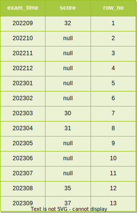
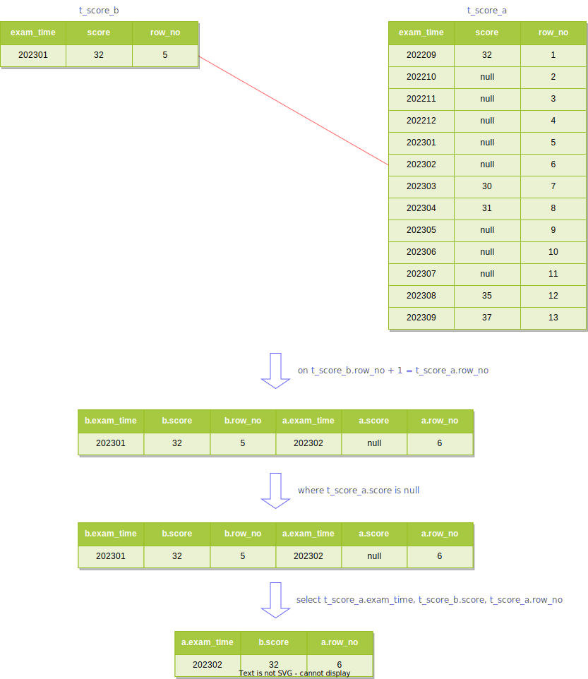

## 场景描述

根据上一行填充本行的空白栏位<sup>[1]</sup>。这是在参考资料中提出的一个问题，它给出了在 SQL Server 数据库中的解决方案，现在要在 PostgreSQL 中来模拟并解决它。

假设在 PostgreSQL 12.10 的库中有一个用户的考试成绩表

```sql
create table t_score (
    user_id integer,   -- 用户 ID
    user_name varchar, -- 用户姓名
    exam_time integer, -- 考试时间，yyyyMM 格式
    score integer      -- 分数
);
```

在成绩表中有如下的一些测试数据

```sql
-- 用户 11 的考试成绩
insert into t_score(user_id, user_name, exam_time, score) values(11, 'u1', 202209, 32);
insert into t_score(user_id, user_name, exam_time, score) values(11, 'u1', 202303, 30);
insert into t_score(user_id, user_name, exam_time, score) values(11, 'u1', 202304, 31);
insert into t_score(user_id, user_name, exam_time, score) values(11, 'u1', 202308, 35);
insert into t_score(user_id, user_name, exam_time, score) values(11, 'u1', 202309, 37);

-- 用户 12 的考试成绩
insert into t_score(user_id, user_name, exam_time, score) values(12, 'u2', 202304, 51);
insert into t_score(user_id, user_name, exam_time, score) values(12, 'u2', 202308, 65);
insert into t_score(user_id, user_name, exam_time, score) values(12, 'u2', 202309, 77);
```

我们期望写一句 SQL 查询出用户 11 的成绩，在没有考试的月份的成绩为最近一次有考试的月份的成绩，下面是我们期望的结果


在结果中有成绩的月份都用红色进行了标记，其他没有考试的月份的成绩为最近一次有考试成绩的月份的成绩。比如在 202210 月没有考试，则该月的成绩为 202209 月的成绩，一直到 202302 月。又比如 202305 月没有考试，则该月的成绩为 202304 月的成绩。

## 场景分析

```sql
-- 递归是针对名称为 t_score_b 的 CTE
with recursive t_score_a as (
    -- 构建月份与成绩的关系，并为每一行分配一个连续的行号
    select a.exam_time, b.score, row_number() over (order by a.exam_time) as row_no
    from (
        -- 构建连续的月份
        select to_char(
            generate_series(
                (select min(to_date(exam_time::text, 'YYYYMM')) from t_score where user_id = 11)::date,
                (select max(to_date(exam_time::text, 'YYYYMM')) from t_score where user_id = 11)::date,
                '1 month'::interval
            )::date,
            'YYYYMM'
        )::integer as exam_time
    ) as a left join t_score as b on a.exam_time = b.exam_time and b.user_id = 11
), t_score_b as (
    -- 非递归项，查询出成绩不为空的行
    select exam_time, score, row_no from t_score_a where score is not null
    union all
    -- 递归项，注意 select 子句中各个字段的取值来源
    select t_score_a.exam_time, t_score_b.score, t_score_a.row_no
    -- 这里的 t_score_b 是递归自引用
    from t_score_b inner join t_score_a
        -- 递归的链接条件
        on t_score_b.row_no + 1 = t_score_a.row_no
    -- 只处理 t_score_a 中成绩为空的行
    where t_score_a.score is null
)
select exam_time, score
from t_score_b
order by exam_time;
```

### 分配行号

`t_score_a` 虽然有 `recursive` 修饰，但它是一个普通的 CTE，它的结果如下



### 非递归项

`t_score_b` 是递归的 CTE，它的非递归项的执行结果为


### 第一次递归

`union all` 保留所有结果行，非递归项的结果作为 `t_score_b` 的结果集的一部分，并且将结果放到一个临时的工作表<sup>[2]</sup>中，此时工作表不为空，开始计算递归项，用工作表的内容替换递归自引用的 `t_score_b`，此时递归项的处理过程大致如下图


将第一次递归的结果加入 `t_score_b` 的结果集中得到如下的结果集


这个结果集就是第一次递归（迭代）后 `t_score_b` 的结果集。

### 第二次递归

将第一次递归的结果放到一个临时的中间表中，用中间表的内容替换工作表的内容，然后清空中间表，开始进行第二次递归。此时工作表不为空计算递归项


将第二次递归的结果加入 `t_score_b` 的结果集中得到如下的结果集


这个结果集就是第二次递归（迭代）后 `t_score_b` 的结果集。

### 第三次递归

将第二次递归的结果放到一个临时的中间表中，用中间表的内容替换工作表的内容，然后清空中间表，开始进行第三次递归。此时工作表不为空计算递归项


将第三次递归的结果加入 `t_score_b` 的结果集中得到如下的结果集


这个结果集就是第三次递归（迭代）后 `t_score_b` 的结果集。

### 第四次递归

将第三次递归的结果放到一个临时的中间表中，用中间表的内容替换工作表的内容，然后清空中间表，开始进行第四次递归。此时工作表不为空计算递归项


将第四次递归的结果加入 `t_score_b` 的结果集中得到如下的结果集


这个结果集就是第四次递归（迭代）后 `t_score_b` 的结果集。

### 第五次递归

将第四次递归的结果放到一个临时的中间表中，用中间表的内容替换工作表的内容，然后清空中间表，开始进行第五次递归。此时工作表不为空计算递归项



将第五次递归的结果加入 `t_score_b` 的结果集中得到如下的结果集


这个结果集就是第五次递归（迭代）后 `t_score_b` 的结果集。

### 第六次递归

将第五次递归的结果放到一个临时的中间表中，用中间表的内容替换工作表的内容，然后清空中间表，开始进行第六次递归。此时工作表不为空计算递归项


第六次递归的结果是一个空结果，为了保持完整性仍然把它们加入 `t_score_b` 的结果集中得到如下的结果集



这个结果集就是第六次递归（迭代）后 `t_score_b` 的结果集，可以看到和第五次递归后的结果集是一样的。

### 结束递归

将第六次递归的结果（空结果）放到一个临时的中间表中，用这个中间表的内容替换工作表的内容，然后清空中间表，此时工作表为空结束递归。

### 查询结果

`order by exam_time` 将第六次（第五次）的结果按考试时间排序，`select exam_time, score` 排除人为添加的 `row_no` 列即最终结果。

## 参考资料

1. [根据上一行填充本行的空白栏位，SQL处理方式](https://www.cnblogs.com/studyzy/p/4244606.html)
2. [7.8. WITH查询（公共表表达式）](http://www.postgres.cn/docs/12/queries-with.html)
3. [9.21. 窗口函数](http://www.postgres.cn/docs/12/functions-window.html)
