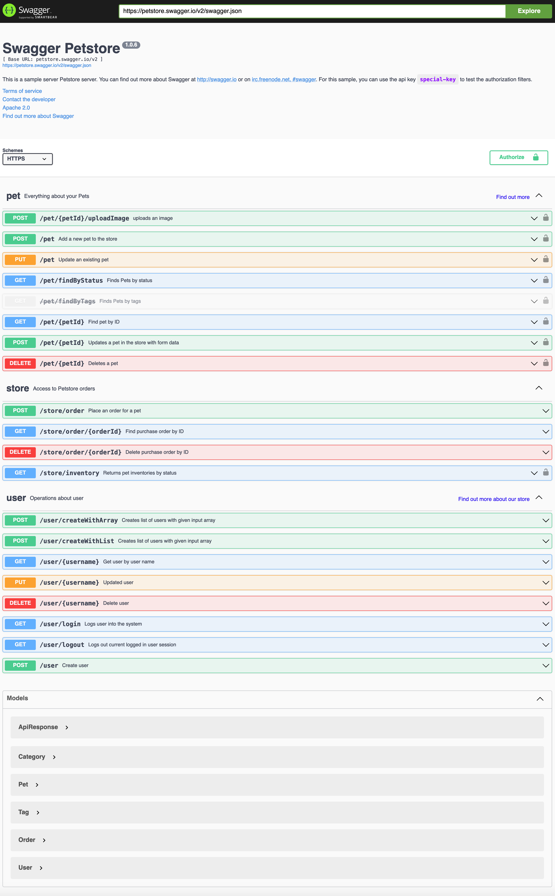

## 问题描述

在日常开发过程中通常会使用如下的类来约定接口返回结果的结构

```java
public class Result<T> implements Serializable {
    private static final long serialVersionUID = 1L;

    private Integer code;

    private String message;

    private T data;
}
```

此时在 `Controller` 中的方法会写成如下的结构

```java
@GetMapping("/{userId}")
public Result<User> get(@PathVariable(name = "userId") Long userId) {
    User user = ....
    return Result.<User>builder().data(user).build();
}
```

在每一个接口方法上都写这样的样板代码还是很繁琐的，此时可以通过 `ResponseBodyAdvice` 来简化这种样板代码

```java
@RestControllerAdvice
public class ResultResponseBodyAdvice implements ResponseBodyAdvice<Object> {
    // ...
}
```

现在前面的接口就可以写成下面个方式

```java
@GetMapping("/{userId}")
public User get(@PathVariable(name = "userId") Long userId) {
    User user = ....
    return user;
}
```

这样的代码直观易懂，屏蔽了 `Result` 这样的技术细节，改变它的结构或者替换为其他实现均不需要修改接口代码。

为了向调用方提供接口文档通常会使用 [SpringDoc](https://springdoc.org/) 这样的组件，在没有使用 `ResponseBodyAdvice` 时整合 SpringDoc 是没有问题的，如果使用了则会出现如下的问题，从而导致接口文档不可用



我们可以设置 `springdoc.swagger-ui.disable-swagger-default-url=true` 来屏蔽 Petstore 的文档，这样设置后页面上将什么都不会显示除了 `No API definition provided.` 这样的提示信息。尝试在页面顶部输入 `/v3/api-docs` 以替换默认的 petstore 的链接


此时后台也打印出了类转换异常的错误日志

```text
java.lang.ClassCastException: me.acomma.example.common.Result cannot be cast to [B
	at org.springframework.http.converter.ByteArrayHttpMessageConverter.getContentLength(ByteArrayHttpMessageConverter.java:39) ~[spring-web-5.3.1.jar:5.3.1]
	at org.springframework.http.converter.AbstractHttpMessageConverter.addDefaultHeaders(AbstractHttpMessageConverter.java:260) ~[spring-web-5.3.1.jar:5.3.1]
	at org.springframework.http.converter.AbstractHttpMessageConverter.write(AbstractHttpMessageConverter.java:211) ~[spring-web-5.3.1.jar:5.3.1]
	at org.springframework.web.servlet.mvc.method.annotation.AbstractMessageConverterMethodProcessor.writeWithMessageConverters(AbstractMessageConverterMethodProcessor.java:280) ~[spring-webmvc-5.3.1.jar:5.3.1]
	at org.springframework.web.servlet.mvc.method.annotation.RequestResponseBodyMethodProcessor.handleReturnValue(RequestResponseBodyMethodProcessor.java:181) ~[spring-webmvc-5.3.1.jar:5.3.1]
	at org.springframework.web.method.support.HandlerMethodReturnValueHandlerComposite.handleReturnValue(HandlerMethodReturnValueHandlerComposite.java:78) ~[spring-web-5.3.1.jar:5.3.1]
	at org.springframework.web.servlet.mvc.method.annotation.ServletInvocableHandlerMethod.invokeAndHandle(ServletInvocableHandlerMethod.java:124) ~[spring-webmvc-5.3.1.jar:5.3.1]
	at org.springframework.web.servlet.mvc.method.annotation.RequestMappingHandlerAdapter.invokeHandlerMethod(RequestMappingHandlerAdapter.java:893) ~[spring-webmvc-5.3.1.jar:5.3.1]
	at org.springframework.web.servlet.mvc.method.annotation.RequestMappingHandlerAdapter.handleInternal(RequestMappingHandlerAdapter.java:807) ~[spring-webmvc-5.3.1.jar:5.3.1]
	at org.springframework.web.servlet.mvc.method.AbstractHandlerMethodAdapter.handle(AbstractHandlerMethodAdapter.java:87) ~[spring-webmvc-5.3.1.jar:5.3.1]
	at org.springframework.web.servlet.DispatcherServlet.doDispatch(DispatcherServlet.java:1061) ~[spring-webmvc-5.3.1.jar:5.3.1]
	at org.springframework.web.servlet.DispatcherServlet.doService(DispatcherServlet.java:961) ~[spring-webmvc-5.3.1.jar:5.3.1]
	at org.springframework.web.servlet.FrameworkServlet.processRequest(FrameworkServlet.java:1006) ~[spring-webmvc-5.3.1.jar:5.3.1]
	at org.springframework.web.servlet.FrameworkServlet.doGet(FrameworkServlet.java:898) ~[spring-webmvc-5.3.1.jar:5.3.1]
	at javax.servlet.http.HttpServlet.service(HttpServlet.java:626) ~[tomcat-embed-core-9.0.39.jar:4.0.FR]
	at org.springframework.web.servlet.FrameworkServlet.service(FrameworkServlet.java:883) ~[spring-webmvc-5.3.1.jar:5.3.1]
	at javax.servlet.http.HttpServlet.service(HttpServlet.java:733) ~[tomcat-embed-core-9.0.39.jar:4.0.FR]
	at org.apache.catalina.core.ApplicationFilterChain.internalDoFilter(ApplicationFilterChain.java:231) ~[tomcat-embed-core-9.0.39.jar:9.0.39]
	at org.apache.catalina.core.ApplicationFilterChain.doFilter(ApplicationFilterChain.java:166) ~[tomcat-embed-core-9.0.39.jar:9.0.39]
	at org.apache.tomcat.websocket.server.WsFilter.doFilter(WsFilter.java:53) ~[tomcat-embed-websocket-9.0.39.jar:9.0.39]
	at org.apache.catalina.core.ApplicationFilterChain.internalDoFilter(ApplicationFilterChain.java:193) ~[tomcat-embed-core-9.0.39.jar:9.0.39]
	at org.apache.catalina.core.ApplicationFilterChain.doFilter(ApplicationFilterChain.java:166) ~[tomcat-embed-core-9.0.39.jar:9.0.39]
	at org.springframework.web.filter.RequestContextFilter.doFilterInternal(RequestContextFilter.java:100) ~[spring-web-5.3.1.jar:5.3.1]
	at org.springframework.web.filter.OncePerRequestFilter.doFilter(OncePerRequestFilter.java:119) ~[spring-web-5.3.1.jar:5.3.1]
	at org.apache.catalina.core.ApplicationFilterChain.internalDoFilter(ApplicationFilterChain.java:193) ~[tomcat-embed-core-9.0.39.jar:9.0.39]
	at org.apache.catalina.core.ApplicationFilterChain.doFilter(ApplicationFilterChain.java:166) ~[tomcat-embed-core-9.0.39.jar:9.0.39]
	at org.springframework.web.filter.FormContentFilter.doFilterInternal(FormContentFilter.java:93) ~[spring-web-5.3.1.jar:5.3.1]
	at org.springframework.web.filter.OncePerRequestFilter.doFilter(OncePerRequestFilter.java:119) ~[spring-web-5.3.1.jar:5.3.1]
	at org.apache.catalina.core.ApplicationFilterChain.internalDoFilter(ApplicationFilterChain.java:193) ~[tomcat-embed-core-9.0.39.jar:9.0.39]
	at org.apache.catalina.core.ApplicationFilterChain.doFilter(ApplicationFilterChain.java:166) ~[tomcat-embed-core-9.0.39.jar:9.0.39]
	at org.springframework.web.filter.CharacterEncodingFilter.doFilterInternal(CharacterEncodingFilter.java:201) ~[spring-web-5.3.1.jar:5.3.1]
	at org.springframework.web.filter.OncePerRequestFilter.doFilter(OncePerRequestFilter.java:119) ~[spring-web-5.3.1.jar:5.3.1]
	at org.apache.catalina.core.ApplicationFilterChain.internalDoFilter(ApplicationFilterChain.java:193) ~[tomcat-embed-core-9.0.39.jar:9.0.39]
	at org.apache.catalina.core.ApplicationFilterChain.doFilter(ApplicationFilterChain.java:166) ~[tomcat-embed-core-9.0.39.jar:9.0.39]
	at org.apache.catalina.core.StandardWrapperValve.invoke(StandardWrapperValve.java:202) ~[tomcat-embed-core-9.0.39.jar:9.0.39]
	at org.apache.catalina.core.StandardContextValve.invoke(StandardContextValve.java:97) [tomcat-embed-core-9.0.39.jar:9.0.39]
	at org.apache.catalina.authenticator.AuthenticatorBase.invoke(AuthenticatorBase.java:542) [tomcat-embed-core-9.0.39.jar:9.0.39]
	at org.apache.catalina.core.StandardHostValve.invoke(StandardHostValve.java:143) [tomcat-embed-core-9.0.39.jar:9.0.39]
	at org.apache.catalina.valves.ErrorReportValve.invoke(ErrorReportValve.java:92) [tomcat-embed-core-9.0.39.jar:9.0.39]
	at org.apache.catalina.core.StandardEngineValve.invoke(StandardEngineValve.java:78) [tomcat-embed-core-9.0.39.jar:9.0.39]
	at org.apache.catalina.connector.CoyoteAdapter.service(CoyoteAdapter.java:343) [tomcat-embed-core-9.0.39.jar:9.0.39]
	at org.apache.coyote.http11.Http11Processor.service(Http11Processor.java:374) [tomcat-embed-core-9.0.39.jar:9.0.39]
	at org.apache.coyote.AbstractProcessorLight.process(AbstractProcessorLight.java:65) [tomcat-embed-core-9.0.39.jar:9.0.39]
	at org.apache.coyote.AbstractProtocol$ConnectionHandler.process(AbstractProtocol.java:868) [tomcat-embed-core-9.0.39.jar:9.0.39]
	at org.apache.tomcat.util.net.NioEndpoint$SocketProcessor.doRun(NioEndpoint.java:1590) [tomcat-embed-core-9.0.39.jar:9.0.39]
	at org.apache.tomcat.util.net.SocketProcessorBase.run(SocketProcessorBase.java:49) [tomcat-embed-core-9.0.39.jar:9.0.39]
	at java.util.concurrent.ThreadPoolExecutor.runWorker(ThreadPoolExecutor.java:1149) [na:1.8.0_281]
	at java.util.concurrent.ThreadPoolExecutor$Worker.run(ThreadPoolExecutor.java:624) [na:1.8.0_281]
	at org.apache.tomcat.util.threads.TaskThread$WrappingRunnable.run(TaskThread.java:61) [tomcat-embed-core-9.0.39.jar:9.0.39]
	at java.lang.Thread.run(Thread.java:748) [na:1.8.0_281]
```

## 原因分析

SpringDoc 通过下面三个类来完成接口文档的显示

1. org.springdoc.webmvc.ui.SwaggerConfigResource
2. org.springdoc.webmvc.ui.SwaggerWelcomeWebMvc
3. org.springdoc.webmvc.api.OpenApiWebMvcResource

它们均是 `Controller`，而 `ResultResponseBodyAdvice` 拦截了它们的响应结果，从而导致了不显示接口文档的问题和类转换异常的问题。

## 解决方案

解决这个问题大致有三个方法。

第一种方法是不使用 `ResponseBodyAdvice`。

第二种方法是在 `@RestControllerAdvice` 注解上配置 `basePackages` 属性的值，限制 `ResponseBodyAdvice` 的作用范围，比如 `@RestControllerAdvice(basePackages = {"me.acomma.example.controller"})`。也可以使用其他几个配置属性，它们的作用都是类似的。

第三种方式是在 `ResponseBodyAdvice` 的 `supports` 方法中排出 SpringDoc 的接口

```java
public boolean supports(MethodParameter returnType, Class<? extends HttpMessageConverter<?>> converterType) {
    if (returnType.getDeclaringClass().getName().equals("org.springdoc.webmvc.ui.SwaggerConfigResource")
            || returnType.getDeclaringClass().getName().equals("org.springdoc.webmvc.ui.SwaggerWelcomeWebMvc")
            || returnType.getDeclaringClass().getName().equals("org.springdoc.webmvc.api.OpenApiWebMvcResource")) {
        return false;
    }

    return true;
}
```

在参考资料的文章中列出了在使用 [SpringFox](http://springfox.github.io/springfox/) 时的几种可选方法。

## 参考资料

1. [项目实现ResponseBodyAdvice导致swagger异常](https://juejin.cn/post/6921700441038258189)
2. [springboot全局响应类与swagger冲突](https://www.cnblogs.com/diaoye/p/14155154.html)
3. [springboot使用ResponseBodyAdvice导致swagger无法显示的问题](https://blog.csdn.net/lisuo1234/article/details/122033317)
