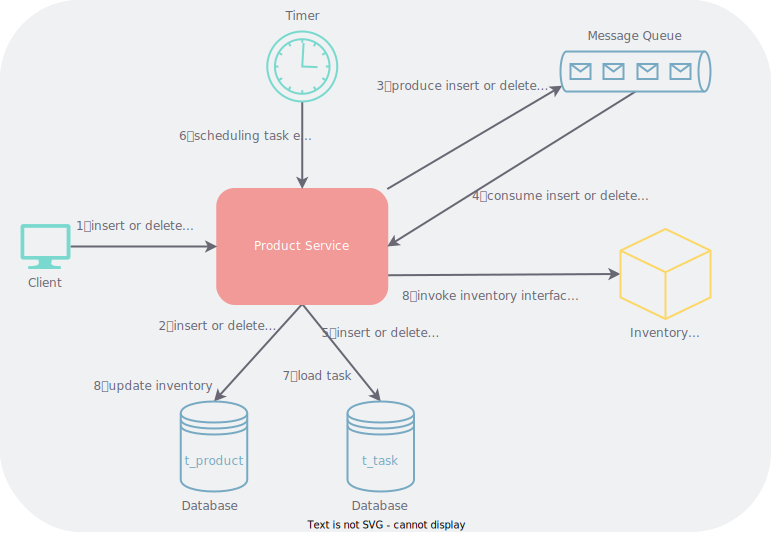

## 需求描述

在一个电商系统中有两个子系统：商品系统和库存系统，它们是独立开发、独立发布和独立部署的两套系统，它们之间关联只有大家都认可的商品编码。每经过一段时间的销售之后库存管理人员都会清点每一件商品的数量，但是请点的时间是不固定的，由库存管理人员自行决定，清点完成后会在库存系统更新每一件商品的数量。现在为了方便在商品系统也展示商品的数量，需要将库存系统里面的商品数量同步到商品系统中来，同时库存系统只提供单一商品的查询接口。

## 方法设计

我们可以把商品系统对每一个商品的数量的更新看作是一个任务，有多少个商品就有多少个任务。

```sql
create table t_task (
    task_id int not null auto_increment primary key comment '任务ID',
    product_code varchar(255) not null comment '商品编码',
    start_time datetime comment '开始执行时间',
    finish_time datetime comment '结束执行时间',
    task_status int not null default 0 comment '任务状态，0：未执行，1：执行中，2：执行成功，3：执行失败',
    remark varchar(255) comment '备注',
    create_time datetime not null default now() comment '创建时间',
    update_time datetime not null default now() comment '结束时间'
) comment '任务表';
```

一开始会导入全部的商品，后面商品有增减时通过*触发器*或者*事件*的方式对任务表里的商品进行增减。

设计一个定时任务按照一定的*频率*，比如一天或者一周，调度任务执行器加载任务状态为未执行的任务或者在*周期*（十天或者一个月）内没有执行过的任务，调用库存系统接口获取商品数量。这个过程有点像[滑动窗口](https://www.cnblogs.com/huansky/p/13488234.html)，只是加载的是窗口以外的任务。



新任务的状态为未执行，它至少要到下一次定时任务调度时才会被加载执行。如果需要即时执行，可以在消费新增商品消息时调用一次库存系统接口（第 4 步）。

任务能够滚动起来依赖两个条件。第一个是定时任务按一定频率执行。第二个是每次加载任务时都会加载在一段时间内没有执行过的任务，这一点通过任务的结束时间进行判断，而不用关心任务到底是执行成功还是执行失败，这两个状态只在排查问题时有用。因此加载待执行任务的 SQL 语句为

```sql
select *
from t_task
where task_status = 0
    or (task_status in (2, 3) and finish_time <= date_sub('2023-06-04 02:00:00', interval 10 day))
limit 1000;
```

其中 `2023-06-04 02:00:00` 为每次定时任务调度的时间，`1000` 为每次加载的任务数量。任务执行器加载任务后可以逐个执行（单线程），也可以使用线程池多线程执行任务。还可以把任务发送到消息队列，启动多个任务消费者进行执行。

每次加载任务后都需要更新任务的状态、开始执行时间和结束执行时间

```sql
update t_task
set task_status = 1,
    start_time = now(),
    finish_time = null,
    remark = null,
    update_time = now()
where task_id in (1, 2, 3);
```

任务执行完成后更新任务的状态和结束执行时间

```sql
update t_task
set task_status = 2,      -- 根据任务执行的结果可以是 2，也可以是 3
    finish_time = now(),
    remark = '执行成功',   -- 如果任务执行失败，可以记录失败信息，方便排查问题
    update_time = now()
where task_id in (1, 2, 3);
```

## 方法扩展

如果考虑到多个商品服务同时开始了调度（一般不会这么做，只是作为一种设想），那么可以考虑在任务表中增加批次号字段或类似的字段，用来表示当前任务是在那一个批次进行处理

```sql
create table t_task (
    -- ...
    batch_no varchar(255) comment '批次号',
    -- ...
) comment '任务表';
```

每次加载待执行任务之前都生成一个批次号，使用该批次号占领（因此也可以叫占有者 occupier）该任务

```sql
update t_task
set batch_no = '0BF4B80291B0C77579D35A2D9B3B782F',  -- 使用是 UUID 模拟批次号
    update_time = now()
where task_status = 0
    or (task_status in (2, 3) and finish_time <= date_sub('2023-06-04 02:00:00', interval 10 day))
limit 1000;
```

占领完成后使用同一个批次号加载待执行任务

```sql
select *
from t_task
where batch_no = '0BF4B80291B0C77579D35A2D9B3B782F';
```
