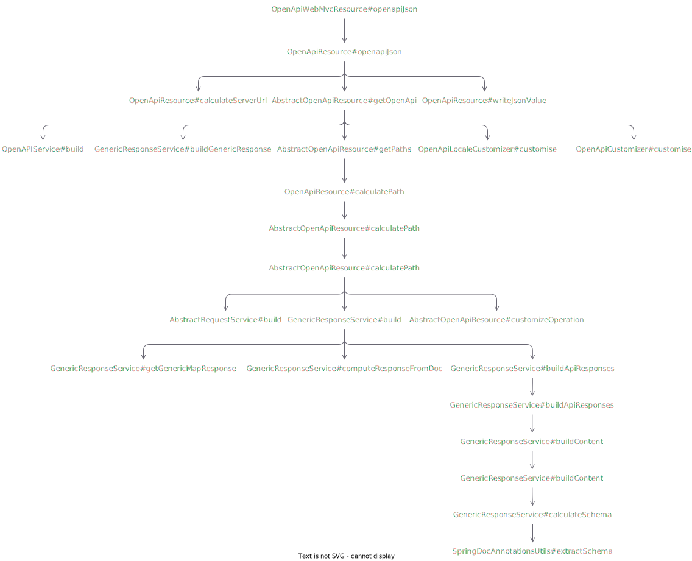

## 问题描述

在日常开发中我们会定义类似下面的 `Result` 类来统一接口返回结果的结构

```java
public class Result<T> implements Serializable {
    private static final long serialVersionUID = 1L;

    private Integer code;

    private String message;

    private T data;
}
```

此时 `Controller` 中的方法就会写成这个样子

```java
@GetMapping("/detail1/{userId}")
public Result<User> detail1(@PathVariable(name = "userId") Long userId) {
    User user = ....
    return Result.<User>builder().data(user).build();
}
```

在每个方法上都写上类似 `Result<User>` 这样的代码还是比较繁琐的，我们期望写成 `User` 这样简单的形式

```java
@GetMapping("/detail2/{userId}")
public User detail2(@PathVariable(name = "userId") Long userId) {
    User user = ....
    return user;
}
```

而由框架去处理返回结果的包装。此时就会使用到 Spring 的 `ResponseBodyAdvice` 接口

```java
@RestControllerAdvice
public class ResultResponseBodyAdvice implements ResponseBodyAdvice<Object> {
    // ...
}
```

同时我们也会使用 [SpringDoc](https://springdoc.org/) 对外提供可访问的文档。此时问题出现了，我们发现在 Swagger 的文档中方法 `detail1` 和方法 `detail2` 对应的 Schema 不一样


我们期望 `detail2` 展示的结果和  `detail1` 一样。

## 问题分析

`io.swagger.v3.oas.models.OpenAPI` 是 Swagger 的核心类，它是 Swagger 文档结构在 Java 语言中的表示，SpringDoc 干的事情就是构建这个类的实例并返回。默认情况下 SpringDoc 会在请求 `/v3/api-docs` 时去构建 `OpenAPI` 对象，它的实现在 `OpenApiWebMvcResource` 类的 `openapiJson(HttpServletRequest, @Value(API_DOCS_URL) String, Locale)` 方法。

跟踪 `openapiJson` 方法的实现我们得到了一个主线与返回值类型处理有关的方法调用链路图



丛中可以发现返回值的类型的处理与 `GenericResponseService` 有关，是不是可以重写它的一些方法来实现给返回值类型不是 `Result` 的增加一点处理。

除了构造方法 `GenericResponseService` 只有下面几个方法是公开的

1. `buildContentFromDoc`
2. `setDescription`
3. `setResponseEntityExceptionHandlerClass`
4. `build`
5. `buildGenericResponse`
6. `getApiResponses`
7. `buildContent`
8. `evaluateResponseStatus`

我们只能在这 8 个方法中选择合适的方法进行重写。通过进一步的分析，我们选择重写 `build` 方法，在返回值类型不是 `Result` 时构建类似 `ResultUser` 的 Schema。

构建好我们自己的 Schema 后还没完，此时只是把 Schema 加入到了 `OpenAPI` 对象中，`Operation` 对应的引用还没有修改，当然也可以在构建的同时进行修改，但是我们有一个更好的地方对它进行修改，当然也是为了展示 SpringDoc 的自定义能力。SpringDoc 在 `org.springdoc.core.customizers` 包下为我们提供了很多定制器，对我们的目标而言我们只需要 `OperationCustomizer`。实现这个定制器，在返回类型值类型不是 `Result` 时，用我们自定义的 Schema 替换原来的 Schema 即可。

## 解决问题

根据问题分析中介绍我们首先继承 `GenericResponseService` 并重写它的 `build` 方法

```java
package me.acomma.example.swagger;

import io.swagger.v3.core.converter.AnnotatedType;
import io.swagger.v3.core.converter.ModelConverters;
import io.swagger.v3.core.converter.ResolvedSchema;
import io.swagger.v3.oas.models.Components;
import io.swagger.v3.oas.models.Operation;
import io.swagger.v3.oas.models.media.Content;
import io.swagger.v3.oas.models.media.MediaType;
import io.swagger.v3.oas.models.media.Schema;
import io.swagger.v3.oas.models.responses.ApiResponses;
import me.acomma.example.common.Result;
import org.springdoc.core.GenericResponseService;
import org.springdoc.core.MethodAttributes;
import org.springdoc.core.OperationService;
import org.springdoc.core.PropertyResolverUtils;
import org.springdoc.core.ReturnTypeParser;
import org.springdoc.core.SpringDocConfigProperties;
import org.springframework.web.method.HandlerMethod;

import java.util.Arrays;
import java.util.List;

/**
 * 扩展 {@link GenericResponseService} 并重写 {@link GenericResponseService#build(Components, HandlerMethod, Operation, MethodAttributes)} 方法，
 * 在返回类型不为包装类型时提供如下功能：
 * <ol>
 *     <li>如果父类没有构建返回类型的 {@code Schema}，则构建它并将它放入 {@code Components}；这种情况出现在返回类型为基本类型及其包装类型和 {@code void} 时；</li>
 *     <li>如果 {@code Components} 中没有包装类型的 {@code Schema}，则构建它并将它放入 {@code Components}；</li>
 *     <li>如果返回类型是 {@code void} 是父类没有构建 {@code Content}，在这里构建并设置它。</li>
 * </ol>
 */
public class ExampleGenericResponseService extends GenericResponseService {
    /**
     * Instantiates a new Generic response builder.
     *
     * @param operationService          the operation builder
     * @param returnTypeParsers         the return type parsers
     * @param springDocConfigProperties the spring doc config properties
     * @param propertyResolverUtils     the property resolver utils
     */
    public ExampleGenericResponseService(OperationService operationService, List<ReturnTypeParser> returnTypeParsers, SpringDocConfigProperties springDocConfigProperties, PropertyResolverUtils propertyResolverUtils) {
        super(operationService, returnTypeParsers, springDocConfigProperties, propertyResolverUtils);
    }

    @Override
    public ApiResponses build(Components components, HandlerMethod handlerMethod, Operation operation, MethodAttributes methodAttributes) {
        ApiResponses apiResponses = super.build(components, handlerMethod, operation, methodAttributes);

        Class<?> returnType = handlerMethod.getMethod().getReturnType();
        Class<?> wrapperType = Result.class;

        if (returnType != wrapperType) {
            String returnTypeSimpleName = returnType.getSimpleName();
            String wrapperTypeSimpleName = wrapperType.getSimpleName();
            String returnTypeSchemaName = returnTypeSimpleName;
            String wrapperTypeSchemaName = wrapperTypeSimpleName + returnTypeSimpleName;

            // 参考类注释功能点 1
            if (!components.getSchemas().containsKey(returnTypeSchemaName)) {
                ResolvedSchema resolvedSchema = ModelConverters.getInstance().resolveAsResolvedSchema(new AnnotatedType(returnType).resolveAsRef(false));
                components.getSchemas().put(returnTypeSchemaName, resolvedSchema.schema);
            }

            // 参考类注释功能点 2
            if (!components.getSchemas().containsKey(wrapperTypeSchemaName)) {
                ResolvedSchema resolvedSchema = ModelConverters.getInstance().resolveAsResolvedSchema(new AnnotatedType(wrapperType).resolveAsRef(false));

                Schema<?> schema = resolvedSchema.schema;
                schema.setName(wrapperTypeSchemaName);
                if (!returnTypeSimpleName.equals("void")) {
                    schema.getProperties().get("data").set$ref("#/components/schemas/" + returnTypeSchemaName);
                }

                components.getSchemas().put(wrapperTypeSchemaName, schema);
            }

            // 参考类注释功能点 3
            if (returnTypeSimpleName.equals("void")) {
                apiResponses.forEach((responseName, apiResponse) -> {
                    if (!responseName.equals("200")) {
                        return;
                    }
                    if (apiResponse.getContent() == null) {
                        MediaType mediaType = new MediaType();
                        mediaType.setSchema(components.getSchemas().get(returnTypeSchemaName));

                        Content content = new Content();
                        setContent(methodAttributes.getMethodProduces(), content, mediaType);

                        apiResponse.setContent(content);
                    }
                });
            }
        }

        return apiResponses;
    }

    /**
     * @see GenericResponseService#setContent
     */
    private void setContent(String[] methodProduces, Content content,
                            io.swagger.v3.oas.models.media.MediaType mediaType) {
        Arrays.stream(methodProduces).forEach(mediaTypeStr -> content.addMediaType(mediaTypeStr, mediaType));
    }
}
```

然后，实现 `OperationCustomizer` 对返回类型值类型不是 `Result` 的 Schema 进行替换

```java
package me.acomma.example.swagger;

import io.swagger.v3.oas.models.Operation;
import me.acomma.example.common.Result;
import org.springdoc.core.customizers.OperationCustomizer;
import org.springframework.web.method.HandlerMethod;

/**
 * 实现 {@link OperationCustomizer}，在返回类型和包装类型不一致时使用包装类型的 {@code Schema} 替换原来的 {@code Schema}。
 */
public class ExampleOperationCustomer implements OperationCustomizer {
    @Override
    public Operation customize(Operation operation, HandlerMethod handlerMethod) {
        Class<?> returnType = handlerMethod.getMethod().getReturnType();
        Class<?> wrapperType = Result.class;
        String returnTypeSimpleName = returnType.getSimpleName();
        String wrapperTypeSimpleName = wrapperType.getSimpleName();

        if (returnType != wrapperType) {
            String schemaName = wrapperTypeSimpleName + returnTypeSimpleName;
            operation.getResponses().forEach((responseName, apiResponse) -> {
                if (!responseName.equals("200")) {
                    return;
                }
                if (apiResponse.getContent() == null) {
                    return;
                }
                apiResponse.getContent().forEach((contentName, mediaType) -> mediaType.getSchema().set$ref("#/components/schemas/" + schemaName));
            });
        }

        return operation;
    }
}
```

最后，我们要把它们注册到容器中

```java
package me.acomma.example.swagger;

import org.springdoc.core.OperationService;
import org.springdoc.core.PropertyResolverUtils;
import org.springdoc.core.ReturnTypeParser;
import org.springdoc.core.SpringDocConfigProperties;
import org.springframework.context.annotation.Bean;
import org.springframework.context.annotation.Configuration;

import java.util.List;

@Configuration
public class ExampleSwaggerConfiguration {
    @Bean
    public ExampleOperationCustomer exampleOperationCustomer() {
        return new ExampleOperationCustomer();
    }

    @Bean
    public ExampleGenericResponseService exampleGenericResponseService(OperationService operationService, List<ReturnTypeParser> returnTypeParsers, SpringDocConfigProperties springDocConfigProperties, PropertyResolverUtils propertyResolverUtils) {
        return new ExampleGenericResponseService(operationService, returnTypeParsers, springDocConfigProperties, propertyResolverUtils);
    }
}
```

这样就实现了我们的目标。

## 参考资料

1. [Swagger 统一应答类型处理](https://passerr.github.io/2022-07-04-swagger-common-response.html)，在使用 [SpringFox](https://springfox.github.io/springfox/) 时如何实现统一应答类型处理
