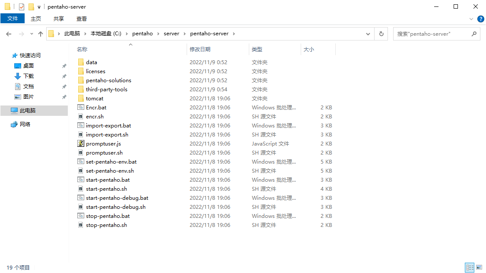
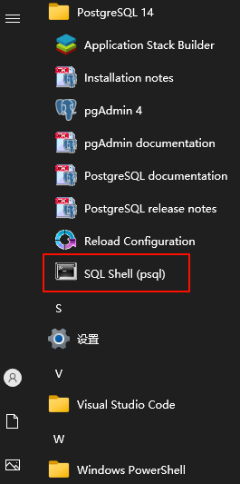
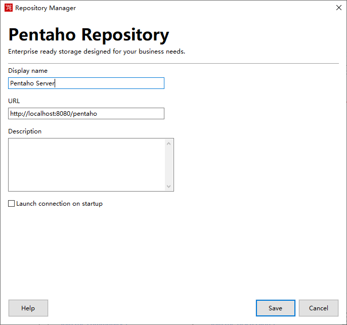

Kettle 是一个开源的 ETL 工具，被 Pentaho 公司收购后改名为 Pentaho Data Integeration，Pentaho 公司随后又被并入 Hitachi Vantara 公司，现在已经发展成了 Pentaho Data Integration & Analytics，成为了 DataOps Platform Software 的一部分。它的发展历史可以参考 [开源ETL工具之Kettle介绍](https://cloud.tencent.com/developer/article/1504246)。因此现在要到 [Hitachi Vantara](https://www.hitachivantara.com/en-us/home.html) 公司的网站下载软件或者查看文档。


Pentaho Data Integration and Analytics 分为[企业版和社区版](https://www.hitachivantara.com/en-us/products/pentaho-plus-platform/data-integration-analytics/download-pentaho.html)，在本文中将使用社区版，下载地址在[这里](https://www.hitachivantara.com/en-us/products/pentaho-plus-platform/data-integration-analytics/pentaho-community-edition.html)。目前的版本为 9.4.0.0-343，因此主要的参考文档为 [Data Integration and Analytics 9.4](https://help.hitachivantara.com/Documentation/Pentaho/Data_Integration_and_Analytics/9.4)。

## 安装服务端

服务端选择使用 [Archive installation](https://help.hitachivantara.com/Documentation/Pentaho/Data_Integration_and_Analytics/9.4/Setup/Archive_installation) 方式进行安装，在安装之前需要阅读一下 [Components Reference](https://help.hitachivantara.com/Documentation/Pentaho/Data_Integration_and_Analytics/9.4/Setup/Components_Reference)。目前选择的组建如下

组件 | 版本 | 备注
--- | --- | ---
Operating System | Microsoft Windows 2022 Server | 64 bit 阿里云按量付费，开通公网
PostgreSQL | 14.10-1 | [postgresql-14.10-1-windows-x64.exe](https://www.enterprisedb.com/downloads/postgres-postgresql-downloads)
JDK | Oracle Java 11.0.21 | [jdk-11.0.21_windows-x64_bin.exe](https://www.oracle.com/java/technologies/downloads/#java11-windows)
Pentaho Server | 9.4.0.0-343 | [pentaho-server-ce-9.4.0.0-343.zip](https://privatefilesbucket-community-edition.s3.us-west-2.amazonaws.com/9.4.0.0-343/ce/server/pentaho-server-ce-9.4.0.0-343.zip)

接下来的步骤主要参考 [Prepare your Windows environment for an archive install](https://help.hitachivantara.com/Documentation/Pentaho/Data_Integration_and_Analytics/9.4/Setup/Prepare_your_Windows_environment_for_an_archive_install) 进行操作。正在具体操作之前需要准备好几个将要使用的工具软件：[7-Zip](https://7-zip.org/)、[Visual Studio Code](https://code.visualstudio.com/) 和 [迅雷](https://dl.xunlei.com/)。

### 创建目录结构

在 Windows 服务器创建目录 `C:\pentaho\server` 用来安装 Pentaho Server。

### 安装 JDK

在 [Java Downloads](https://www.oracle.com/java/technologies/downloads/#java11-windows) 下载 [jdk-11.0.21_windows-x64_bin.exe](https://www.oracle.com/java/technologies/downloads/#java11-windows) 并双击运行进行安装。安装完成后需要配置 `JAVA_HOME` 环境变量


并且把 `%JAVA_HOME%\bin` 加入 `Path` 环境变量中


### 安装 PostgreSQL

在 [Windows installers](https://www.postgresql.org/download/windows/) 页面找到并点击 [Download the installer](https://www.enterprisedb.com/downloads/postgres-postgresql-downloads) 链接跳转到 EDB 的 [Download PostgreSQL](https://www.enterprisedb.com/downloads/postgres-postgresql-downloads) 页面下载 postgresql-14.10-1-windows-x64.exe。

选择安装路径


选择需要安装的组件


选择数据的存放目录


设置用户 `postgres` 的密码，这里设置的是 `123456`


设置 PostgreSQL 服务器的端口


设置 Locale


### 安装 Pentaho Server

在 [Pentaho Community Edition Download](https://www.hitachivantara.com/zh-cn/products/pentaho-platform/data-integration-analytics/pentaho-community-edition.html) 页面下载 [pentaho-server-ce-9.4.0.0-343.zip](https://privatefilesbucket-community-edition.s3.us-west-2.amazonaws.com/9.4.0.0-343/ce/server/pentaho-server-ce-9.4.0.0-343.zip)。下载完成后解压到 `C:\pentaho\server` 目录，解压完成后的目录结果如下图所示



### 初始化数据库

本节主要参考 [Use PostgreSQL as Your Repository Database (Archive installation)](https://help.hitachivantara.com/Documentation/Pentaho/Data_Integration_and_Analytics/9.4/Setup/Use_PostgreSQL_as_Your_Repository_Database_(Archive_installation)) 初始化数据库。

数据库的脚本文件在 `C:\pentaho\server\pentaho-server\data\postgresql` 目录，里面有三个文件

* create_jcr_postgresql.sql
* create_quartz_postgresql.sql
* create_repository_postgresql.sql

我们应该修改这几个脚本里的密码部分，但是为了保持简单我们暂且保持原样。接下来我们启动 PostgreSQL 的 SQL Shell，即 `psql`



在 `psql` 中依次执行下面的脚本初始化数据库，注意路径的分割符使用的是 `/`

```shell
\i C:/pentaho/server/pentaho-server/data/postgresql/create_quartz_postgresql.sql
\i C:/pentaho/server/pentaho-server/data/postgresql/create_repository_postgresql.sql
\i C:/pentaho/server/pentaho-server/data/postgresql/create_jcr_postgresql.sql
```

### 配置 Pentaho Server

#### 设置 Quartz

打开 `C:\pentaho\server\pentaho-server\pentaho-solutions\system\quartz\quartz.properties` 文件，确保如下两项配置

```properties
org.quartz.jobStore.driverDelegateClass = org.quartz.impl.jdbcjobstore.PostgreSQLDelegate
org.quartz.dataSource.myDS.jndiURL = Quartz
```

#### 设置 Hibernate

打开 `C:\pentaho\server\pentaho-server\pentaho-solutions\system\hibernate\hibernate-settings.xml` 文件，确保 `config-file` 项的内容如下所示

```xml
<config-file>system/hibernate/postgresql.hibernate.cfg.xml</config-file>
```

#### 设置 Jackrabbit

打开 `C:\pentaho\server\pentaho-server\pentaho-solutions\system\jackrabbit\repository.xml` 文件，打开 `postgresql` 所在的快的注释而不是其他，删除注释内容后的文件为

```xml
<?xml version="1.0"?>

<!DOCTYPE Repository
    PUBLIC "-//The Apache Software Foundation//DTD Jackrabbit 2.0//EN"
    "http://jackrabbit.apache.org/dtd/repository-2.0.dtd">

<Repository>
  <FileSystem class="org.apache.jackrabbit.core.fs.db.DbFileSystem">
    <param name="driver" value="javax.naming.InitialContext"/>
    <param name="url" value="java:comp/env/jdbc/jackrabbit"/>
    <param name="schema" value="postgresql"/>
    <param name="schemaObjectPrefix" value="fs_repos_"/>
  </FileSystem>

  <DataStore class="org.apache.jackrabbit.core.data.db.DbDataStore">
    <param name="driver" value="javax.naming.InitialContext"/>
    <param name="url" value="java:comp/env/jdbc/jackrabbit"/>
    <param name="databaseType" value="postgresql"/>
    <param name="minRecordLength" value="1024"/>
    <param name="maxConnections" value="3"/>
    <param name="copyWhenReading" value="true"/>
    <param name="tablePrefix" value=""/>
    <param name="schemaObjectPrefix" value="ds_repos_"/>
  </DataStore>

  <Security appName="Jackrabbit">
    <SecurityManager class="org.apache.jackrabbit.core.DefaultSecurityManager" workspaceName="security">
    </SecurityManager>

    <AccessManager class="org.apache.jackrabbit.core.security.DefaultAccessManager">
    </AccessManager>

    <LoginModule class="org.pentaho.platform.repository2.unified.jcr.jackrabbit.security.SpringSecurityLoginModule">
      <param name="anonymousId" value="anonymous"/>
      <param name="adminId" value="pentahoRepoAdmin"/>

      <param name="principalProvider"
             value="org.pentaho.platform.repository2.unified.jcr.jackrabbit.security.SpringSecurityPrincipalProvider"/>
      <param name="preAuthenticationTokens" value="ZchBOvP8q9FQ"/>
      <param name="trust_credentials_attribute" value="pre_authentication_token"/>
    </LoginModule>
  </Security>

  <Workspaces rootPath="${rep.home}/workspaces" defaultWorkspace="default"/>
  
  <Workspace name="${wsp.name}">
    <FileSystem class="org.apache.jackrabbit.core.fs.db.DbFileSystem">
      <param name="driver" value="javax.naming.InitialContext"/>
      <param name="url" value="java:comp/env/jdbc/jackrabbit"/>
      <param name="schema" value="postgresql"/>
      <param name="schemaObjectPrefix" value="fs_ws_"/>
    </FileSystem>

    <PersistenceManager class="org.apache.jackrabbit.core.persistence.bundle.PostgreSQLPersistenceManager">
      <param name="driver" value="javax.naming.InitialContext"/>
      <param name="url" value="java:comp/env/jdbc/jackrabbit"/>
      <param name="schema" value="postgresql"/>
      <param name="schemaObjectPrefix" value="${wsp.name}_pm_ws_"/>
    </PersistenceManager>

    <SearchIndex class="org.apache.jackrabbit.core.query.lucene.SearchIndex">
      <param name="path" value="${wsp.home}/index"/>
      <param name="supportHighlighting" value="true"/>
    </SearchIndex>

    <WorkspaceSecurity>
      <AccessControlProvider class="org.apache.jackrabbit.core.security.authorization.acl.PentahoACLProvider"/>
    </WorkspaceSecurity>
  </Workspace>

  <Versioning rootPath="${rep.home}/version">
    <FileSystem class="org.apache.jackrabbit.core.fs.db.DbFileSystem">
      <param name="driver" value="javax.naming.InitialContext"/>
      <param name="url" value="java:comp/env/jdbc/jackrabbit"/>
      <param name="schema" value="postgresql"/>
      <param name="schemaObjectPrefix" value="fs_ver_"/>
    </FileSystem>

    <PersistenceManager class="org.apache.jackrabbit.core.persistence.bundle.PostgreSQLPersistenceManager">
      <param name="driver" value="javax.naming.InitialContext"/>
      <param name="url" value="java:comp/env/jdbc/jackrabbit"/>
      <param name="schema" value="postgresql"/>
      <param name="schemaObjectPrefix" value="pm_ver_"/>
    </PersistenceManager>
  </Versioning>

  <Cluster id="node1">
    <Journal class="org.apache.jackrabbit.core.journal.DatabaseJournal">
      <param name="revision" value="${rep.home}/revision.log" />
      <param name="driver" value="javax.naming.InitialContext"/>
      <param name="url" value="java:comp/env/jdbc/jackrabbit"/>
      <param name="schema" value="postgresql"/>
      <param name="schemaObjectPrefix" value="cl_j_"/>
      <param name="janitorEnabled" value="true"/>
      <param name="janitorSleep" value="86400"/>
      <param name="janitorFirstRunHourOfDay" value="3"/>
    </Journal>
  </Cluster>
</Repository>
```

#### 修改 Tomcat JDBC 配置

打开文件 `C:\pentaho\server\pentaho-server\tomcat\webapps\pentaho\META-INF\context.xml`，修改后的内容为

```xml
<?xml version="1.0" encoding="UTF-8"?>
<Context path="/pentaho" docbase="webapps/pentaho/">
	<Resource name="jdbc/Hibernate" auth="Container" type="javax.sql.DataSource" factory="org.pentaho.di.core.database.util.DecryptingDataSourceFactory" maxActive="20" minIdle="0" maxIdle="5" initialSize="0" maxWait="10000" username="hibuser" password="password" driverClassName="org.postgresql.Driver" url="jdbc:postgresql://localhost:5432/hibernate" validationQuery="select 1" jdbcInterceptors="ConnectionState" defaultAutoCommit="true"/>
	<Resource name="jdbc/Quartz" auth="Container" type="javax.sql.DataSource" factory="org.pentaho.di.core.database.util.DecryptingDataSourceFactory" maxActive="20" minIdle="0" maxIdle="5" initialSize="0" maxWait="10000" username="pentaho_user" password="password" testOnBorrow="true" driverClassName="org.postgresql.Driver" url="jdbc:postgresql://localhost:5432/quartz" validationQuery="select 1"/>
	<Resource name="jdbc/jackrabbit" auth="Container" type="javax.sql.DataSource" factory="org.pentaho.di.core.database.util.DecryptingDataSourceFactory" maxActive="20" minIdle="0" maxIdle="5" initialSize="0" maxWait="10000" username="jcr_user" password="password" driverClassName="org.postgresql.Driver" url="jdbc:postgresql://localhost:5432/jackrabbit" validationQuery="select 1" jdbcInterceptors="ConnectionState" defaultAutoCommit="true"/>
</Context>
```

### 启停 Pentaho Server

参考 [Starting the Pentaho Server after an archive installation](https://help.hitachivantara.com/Documentation/Pentaho/Data_Integration_and_Analytics/9.4/Setup/Starting_the_Pentaho_Server_after_an_archive_installation) 执行 `C:\pentaho\server\pentaho-server\start-pentaho.bat` 启动 Pentaho Server。

执行 `C:\pentaho\server\pentaho-server\stop-pentaho.bat` 停止 Pentaho Server。

### 访问 Pentaho Server

在浏览器地址栏中输入 `http://localhost:8080/pentaho` 访问 Pentaho Server，默认的用户名密码为 `admin/password`。

## 安装客户端

在 [Pentaho Community Edition Download](https://www.hitachivantara.com/zh-cn/products/pentaho-platform/data-integration-analytics/pentaho-community-edition.html) 下载 [pdi-ce-9.4.0.0-343.zip](https://privatefilesbucket-community-edition.s3.us-west-2.amazonaws.com/9.4.0.0-343/ce/client-tools/pdi-ce-9.4.0.0-343.zip)。

参考 [Install the PDI tools and plugins](https://help.hitachivantara.com/Documentation/Pentaho/Data_Integration_and_Analytics/9.4/Setup/Install_the_PDI_tools_and_plugins) 把下载的文件解压到 `C:\pentaho\design-tools` 目录。解压完成后的目录结构如下


## 使用 PDI

执行 `C:\pentaho\design-tools\data-integration\Spoon.bat` 启动 PID。

参考 [Use a Pentaho Repository in PDI](https://help.hitachivantara.com/Documentation/Pentaho/Data_Integration_and_Analytics/9.4/Products/Use_a_Pentaho_Repository_in_PDI) 创建 Pentaho Repository，注意 URL 的地址为 Pentaho Server 的地址 `http://localhost:8080/pentaho`



登录刚刚创建的 Pentaho Repository，用户名和密码为 Pentaho Server 的用户名和密码，即 `admin/password`


接下来就可以按步就班地学习 [Pentaho Data Integration](https://help.hitachivantara.com/Documentation/Pentaho/Data_Integration_and_Analytics/9.4/Products/Pentaho_Data_Integration) 的内容了。
