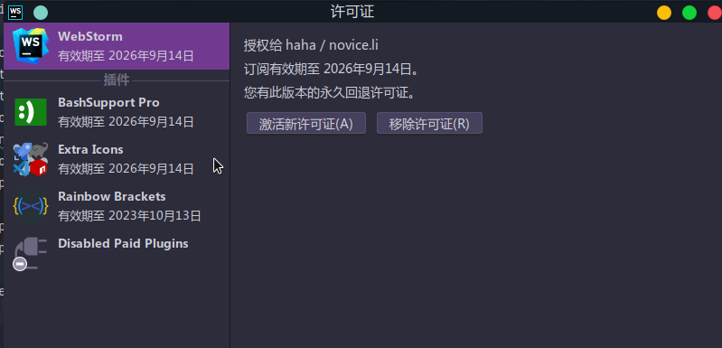

转载自 [Idea agent 激活原理](https://linux.do/t/topic/469)

## 一 破解原理

jetbrains提供了一个付费插件如何校验**License** 的示例代码, 点击下方的CheckLicense.java即可查看

[CheckLicense.java](https://github.com/JetBrains/marketplace-makemecoffee-plugin/blob/master/src/main/java/com/company/license/CheckLicense.java)

现在对代码进行分析,校验license的入口是isKeyValid方法

```java
private static boolean isKeyValid(String key) {
    String[] licenseParts = key.split("-");
    if (licenseParts.length != 4) {
        return false; 
    }

    final String licenseId = licenseParts[0];
    final String licensePartBase64 = licenseParts[1];
    final String signatureBase64 = licenseParts[2];
    final String certBase64 = licenseParts[3];

    try {
        final Signature sig = Signature.getInstance("SHA1withRSA");
sig.initVerify(createCertificate(Base64.getMimeDecoder().decode(certBase64.getBytes(StandardCharsets.UTF_8)), Collections.emptySet(), false));
        final byte[] licenseBytes = Base64.getMimeDecoder().decode(licensePartBase64.getBytes(StandardCharsets.UTF_8));
        sig.update(licenseBytes);
        if (!sig.verify(Base64.getMimeDecoder().decode(signatureBase64.getBytes(StandardCharsets.UTF_8)))) {
            return false;
        }
        final String licenseData = new String(licenseBytes, StandardCharsets.UTF_8);
        return licenseData.contains("\"licenseId\":\"" + licenseId + "\"");
    } catch (Throwable e) {
        e.printStackTrace()
    }
    return false;
}
```

下面进行逐步分析:

### 1.1 License的格式

```java
String[] licenseParts = key.split("-");
if (licenseParts.length != 4) {
    return false; // invalid format
}

final String licenseId = licenseParts[0];
final String licensePartBase64 = licenseParts[1];
final String signatureBase64 = licenseParts[2];
final String certBase64 = licenseParts[3];
```

透过这几行,我们可以发现License由4部分组成,这4部分用-拼接

**licenseId**

licenseId 没什么好解释的,大家写代码对一条数据会给他一个id标识,这里也是一样的

**licensePartBase64**

既然是base64我们使用base64解码试试,先从网上找个license

再写几行代码解码打印一下

打印结果,下面是json格式化后的

```json
{
    "licenseId": "29VRVXKXEQ",
    "licenseeName": "gurgles tumbles",
    "assigneeName": "",
    "assigneeEmail": "",
    "licenseRestriction": "",
    "checkConcurrentUse": false,
    "products": [
        {
            "code": "II",
            "fallbackDate": "2026-09-14",
            "paidUpTo": "2026-09-14",
            "extended": false
        },
        {
            "code": "PCWMP",
            "fallbackDate": "2026-09-14",
            "paidUpTo": "2026-09-14",
            "extended": true
        },
        {
            "code": "PSI",
            "fallbackDate": "2026-09-14",
            "paidUpTo": "2026-09-14",
            "extended": true
        },
        {
            "code": "PDB",
            "fallbackDate": "2026-09-14",
            "paidUpTo": "2026-09-14",
            "extended": true
        }
    ],
    "metadata": "0120230914PSAX000005",
    "hash": "TRIAL:1649058719",
    "gracePeriodDays": 7,
    "autoProlongated": false,
    "isAutoProlongated": false
}
```

可以看出,这个json存储了license的信息了,过期时间,产品编码,等等

**signatureBase64**

这个虽然也是bash64编码的,但是不可读,从后续的代码中可以看到这个是**licensePartBase64**的签名(防止你修改**licensePartBase64**的内容)

**certBase64**

这个从名字就可以知道,这是一个证书的base64,我们可以写几行代码试试将其转成**X509Certificate**
打印结果

```text
[
[
  Version: V3
  Subject: CN=prod2y-from-20201019
  Signature Algorithm: SHA256withRSA, OID = 1.2.840.113549.1.1.11

  Key:  Sun RSA public key, 2048 bits
  params: null
  modulus: 18757061644631641897871738039803297079222086307758970668007743391230210652175936091067273679967614176566958971386041386130847029810514259477478961428354871927476348879585595226079089482240396983201444402264034332735246934562349766525834026808529064015070873142427210769732272794189934622072446800676835238869578773294766180028559237543555831007850742231939840102022188112702553709667158412697383676208362494918482992433951964054476644792447772443724250800187136958875570841896406567118594736548490951814592975795053469752356231684777929851181510821765498304994721447237722500206967118619930964967974888609206437705281
  public exponent: 65537
  Validity: [From: Mon Oct 19 17:05:53 CST 2020,
               To: Fri Oct 21 17:05:53 CST 2022]
  Issuer: CN=JetProfile CA
  SerialNumber: [    0d]

Certificate Extensions: 5
[1]: ObjectId: 2.5.29.35 Criticality=false
AuthorityKeyIdentifier [
KeyIdentifier [
0000: A3 9E B6 48 67 42 12 36   41 BD 6D E0 B9 B4 A0 52  ...HgB.6A.m....R
0010: 8B 97 F1 B3                                        ....
]
[CN=JetProfile CA]
SerialNumber: [    d26cb183 b28379e1]
]

[2]: ObjectId: 2.5.29.19 Criticality=false
BasicConstraints:[
  CA:false
  PathLen: undefined
]

[3]: ObjectId: 2.5.29.37 Criticality=false
ExtendedKeyUsages [
  serverAuth
]

[4]: ObjectId: 2.5.29.15 Criticality=false
KeyUsage [
  DigitalSignature
  Key_Encipherment
]

[5]: ObjectId: 2.5.29.14 Criticality=false
SubjectKeyIdentifier [
KeyIdentifier [
0000: 24 DA 11 22 96 F5 85 41   C0 93 47 E8 31 23 4C F4  $.."...A..G.1#L.
0010: C0 84 02 FF                                        ....
]
]

]
  Algorithm: [SHA256withRSA]
  Signature:
......

]
```

可以看出这个一个由JetProfile CA签名的子证书

### 1.2 验证证书

```java
final Signature sig = Signature.getInstance("SHA1withRSA");
// Here it is only important that the key was signed with an authentic JetBrains certificate.
sig.initVerify(createCertificate(Base64.getMimeDecoder().decode(certBase64.getBytes(StandardCharsets.UTF_8)), Collections.emptySet(), false));
```

Here it is only important that the key was signed with an authentic JetBrains certificate.翻译一下就是:这里唯一重要的是密钥是使用真实的 JetBrains 证书签名的

说明了这段代码唯一的目的就是校验证书是JetBrains签名的,createCertificate核心代码如下

```java
final X509CertSelector selector = new X509CertSelector();
selector.setCertificate(cert);
final Set<TrustAnchor> trustAchors = new HashSet<>();
for (String rc : ROOT_CERTIFICATES) {
    trustAchors.add(new TrustAnchor((X509Certificate) x509factory.generateCertificate(new ByteArrayInputStream(rc.getBytes(StandardCharsets.UTF_8))), null));
}

final PKIXBuilderParameters pkixParams = new PKIXBuilderParameters(trustAchors, selector);
pkixParams.setRevocationEnabled(false);
if (!checkValidityAtCurrentDate) {
    pkixParams.setDate(cert.getNotBefore());
}
pkixParams.addCertStore(CertStore.getInstance("Collection", new CollectionCertStoreParameters(allCerts)));
final CertPath path = CertPathBuilder.getInstance("PKIX").build(pkixParams).getCertPath();
if (path != null) {
    CertPathValidator.getInstance("PKIX").validate(path, pkixParams);
    return cert;
}
```

ROOT_CERTIFICATES 是内置的根证书,使用根证书来验证传入的证书是不是根证书签发的,后面的代码都是使用java的库进行证书链验证

这里涉及到了证书链 证书签名

证书包含的内容可以概述为三部分，用户的信息、用户的公钥、还有CA中心对该证书里面的信息的签名。我们在验证证书的有效性的时候，会逐级去寻找签发者的证书，直至根证书为结束，然后通过公钥一级一级验证数字签名的正确性。

证书签名即使用上一级机构的私钥对证书里的信息进行hash再加密

用户使用上一级的公钥对签名进行解密得到一个值

用户使用证书里的信息进行hash的到一个值

如果这两者相同,则说明证书是正确的

### 1.3 验证licensePart

验证完证书,还需要验证license中的信息是不是被修改过,

```java
final Signature sig = Signature.getInstance("SHA1withRSA");
sig.initVerify(createCertificate(Base64.getMimeDecoder().decode(certBase64.getBytes(StandardCharsets.UTF_8)), Collections.emptySet(), false));
final byte[] licenseBytes = Base64.getMimeDecoder().decode(licensePartBase64.getBytes(StandardCharsets.UTF_8));
sig.update(licenseBytes);
if (!sig.verify(Base64.getMimeDecoder().decode(signatureBase64.getBytes(StandardCharsets.UTF_8)))) {
    return false;
}
```

其实就使用证书里包含的公钥与**SHA1withRSA** 算法进行验证

### 1.4 破解的思路

首先,我们需要一个证书, 还要有这个证书的私钥,网上找的**license**只能拿到证书,没有私钥,没有私钥就无法对**licensePart**进行签名

如果我们自己签一个证书,那么验证证书时是无法通过的, 我们需要一点魔法来搞定这一点, Java agent 技术修改jdk的字节码, 使得校验我们的证书时总是通过

有了证书后,使用证书的私钥对我们修改过的**licensePart**进行签名,最后拼接得到**license**

为什么不直接改掉这个函数?

上面的代码只是一个demo,并不代表实际软件里是这么实现的,并且idea的代码经过混淆加密,根本无法查看,无法定位到是那个方法校验的**license**

## 二 破解的实现

### 2.1 生成证书

使用下面的python脚本即可

```python
import datetime

from cryptography import x509
from cryptography.hazmat.backends import default_backend
from cryptography.hazmat.primitives import hashes, serialization
from cryptography.hazmat.primitives.asymmetric import rsa
from cryptography.x509.oid import NameOID

one_day = datetime.timedelta(days=1)
ten_day = datetime.timedelta(days=3650)
today = datetime.datetime.today()
yesterday = today - one_day
tomorrow = today + ten_day

private_key = rsa.generate_private_key(
    public_exponent=65537,
    key_size=4096,
    backend=default_backend()
)
public_key = private_key.public_key()
builder = x509.CertificateBuilder()

builder = builder.subject_name(x509.Name([
    x509.NameAttribute(NameOID.COMMON_NAME, 'Novice-from-2024-01-19'),
]))
builder = builder.issuer_name(x509.Name([
    x509.NameAttribute(NameOID.COMMON_NAME, 'JetProfile CA'),
]))
builder = builder.not_valid_before(yesterday)
builder = builder.not_valid_after(tomorrow)
builder = builder.serial_number(x509.random_serial_number())
builder = builder.public_key(public_key)

certificate = builder.sign(
    private_key=private_key, algorithm=hashes.SHA256(),
    backend=default_backend()
)

private_bytes = private_key.private_bytes(
    encoding=serialization.Encoding.PEM,
    format=serialization.PrivateFormat.TraditionalOpenSSL,
    encryption_algorithm=serialization.NoEncryption())
public_bytes = certificate.public_bytes(
    encoding=serialization.Encoding.PEM)
with open("ca.key", "wb") as fout:
    fout.write(private_bytes)
with open("ca.crt", "wb") as fout:
    fout.write(public_bytes)
```

执行这个脚本会生成保存一个证书ca.crt, 以及一个私钥ca.key

### 2.2 使用证书和私钥生成license

```java
import org.bouncycastle.jce.provider.BouncyCastleProvider;
import org.bouncycastle.openssl.PEMKeyPair;
import org.bouncycastle.openssl.PEMParser;
import org.bouncycastle.openssl.jcajce.JcaPEMKeyConverter;

import java.io.FileInputStream;
import java.io.FileReader;
import java.nio.charset.StandardCharsets;
import java.security.KeyPair;
import java.security.PrivateKey;
import java.security.Security;
import java.security.Signature;
import java.security.cert.CertificateFactory;
import java.security.cert.X509Certificate;
import java.util.Base64;

public class Main {
    public static void main(String[] args) throws Exception {

        CertificateFactory certificateFactory = CertificateFactory.getInstance("X.509");
        X509Certificate cert = (X509Certificate) certificateFactory.generateCertificate(new FileInputStream("ca.crt"));

        // 自己修改 license内容
        // 注意licenseId要一致
        // 里面的内容是激活webstorm
        String licensePart = "{\"licenseId\":\"MOUGH5FKDV\",\"licenseeName\":\"haha\",\"assigneeName\":\"novice.li\",\"assigneeEmail\":\"\",\"licenseRestriction\":\"\",\"checkConcurrentUse\":false,\"products\":[{\"code\":\"PCWMP\",\"fallbackDate\":\"2026-09-14\",\"paidUpTo\":\"2026-09-14\",\"extended\":true},{\"code\":\"PSI\",\"fallbackDate\":\"2026-09-14\",\"paidUpTo\":\"2026-09-14\",\"extended\":true},{\"code\":\"WS\",\"fallbackDate\":\"2026-09-14\",\"paidUpTo\":\"2026-09-14\",\"extended\":false}],\"metadata\":\"0120230914PSAX000005\",\"hash\":\"TRIAL:-1920204289\",\"gracePeriodDays\":7,\"autoProlongated\":false,\"isAutoProlongated\":false}";
        String licenseId = "MOUGH5FKDV";
        byte[] licensePartBytes = licensePart.getBytes(StandardCharsets.UTF_8);
        String licensePartBase64 = Base64.getEncoder().encodeToString(licensePartBytes);

        PrivateKey privateKey = getPrivateKey();


        Signature signature = Signature.getInstance("SHA1withRSA");
        signature.initSign(privateKey);
        signature.update(licensePartBytes);
        byte[] signatureBytes = signature.sign();

        String sigResultsBase64 = Base64.getEncoder().encodeToString(signatureBytes);
//        verify
//        Signature verifySignature = Signature.getInstance("SHA1withRSA");
//        verifySignature.initVerify(cert.getPublicKey());
//        verifySignature.update(Base64.getDecoder().decode(licensePartBase64));
//        boolean verify = verifySignature.verify(Base64.getDecoder().decode(sigResultsBase64));
//        System.out.println(verify);


        // Combine results as needed
        String result = licenseId + "-" + licensePartBase64 + "-" + sigResultsBase64 + "-" + Base64.getEncoder().encodeToString(cert.getEncoded());
        System.out.println(result);

    }


    static PrivateKey getPrivateKey() throws Exception {
        Security.addProvider(new BouncyCastleProvider());
        PEMParser pemParser = new PEMParser(new FileReader("ca.key"));
        JcaPEMKeyConverter converter = new JcaPEMKeyConverter().setProvider("BC");
        Object object = pemParser.readObject();
        KeyPair kp = converter.getKeyPair((PEMKeyPair) object);
        return kp.getPrivate();
    }

}
```

这里需要一个第三方的库

```xml
<dependency>
    <groupId>org.bouncycastle</groupId>
    <artifactId>bcpkix-jdk18on</artifactId>
    <version>1.72</version>
</dependency>
<dependency>
    <groupId>org.bouncycastle</groupId>
    <artifactId>bcprov-jdk18on</artifactId>
    <version>1.72</version>
</dependency>
```

执行main方法,因该能得到类似以下内容, 证书不同, **licensePart**不同,所以内容每个人都不一样使用的jdk是OpenJdk17

```text
MOUGH5FKDV-eyJsaWNlbnNlSWQiOiJNT1VHSDVGS0RWIiwibGljZW5zZWVOYW1lIjoiaGFoYSIsImFzc2lnbmVlTmFtZSI6Im5vdmljZS5saSIsImFzc2lnbmVlRW1haWwiOiIiLCJsaWNlbnNlUmVzdHJpY3Rpb24iOiIiLCJjaGVja0NvbmN1cnJlbnRVc2UiOmZhbHNlLCJwcm9kdWN0cyI6W3siY29kZSI6IlBDV01QIiwiZmFsbGJhY2tEYXRlIjoiMjAyNi0wOS0xNCIsInBhaWRVcFRvIjoiMjAyNi0wOS0xNCIsImV4dGVuZGVkIjp0cnVlfSx7ImNvZGUiOiJQU0kiLCJmYWxsYmFja0RhdGUiOiIyMDI2LTA5LTE0IiwicGFpZFVwVG8iOiIyMDI2LTA5LTE0IiwiZXh0ZW5kZWQiOnRydWV9LHsiY29kZSI6IldTIiwiZmFsbGJhY2tEYXRlIjoiMjAyNi0wOS0xNCIsInBhaWRVcFRvIjoiMjAyNi0wOS0xNCIsImV4dGVuZGVkIjpmYWxzZX1dLCJtZXRhZGF0YSI6IjAxMjAyMzA5MTRQU0FYMDAwMDA1IiwiaGFzaCI6IlRSSUFMOi0xOTIwMjA0Mjg5IiwiZ3JhY2VQZXJpb2REYXlzIjo3LCJhdXRvUHJvbG9uZ2F0ZWQiOmZhbHNlLCJpc0F1dG9Qcm9sb25nYXRlZCI6ZmFsc2V9-EtkxIjIOL6nbRjpnwjn3xoS5ch3k/gMZMFZ8/oqxIqNhlwDsQajZw/UASlLpd3t6tWRqefL4kucMfpNyUEPbwe3jcA0cbE7bD7wj1O2UUCTBDpCTY3Hh57dgdkvYIizIaqdFFay7GtQf46ltXraYt3YUpiQfx0ferOR9tDdg1zgL2n0vxLtlChYAMvBo2yMnyMvAS490tQu4c5Oi87KNcTWmUihL6oiDIv1a2/DaMYpKY10PvAENwfq0wuQtWQqrb1azF1LIziratnBY0AfpMOb6HMIYf0iPGMCyYcwmyDfQ5nM5gKnip9V8gsyQFX+Ja4dzDbEoRt5AavvShbYJjYTB8RCXWuLW6uLhoaJJMKK5VWDNPwqd2iL4cRWmXLVOM6IDdtP0asLVjgfugbr7NYHZepfhQhgPCZrJR4MeLbYtdJakDwI+JBim7gSlYDJi8DNxXl5qvnzTL9oS66zwvx84E5KNCePC08MkUVallELohQpcs7pt8CfRPsqTJpSDMS/h3aTvhLOVLCY5zCXc2G1bmh6HdDYWPvbhU4uiGlWcqTiBVjUo324tO0085yU40VUk6S4QL+Q69HX1i13k43saaDg1OirnLY7pGq6bgW6fqALqVrrOgjy4Pkhwyzx/hJWTqxcY1kHFyqIFpWT/lWJ8shpU/Lp0NTQ6OIDe4Ag=-MIIExTCCAq2gAwIBAgIUONPn09E4/d2ARDMbTgtVdG78L5owDQYJKoZIhvcNAQELBQAwGDEWMBQGA1UEAwwNSmV0UHJvZmlsZSBDQTAeFw0yMzA5MjIxMjI3NTRaFw0zMzA5MjAxMjI3NTRaMCExHzAdBgNVBAMMFk1vWXVuby1mcm9tLTIwMjItMDctMjUwggIiMA0GCSqGSIb3DQEBAQUAA4ICDwAwggIKAoICAQCgoO4tub6olCRbJ38I0K4kWr+suajcuwTDbrAvWqkNTt3U1SWArWQa7s6QJfKAAFVKEQpFW2eu861YLC8GUVKKZS4ol9dihVy+Zp7ThUuSkz64d9kwQ4/5JwKEAW51fWORHbjs3dhdShAq9tmuOGohi0KjBhkTzeKpTMa2k/TlxHD0pwdVDEQygQ02+ddCkSuozF/9/mzafG2RB6iYiKld7vUs68n2FVotktpN2eGrXv72nenuQLKVT7ecXNT0m6KzY6+aelAFqeSUhnyqVe9Zm0oPIPL9QAJXmjUpzyw6vu2ZYkCoJcGjtogs9uilqlOaKGFQc1OGxuoQhOerBOZm6n93YIobjr5RwRb0img6AtkknFsXoUKNHxAGu8iCFlRGykWU5K+h+/NRd7JAO2AAMv2Qa5CwG+wcc1YXZQejL7YkBTw70zUI3107on2n4KTbtNYpdwccqAjWcdycG4eekBMxGDGKS43aH1adT54ICQsm8jsq5/zTg/8PR4PBG/jXyUGR0JRlwy14aWyJwaLIdscDGU3S6nfM8f2mtchKnDySzkn17FucNkW9nXbV979WsxX+TPX3y/vNAQzM04z+6Vjfp/1AIFu+LC0VaOhbI1yqYZOvUdQX5XyhZ6N/rCFj6Hsv4fuCVCTMuSs/qGS83js6LVxd9ZygRlhcc8YL7wIDAQABMA0GCSqGSIb3DQEBCwUAA4ICAQAI3XgTh8LKomEU8T0Zd2fYjT7I/XdNgY3KvW/DzsdG6A0wRlijwA74aWcD7N/Rrrz9vObI1PUMUbJzUwwcHu6ZvlL0f23QRu4oXASEVuU34QYDIY5/1nMaFyjLKGrXfctz9+qXnn/admaiUVj81jroLKbHFoAga9I2i987fwaVnG1CwDOIkG54xwvCT34M3d7sxEUZwSI/+yMS3JVG19kOqf16KBar5WlZcSYA+rd01RfuBKW4ciu5VplAoKBfU6QOeh5SfQdoG8cxUHI5KBUWzhDUZo8TK5donK8ZQs5Pka5mWLCAWW6gq+9JzCeEFxyscr8pTMWegQpEQG6B8ULtMuT69DTx6RRQzwDe9oQAzZqqAjnuiLr87y6IKKwRaZe3zqsMkdqnEslDOMFuYZce4vGyYZr5vx5774kjIv3AvCowx8O6UMOhJgi7aDnEbTdF3AswUg3fGGsMwujKY6VLMzzIJ8i6P+X3Abdb51hr0hEimWnbBIi4Vdg9Ga6sLR+gAr4PAy/LX2tfxTfIryehcC12C5s2uMDtoHPi5MtQZ7ZLDj7F1opGd4RjEtdAuA81e+usCPbpc2A9DLEFTzqJCxmbhd4obzlj75Bb2ih83MeJwvlhNl3oLb89Ur05VyF/XF5vWdtFA7EOx7Tb/s5Vv4N5PptsDX8jjFNdTrbByA==
```

### 2.3 实现agent

不借助第三方库实现agent过于麻烦,这里使用了bytebuddy

```xml
<dependencies>
    <dependency>
        <groupId>net.bytebuddy</groupId>
        <artifactId>byte-buddy</artifactId>
        <version>1.14.8</version>
    </dependency>

    <dependency>
        <groupId>net.bytebuddy</groupId>
        <artifactId>byte-buddy-agent</artifactId>
        <version>1.14.8</version>
    </dependency>
</dependencies>
```

**agent入口**

```java
public class MyAgent {

    public static void premain(String agentArgs, Instrumentation inst) throws Exception {
        System.out.println("premain");
        AgentBuilder agentBuilder = new AgentBuilder.Default()
                .with(AgentBuilder.RedefinitionStrategy.RETRANSFORMATION)
                .with(AgentBuilder.InitializationStrategy.NoOp.INSTANCE)
                .with(AgentBuilder.TypeStrategy.Default.REDEFINE)
                .ignore(ElementMatchers.nameStartsWith("net.bytebuddy."));
//                .with(new MyAgentListener());
        // 使得证书验证通过
        agentBuilder.type(ElementMatchers.named("java.math.BigInteger"))
                .transform((builder, typeDescription, classLoader, module, protectionDomain) -> builder
                        .visit(Advice.to(BigIntegerAdvice.class)
                                .on(ElementMatchers.named("oddModPow"))))
                .installOn(inst);
        // 使得软件无法联查询license是否有效
        agentBuilder.type(ElementMatchers.named("sun.net.www.http.HttpClient"))
                .transform((builder, typeDescription, classLoader, module, protectionDomain) -> builder
                        .visit(Advice.to(HttpClientAdvice.class)
                                .on(ElementMatchers.named("openServer"))))
                .installOn(inst);

    }
}
```

**BigInteger字节码修改**

```java
public class BigIntegerAdvice {


    @Advice.OnMethodExit
    public static void intercept(
            @Advice.This Object x,
            @Advice.Argument(0) Object y,
            @Advice.Argument(1) Object z,
            @Advice.Return(readOnly = false, typing = Assigner.Typing.DYNAMIC) Object result) {
        if (x.equals(new BigInteger("36166507575254258312547027941858871437580810141594337200634531192709271990549138017653139428637214469518776226512514369004499289847036817469920968543987282718805757210373621424125369064930654976403697173880331936585809803551274383021052688245707534952529753956318732372398693865515682072768749358719639235133806071855621596884699396908937096538670823305390763889445915414212661834406474645084286972757261296942320901075450730996142655451199555878429717483753245244508608163955616875622042555910407980521229778591975259177464788366985872288786334747203093703957973287632789434327641599787000549866966192526794523855683888490599956338743423054243358140301110599656608543763370035640069620948490016119875557306188027723775640833530499501378515276585419289699580465617070710428011530935063840014105253697311418321548680810054175037350220973183173395413388108134009666677350116213765976505112039029245857777643312281864634007579756549926726103948406693982258504228622481891671878799710903090844117319488904013303198514270837678342521608616094938912551751797776393327428080770304213598190322505916651401618610161692299082137461123669656196926798832696434348431060443898249477064062856464545081431225728688735741916845932153841685712257480"))){
            if (y.equals(new BigInteger("65537"))){
                if (z.equals(new BigInteger("860106576952879101192782278876319243486072481962999610484027161162448933268423045647258145695082284265933019120714643752088997312766689988016808929265129401027490891810902278465065056686129972085119605237470899952751915070244375173428976413406363879128531449407795115913715863867259163957682164040613505040314747660800424242248055421184038777878268502955477482203711835548014501087778959157112423823275878824729132393281517778742463067583320091009916141454657614089600126948087954465055321987012989937065785013284988096504657892738536613208311013047138019418152103262155848541574327484510025594166239784429845180875774012229784878903603491426732347994359380330103328705981064044872334790365894924494923595382470094461546336020961505275530597716457288511366082299255537762891238136381924520749228412559219346777184174219999640906007205260040707839706131662149325151230558316068068139406816080119906833578907759960298749494098180107991752250725928647349597506532778539709852254478061194098069801549845163358315116260915270480057699929968468068015735162890213859113563672040630687357054902747438421559817252127187138838514773245413540030800888215961904267348727206110582505606182944023582459006406137831940959195566364811905585377246353"))){
                    result = new BigInteger("31872219281407242025505148642475109331663948030010491344733687844358944945421064967310388547820970408352359213697487269225694990179009814674781374751323403257628081559561462351695605167675284372388551941279783515209238245831229026662363729380633136520288327292047232179909791526492877475417113579821717193807584807644097527647305469671333646868883650312280989663788656507661713409911267085806708237966730821529702498972114194166091819277582149433578383639532136271637219758962252614390071122773223025154710411681628917523557526099053858210363406122853294409830276270946292893988830514538950951686480580886602618927728470029090747400687617046511462665469446846624685614084264191213318074804549715573780408305977947238915527798680393538207482620648181504876534152430149355791756374642327623133843473947861771150672096834149014464956451480803326284417202116346454345929350148770746553056995922154382822307758515805142704373984019252210715650875853634697920708113806880196144197384637328982263167395073688501517286678083973976140696077590122053014085412828620051470085033364773099146103525313018873319293728800442101520384088109603555959893639842091339193908358622712857369348954116918063496396334792107628357445854420445133725500867");
                }
            }
        }
    }
    
}
```

上面的几个大数字是由我们生成的证书计算来的,后面会给出计算代码,并作出解释

**HttpClient字节码修改**

```java
public class HttpClientAdvice {
    @Advice.OnMethodExit
    public static void intercept(@Advice.This Object x) throws Exception {
        if (x.toString().contains("validateKey.action")){
            throw new SocketTimeoutException();
        }
 
    }
}
```

**maven打包配置**

记得修改pom的打包配置, 记得修改配置里的包名,改成你自己的

```xml
<build>
    <plugins>
        <plugin>
            <artifactId>maven-assembly-plugin</artifactId>
            <configuration>
                <appendAssemblyId>false</appendAssemblyId>
                <descriptorRefs>
                    <descriptorRef>jar-with-dependencies</descriptorRef>
                </descriptorRefs>
                <archive>
                    <manifestEntries>
                        <Premain-Class>win.novice.li.MyAgent</Premain-Class>
                        <Can-Redefine-Classes>true</Can-Redefine-Classes>
                        <Can-Retransform-Classes>true</Can-Retransform-Classes>
                    </manifestEntries>
                </archive>
            </configuration>
            <executions>
                <execution>
                    <id>make-assembly</id>
                    <phase>package</phase>
                    <goals>
                        <goal>single</goal>
                    </goals>
                </execution>
            </executions>
        </plugin>
    </plugins>
</build>
```

**使用生成的激活码**

编辑打包

给webstorm的jvm配置加上下面的参数

```text
--add-opens=java.base/jdk.internal.org.objectweb.asm=ALL-UNNAMED
--add-opens=java.base/jdk.internal.org.objectweb.asm.tree=ALL-UNNAMED

-javaagent:/home/novice/work/jetbrains/java/myagent/target/myagent-1.0.0.jar
```

其中javaAgent的路径需要修改成你们自己打包后存放的路径,启动再输入生成的激活码



**BigIntegerAdvice 中的几个数字是如何生成,这段代码为什么是这样?**

对证书验证其实就是验证证书中携带的签名是否和jetbains计算的签名是否一致，jetbrains会使用其内置根证书z尝试对签名解密，即计算：x.modpow(y,z)（具体的签名验签原理可以看[RSA加密&签名](https://xuzhengtong.com/2022/07/25/secure/RSA/），但是这里的证书不是由jetbrains签发，所以要替换计算的结果

x：证书的签名密文

y：证书指数 固定65535

z：内置根证书的公钥,文章最开始验证激活码的demo代码里硬编码的

r : 对DER 编码的证书信息(即来自该证书的tbsCertificate) 进行sha265摘要计算，计算的结果转换为ASN1格式数据，ASN1格式数据再进行填充得到的

当检测到使用modpow方法解密我们证书的签名时,返回r,这样idea再对r做一些计算得到的值等于证书信息的sha265摘要,idea就会认为可信的证书,下面是sun.security.rsa.RSASignature的验签实现

```java
protected boolean engineVerify(byte[] sigBytes) throws SignatureException {
    // sigBytes 即我们自己生成的证书的签名
    if (publicKey == null) {  // 使用根证书的公钥进行解密
        throw new SignatureException("Missing public key");
    }
    try {
        if (sigBytes.length != RSACore.getByteLength(publicKey)) {
            throw new SignatureException("Signature length not correct: got " +
                    sigBytes.length + " but was expecting " +
                    RSACore.getByteLength(publicKey));
        }
        //  对DER 编码的证书信息 进行sha256 得到摘要
        byte[] digest = getDigestValue();
        // 使用公钥进行解密 底层使用了oddModPow这也是我们修改的地方
        byte[] decrypted = RSACore.rsa(sigBytes, publicKey);
        // 去除补齐  所以在计算 r的时候需要我们进行补齐
        byte[] unpadded = padding.unpad(decrypted);
        // 解码 DER-encoded 信息 得到摘要     所以在计算 r的时候需要我们进行DER-encoded
        byte[] decodedDigest = decodeSignature(digestOID, unpadded);
        return MessageDigest.isEqual(digest, decodedDigest);
    } catch (javax.crypto.BadPaddingException e) {
        return false;
    } catch (IOException e) {
        throw new SignatureException("Signature encoding error", e);
    } finally {
        resetDigest();
    }
}
```

下面是计算x y z r 的代码

```java
import java.io.ByteArrayInputStream;
import java.io.FileInputStream;
import java.math.BigInteger;
import java.nio.charset.StandardCharsets;
import java.security.MessageDigest;
import java.security.cert.CertificateFactory;
import java.security.cert.X509Certificate;
import java.security.interfaces.RSAPublicKey;
import java.util.*;
public class XYZR {

    private static final String ROOT_CERTIFICATE = "-----BEGIN CERTIFICATE-----\n" +
            "MIIFOzCCAyOgAwIBAgIJANJssYOyg3nhMA0GCSqGSIb3DQEBCwUAMBgxFjAUBgNV\n" +
            "BAMMDUpldFByb2ZpbGUgQ0EwHhcNMTUxMDAyMTEwMDU2WhcNNDUxMDI0MTEwMDU2\n" +
            "WjAYMRYwFAYDVQQDDA1KZXRQcm9maWxlIENBMIICIjANBgkqhkiG9w0BAQEFAAOC\n" +
            "Ag8AMIICCgKCAgEA0tQuEA8784NabB1+T2XBhpB+2P1qjewHiSajAV8dfIeWJOYG\n" +
            "y+ShXiuedj8rL8VCdU+yH7Ux/6IvTcT3nwM/E/3rjJIgLnbZNerFm15Eez+XpWBl\n" +
            "m5fDBJhEGhPc89Y31GpTzW0vCLmhJ44XwvYPntWxYISUrqeR3zoUQrCEp1C6mXNX\n" +
            "EpqIGIVbJ6JVa/YI+pwbfuP51o0ZtF2rzvgfPzKtkpYQ7m7KgA8g8ktRXyNrz8bo\n" +
            "iwg7RRPeqs4uL/RK8d2KLpgLqcAB9WDpcEQzPWegbDrFO1F3z4UVNH6hrMfOLGVA\n" +
            "xoiQhNFhZj6RumBXlPS0rmCOCkUkWrDr3l6Z3spUVgoeea+QdX682j6t7JnakaOw\n" +
            "jzwY777SrZoi9mFFpLVhfb4haq4IWyKSHR3/0BlWXgcgI6w6LXm+V+ZgLVDON52F\n" +
            "LcxnfftaBJz2yclEwBohq38rYEpb+28+JBvHJYqcZRaldHYLjjmb8XXvf2MyFeXr\n" +
            "SopYkdzCvzmiEJAewrEbPUaTllogUQmnv7Rv9sZ9jfdJ/cEn8e7GSGjHIbnjV2ZM\n" +
            "Q9vTpWjvsT/cqatbxzdBo/iEg5i9yohOC9aBfpIHPXFw+fEj7VLvktxZY6qThYXR\n" +
            "Rus1WErPgxDzVpNp+4gXovAYOxsZak5oTV74ynv1aQ93HSndGkKUE/qA/JECAwEA\n" +
            "AaOBhzCBhDAdBgNVHQ4EFgQUo562SGdCEjZBvW3gubSgUouX8bMwSAYDVR0jBEEw\n" +
            "P4AUo562SGdCEjZBvW3gubSgUouX8bOhHKQaMBgxFjAUBgNVBAMMDUpldFByb2Zp\n" +
            "bGUgQ0GCCQDSbLGDsoN54TAMBgNVHRMEBTADAQH/MAsGA1UdDwQEAwIBBjANBgkq\n" +
            "hkiG9w0BAQsFAAOCAgEAjrPAZ4xC7sNiSSqh69s3KJD3Ti4etaxcrSnD7r9rJYpK\n" +
            "BMviCKZRKFbLv+iaF5JK5QWuWdlgA37ol7mLeoF7aIA9b60Ag2OpgRICRG79QY7o\n" +
            "uLviF/yRMqm6yno7NYkGLd61e5Huu+BfT459MWG9RVkG/DY0sGfkyTHJS5xrjBV6\n" +
            "hjLG0lf3orwqOlqSNRmhvn9sMzwAP3ILLM5VJC5jNF1zAk0jrqKz64vuA8PLJZlL\n" +
            "S9TZJIYwdesCGfnN2AETvzf3qxLcGTF038zKOHUMnjZuFW1ba/12fDK5GJ4i5y+n\n" +
            "fDWVZVUDYOPUixEZ1cwzmf9Tx3hR8tRjMWQmHixcNC8XEkVfztID5XeHtDeQ+uPk\n" +
            "X+jTDXbRb+77BP6n41briXhm57AwUI3TqqJFvoiFyx5JvVWG3ZqlVaeU/U9e0gxn\n" +
            "8qyR+ZA3BGbtUSDDs8LDnE67URzK+L+q0F2BC758lSPNB2qsJeQ63bYyzf0du3wB\n" +
            "/gb2+xJijAvscU3KgNpkxfGklvJD/oDUIqZQAnNcHe7QEf8iG2WqaMJIyXZlW3me\n" +
            "0rn+cgvxHPt6N4EBh5GgNZR4l0eaFEV+fxVsydOQYo1RIyFMXtafFBqQl6DDxujl\n" +
            "FeU3FZ+Bcp12t7dlM4E0/sS1XdL47CfGVj4Bp+/VbF862HmkAbd7shs7sDQkHbU=\n" +
            "-----END CERTIFICATE-----\n";

    public static void main(String[] args)  throws Exception{
        CertificateFactory certificateFactory = CertificateFactory.getInstance("X.509");
        X509Certificate cert =  (X509Certificate)certificateFactory.generateCertificate(new FileInputStream("ca.crt"));

        // x：证书的签名密文
        System.out.println("x：证书的签名密文");
        System.out.println(new BigInteger(cert.getSignature()));
        System.out.println();

        // y：证书指数 固定65535
        System.out.println("y：证书指数 固定65535");
        System.out.println(new BigInteger("65535"));
        System.out.println();


        // z：内置根证书的公钥
        X509Certificate rootCertificate = (X509Certificate) certificateFactory.generateCertificate(new ByteArrayInputStream(ROOT_CERTIFICATE.getBytes(StandardCharsets.UTF_8)));
        RSAPublicKey publicKey = (RSAPublicKey)rootCertificate.getPublicKey();
        System.out.println("z：内置根证书的公钥");
        System.out.println(publicKey.getModulus());
        System.out.println();


        // 对DER 编码的证书信息(即来自该证书的tbsCertificate) 进行sha265摘要计算，计算的结果转换为ASN1格式数据，ASN1格式数据再进行填充得到的
        int modBits = ((RSAPublicKey)cert.getPublicKey()).getModulus().bitLength();
        int emLen = (modBits + 7) / 8;
        // sha256 进行摘要
        MessageDigest digest = MessageDigest.getInstance("SHA-256");
        byte[] tbsCertificateBytes = cert.getTBSCertificate();
        byte[] digestBytes = digest.digest(tbsCertificateBytes);
        // DER-encoded
        byte[] digestAlgo = new byte[]{0x30, 0x31, 0x30, 0x0d, 0x06, 0x09, 0x60, (byte) 0x86, 0x48, 0x01, (byte) 0x65, 0x03, 0x04, 0x02, 0x01, 0x05, 0x00, 0x04, 0x20};
        byte[] digestInfo = new byte[digestAlgo.length + digestBytes.length];
        System.arraycopy(digestAlgo, 0, digestInfo, 0, digestAlgo.length);
        System.arraycopy(digestBytes, 0, digestInfo, digestAlgo.length, digestBytes.length);

        // 补齐
        byte[] ps = new byte[emLen - digestInfo.length - 3];
        Arrays.fill(ps, (byte) 0xFF);

        //构造最终的结果
        byte[] encoded = new byte[emLen];
        encoded[0] = 0x00;
        encoded[1] = 0x01;
        System.arraycopy(ps, 0, encoded, 2, ps.length);
        encoded[ps.length + 2] = 0x00;
        System.arraycopy(digestInfo, 0, encoded, ps.length + 3, digestInfo.length);

        System.out.println("r：对DER 编码的证书信息(即来自该证书的tbsCertificate) 进行sha265摘要计算，计算的结果转换为ASN1格式数据，ASN1格式数据再进行填充得到的");
        System.out.println(new BigInteger(encoded));
        System.out.println();
    }


}
```

## 三 参考资料

[ja-netfilter power插件原理](https://www.xuzhengtong.com/2022/07/25/ja-netfilter/ja-netfilter-plugins-power/)

关键点 源码仓：https://gitee.com/ja-netfilter/ja-netfilter, 码云还能用, 作者的github已被封禁

[https://bbs.kanxue.com/thread-271578.htm](https://bbs.kanxue.com/thread-271578.htm)

[https://bbs.kanxue.com/thread-271052.htm](https://bbs.kanxue.com/thread-271052.htm)

## 四 插件?

插件的破解其实是一模一样的,当你配置好agent后,使用激活码生成工具,修改licensePart中的products.code为插件的code即可  
插件的code可以在插件主页找到

## 五 仅供学习交流使用

以上仅供学习交流使用!!!

以上仅供学习交流使用!!!

以上仅供学习交流使用!!!

## 以下是论坛回复

实际上如果仅仅只是为了激活Idea,并不需要修改BigInteger的字节码.其它方式同样可以做到

很多插件已经开始防范Janetfilter,比如某彩虹括号插件只要是发现你使用agent就提示你使用了janetfilter,禁止你使用付费特性,再比如某api请求插件,会将你的激活码上传到他自己的服务器进行校验

这个彩虹还有其他办法么？

```java
//  System.getProperty
@Advice.OnMethodExit
public static void intercept(@Advice.Argument(0) Object x, @Advice.Return(readOnly = false) String r) throws Exception {
    if (x.toString().equals("jb.vmOptionsFile")) {
        RuntimeException exception = new RuntimeException();
        int nullCnt = 0;
        boolean hasReflect = false;
        for (StackTraceElement element : exception.getStackTrace()) {
            if (element.getFileName() == null) {
                nullCnt += 1;
                continue;
            }
            if (element.getFileName().equals("Method.java")) {
                hasReflect = true;
            }
        }
        if (nullCnt >= 3 && hasReflect) {
            r = null;
        }
    }
}
```

我拦截了 System.getProperty

上面的生成几个数字的代码有点问题, 65535改成65537

```java
public class XYZR {

    private static final String ROOT_CERTIFICATE = "-----BEGIN CERTIFICATE-----\n" +
            "MIIFOzCCAyOgAwIBAgIJANJssYOyg3nhMA0GCSqGSIb3DQEBCwUAMBgxFjAUBgNV\n" +
            "BAMMDUpldFByb2ZpbGUgQ0EwHhcNMTUxMDAyMTEwMDU2WhcNNDUxMDI0MTEwMDU2\n" +
            "WjAYMRYwFAYDVQQDDA1KZXRQcm9maWxlIENBMIICIjANBgkqhkiG9w0BAQEFAAOC\n" +
            "Ag8AMIICCgKCAgEA0tQuEA8784NabB1+T2XBhpB+2P1qjewHiSajAV8dfIeWJOYG\n" +
            "y+ShXiuedj8rL8VCdU+yH7Ux/6IvTcT3nwM/E/3rjJIgLnbZNerFm15Eez+XpWBl\n" +
            "m5fDBJhEGhPc89Y31GpTzW0vCLmhJ44XwvYPntWxYISUrqeR3zoUQrCEp1C6mXNX\n" +
            "EpqIGIVbJ6JVa/YI+pwbfuP51o0ZtF2rzvgfPzKtkpYQ7m7KgA8g8ktRXyNrz8bo\n" +
            "iwg7RRPeqs4uL/RK8d2KLpgLqcAB9WDpcEQzPWegbDrFO1F3z4UVNH6hrMfOLGVA\n" +
            "xoiQhNFhZj6RumBXlPS0rmCOCkUkWrDr3l6Z3spUVgoeea+QdX682j6t7JnakaOw\n" +
            "jzwY777SrZoi9mFFpLVhfb4haq4IWyKSHR3/0BlWXgcgI6w6LXm+V+ZgLVDON52F\n" +
            "LcxnfftaBJz2yclEwBohq38rYEpb+28+JBvHJYqcZRaldHYLjjmb8XXvf2MyFeXr\n" +
            "SopYkdzCvzmiEJAewrEbPUaTllogUQmnv7Rv9sZ9jfdJ/cEn8e7GSGjHIbnjV2ZM\n" +
            "Q9vTpWjvsT/cqatbxzdBo/iEg5i9yohOC9aBfpIHPXFw+fEj7VLvktxZY6qThYXR\n" +
            "Rus1WErPgxDzVpNp+4gXovAYOxsZak5oTV74ynv1aQ93HSndGkKUE/qA/JECAwEA\n" +
            "AaOBhzCBhDAdBgNVHQ4EFgQUo562SGdCEjZBvW3gubSgUouX8bMwSAYDVR0jBEEw\n" +
            "P4AUo562SGdCEjZBvW3gubSgUouX8bOhHKQaMBgxFjAUBgNVBAMMDUpldFByb2Zp\n" +
            "bGUgQ0GCCQDSbLGDsoN54TAMBgNVHRMEBTADAQH/MAsGA1UdDwQEAwIBBjANBgkq\n" +
            "hkiG9w0BAQsFAAOCAgEAjrPAZ4xC7sNiSSqh69s3KJD3Ti4etaxcrSnD7r9rJYpK\n" +
            "BMviCKZRKFbLv+iaF5JK5QWuWdlgA37ol7mLeoF7aIA9b60Ag2OpgRICRG79QY7o\n" +
            "uLviF/yRMqm6yno7NYkGLd61e5Huu+BfT459MWG9RVkG/DY0sGfkyTHJS5xrjBV6\n" +
            "hjLG0lf3orwqOlqSNRmhvn9sMzwAP3ILLM5VJC5jNF1zAk0jrqKz64vuA8PLJZlL\n" +
            "S9TZJIYwdesCGfnN2AETvzf3qxLcGTF038zKOHUMnjZuFW1ba/12fDK5GJ4i5y+n\n" +
            "fDWVZVUDYOPUixEZ1cwzmf9Tx3hR8tRjMWQmHixcNC8XEkVfztID5XeHtDeQ+uPk\n" +
            "X+jTDXbRb+77BP6n41briXhm57AwUI3TqqJFvoiFyx5JvVWG3ZqlVaeU/U9e0gxn\n" +
            "8qyR+ZA3BGbtUSDDs8LDnE67URzK+L+q0F2BC758lSPNB2qsJeQ63bYyzf0du3wB\n" +
            "/gb2+xJijAvscU3KgNpkxfGklvJD/oDUIqZQAnNcHe7QEf8iG2WqaMJIyXZlW3me\n" +
            "0rn+cgvxHPt6N4EBh5GgNZR4l0eaFEV+fxVsydOQYo1RIyFMXtafFBqQl6DDxujl\n" +
            "FeU3FZ+Bcp12t7dlM4E0/sS1XdL47CfGVj4Bp+/VbF862HmkAbd7shs7sDQkHbU=\n" +
            "-----END CERTIFICATE-----\n";

    public static void main(String[] args)  throws Exception{
        CertificateFactory certificateFactory = CertificateFactory.getInstance("X.509");
        X509Certificate cert =  (X509Certificate)certificateFactory.generateCertificate(new FileInputStream("ca.crt"));

        // x：证书的签名密文
        System.out.println("x：证书的签名密文");
        System.out.println(new BigInteger(1,cert.getSignature()));
        System.out.println();

        // y：证书指数 固定65537
        System.out.println("y：证书指数 固定65537");
        System.out.println(new BigInteger("65537"));
        System.out.println();


        // z：内置根证书的公钥
        X509Certificate rootCertificate = (X509Certificate) certificateFactory.generateCertificate(new ByteArrayInputStream(ROOT_CERTIFICATE.getBytes(StandardCharsets.UTF_8)));
        RSAPublicKey publicKey = (RSAPublicKey)rootCertificate.getPublicKey();
        System.out.println("z：内置根证书的公钥");
        System.out.println(publicKey.getModulus());
        System.out.println();


        //r : 对DER 编码的证书信息(即来自该证书的tbsCertificate) 进行sha265摘要计算，计算的结果转换为ASN1格式数据，ASN1格式数据再进行填充得到的
        int modBits = ((RSAPublicKey)cert.getPublicKey()).getModulus().bitLength();
        int emLen = (modBits + 7) / 8;
        // sha256 进行摘要
        MessageDigest digest = MessageDigest.getInstance("SHA-256");
        byte[] tbsCertificateBytes = cert.getTBSCertificate();
        byte[] digestBytes = digest.digest(tbsCertificateBytes);
        // DER-encoded
        byte[] digestAlgo = new byte[]{0x30, 0x31, 0x30, 0x0d, 0x06, 0x09, 0x60, (byte) 0x86, 0x48, 0x01, (byte) 0x65, 0x03, 0x04, 0x02, 0x01, 0x05, 0x00, 0x04, 0x20};
        byte[] digestInfo = new byte[digestAlgo.length + digestBytes.length];
        System.arraycopy(digestAlgo, 0, digestInfo, 0, digestAlgo.length);
        System.arraycopy(digestBytes, 0, digestInfo, digestAlgo.length, digestBytes.length);

        // 补齐
        byte[] ps = new byte[emLen - digestInfo.length - 3];
        Arrays.fill(ps, (byte) 0xFF);

        //构造最终的结果
        byte[] encoded = new byte[emLen];
        encoded[0] = 0x00;
        encoded[1] = 0x01;
        System.arraycopy(ps, 0, encoded, 2, ps.length);
        encoded[ps.length + 2] = 0x00;
        System.arraycopy(digestInfo, 0, encoded, ps.length + 3, digestInfo.length);

        System.out.println("r : 对DER 编码的证书信息(即来自该证书的tbsCertificate) 进行sha265摘要计算，计算的结果转换为ASN1格式数据，ASN1格式数据再进行填充得到的");
        System.out.println(new BigInteger(encoded));
        System.out.println();
    }

}
```
