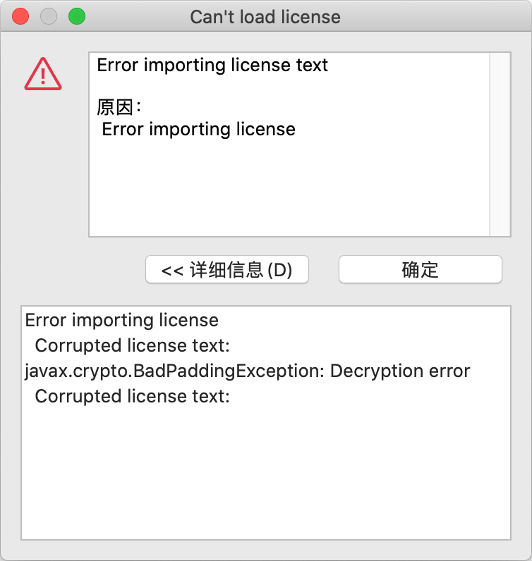

本文生成的激活码和规则只在 [dbeaver-ue-24.0.0-macos-x86_64.dmg](https://dbeaver.com/downloads-ultimate/24.0.0/dbeaver-ue-24.0.0-macos-x86_64.dmg) 中测试通过。根据参考资料 1 的描述 DBeaver 将如何生成 License 的逻辑都放在了 `LMMain` 这个类中，只是这个类的位置发生的变动，在 24.0.0 版本中这个类在 `com.dbeaver.lm.api_3.0.2.202404011634.jar` 包下，完整的类路径为 `com.dbeaver.lm.api.LMMain`。

## 生成自定义的密钥对

生成密钥对的方法来自 `LMMain#generateKeyPair` 方法，DBeaver 密钥对的 `keySize` 为 2048，并且密钥对使用 Base64 编码后被按每行最多 76 个字符显示

```java
import java.security.KeyPair;
import java.security.KeyPairGenerator;
import java.security.NoSuchAlgorithmException;
import java.security.PrivateKey;
import java.security.PublicKey;
import java.security.SecureRandom;
import java.util.Base64;

public class KeyGenerator {
    public static void main(String[] args) throws Exception {
        KeyPair keyPair = generateKeyPair(2048);
        PublicKey publicKey = keyPair.getPublic();
        PrivateKey privateKey = keyPair.getPrivate();
        System.out.println("--- PUBLIC KEY ---");
        System.out.println(splitLines(Base64.getEncoder().encodeToString(publicKey.getEncoded()), 76));
        System.out.println("--- PRIVATE KEY ---");
        System.out.println(splitLines(Base64.getEncoder().encodeToString(privateKey.getEncoded()), 76));
    }

    public static KeyPair generateKeyPair(int keySize) throws NoSuchAlgorithmException {
        KeyPairGenerator keyPairGenerator = KeyPairGenerator.getInstance("RSA");
        SecureRandom secureRandom = SecureRandom.getInstance("SHA1PRNG");
        keyPairGenerator.initialize(keySize, secureRandom);
        return keyPairGenerator.generateKeyPair();
    }

    public static String splitLines(String bigString, int lineLength) {
        return bigString.replaceAll("(.{" + lineLength + "})", "$1\n");
    }
}
```

将生成的公钥和私钥分别保存到 `user-public-key.txt` 和 `user-private-key.txt` 文件中。

## 提取 DBeaver 公钥

在启动 DBeaver 后会显示 No license found 对话框


点击 Import License 按钮会显示 Import License 对话框


随便输入 2 个字符（至少 2 个）后点击 Import 按钮，此时会显示 Can't load license 对话框



现在我们打开 `/Users/nucintosh/Library/DBeaverData/workspace6/.metadata/dbeaver-debug.log` 文件，我们会看到如下的异常日志片段

```text
2024-05-04 14:56:51.534 - DBeaver Ultimate 24.0.0.202404011634 is starting
2024-05-04 14:56:51.534 - OS: Mac OS X 10.15.7 (x86_64)
2024-05-04 14:56:51.535 - Java version: 17.0.2 by Oracle Corporation (64bit)
2024-05-04 14:56:51.535 - Install path: '/Applications/DBeaverUltimate.app/Contents/Eclipse'
2024-05-04 14:56:51.535 - Instance path: 'file:/Users/nucintosh/Library/DBeaverData/workspace6/'
2024-05-04 14:56:51.536 - Memory available 130Mb/2048Mb
2024-05-04 14:56:51.543 - Create display
2024-05-04 14:56:51.686 - Initialize desktop platform...
2024-05-04 14:56:51.826 - BounceCastle bundle found. Use JCE provider BC
> Start Core File Systems [org.eclipse.core.filesystem 1.10.200.v20231102-0934]
> Start Core Resource Management [org.eclipse.core.resources 3.20.0.v20231102-0934]
> Start 小组支持核心 [org.eclipse.team.core 3.10.200.v20231106-1240]
> Start DBeaver PRO Runtime [com.dbeaver.ee.runtime 2.0.154.202404011634]
> Start DBeaver UI Navigator [org.jkiss.dbeaver.ui.navigator 1.0.126.202404011634]
2024-05-04 14:56:52.046 - Initialize base platform...
> Start DBeaver QMDB Core [com.dbeaver.ee.qmdb.core 2.0.154.202404011634]
2024-05-04 14:56:52.078 - Platform initialized (392ms)
> Start DBeaver UI Editors - Base [org.jkiss.dbeaver.ui.editors.base 1.0.126.202404011634]
2024-05-04 14:56:52.117 - Starting instance server at http://localhost:49630
2024-05-04 14:56:52.124 - Run workbench
> Start Equinox Security Default UI [org.eclipse.equinox.security.ui 1.4.100.v20231103-0809]
> Start Eclipse e4 工作台 SWT [org.eclipse.e4.ui.workbench.swt 0.17.200.v20231030-2045]
> Start Eclipse Application Services [org.eclipse.e4.core.services 2.4.200.v20231103-2012]
> Start Eclipse UI Application Services [org.eclipse.e4.ui.services 1.6.200.v20231030-2045]
> Start Eclipse e4 Progress View [org.eclipse.e4.ui.progress 0.4.200.v20231030-2045]
> Start Eclipse Bindings Support [org.eclipse.e4.ui.bindings 0.14.200.v20231030-2045]
> Start Eclipse e4 core commands [org.eclipse.e4.core.commands 1.1.200.v20231108-1058]
> Start EMF XML/XMI Persistence [org.eclipse.emf.ecore.xmi 2.36.0.v20231002-1156]
> Start Eclipse e4 工作台加载项 [org.eclipse.e4.ui.workbench.addons.swt 1.5.200.v20231106-1600]
> Start Eclipse e4 工作台 SWT 呈现器 [org.eclipse.e4.ui.workbench.renderers.swt 0.16.200.v20231030-2045]
> Start Eclipse Dependency Injection Extensions [org.eclipse.e4.core.di.extensions 0.18.100.v20231103-2012]
> Start Eclipse CSS SWT Support [org.eclipse.e4.ui.css.swt 0.15.200.v20231025-0632]
> Start Eclipse CSS SWT Theme Support [org.eclipse.e4.ui.css.swt.theme 0.14.200.v20230913-1724]
> Start 市场客户端主题支持 [org.eclipse.epp.mpc.ui.css 1.10.2.v20231116-1812]
2024-05-04 14:56:54.029 - Configure workbench window
> Start DBeaver SQL Model [org.jkiss.dbeaver.model.sql 1.0.116.202404011634]
2024-05-04 14:56:54.164 - Total database drivers: 141 (141)
> Start 帮助系统核心 [org.eclipse.help 3.10.200.v20231106-1240]
2024-05-04 14:56:54.229 - Disable Eclipse action set 'org.eclipse.ui.edit.text.actionSet.annotationNavigation'
2024-05-04 14:56:54.229 - Disable Eclipse action set 'org.eclipse.ui.WorkingSetActionSet'
2024-05-04 14:56:54.229 - Disable Eclipse action set 'org.eclipse.ui.actionSet.openFiles'
Warning: NLS unused message: dialog_connection_deprecated_description in: org.jkiss.dbeaver.core.CoreResources
Warning: NLS unused message: dialog_connection_deprecated_title in: org.jkiss.dbeaver.core.CoreResources
Warning: NLS unused message: pref_page_ui_general_group_timezone in: org.jkiss.dbeaver.core.CoreResources
> Start jna [com.sun.jna 5.13.0.v20230812-1000]
2024-05-04 14:56:54.570 - Initialize workbench window
2024-05-04 14:56:54.576 - Finish initialization
2024-05-04 14:56:54.577 - Check product license
> Start DBeaver License Manager UI [com.dbeaver.ui.license 2.0.154.202404011634]
2024-05-04 14:56:54.583 - Initialize QMDB...
2024-05-04 14:56:54.586 - 	Initialize license manager for dbeaver-ue
> Start DBeaver JDBC Model [org.jkiss.dbeaver.model.jdbc 1.0.19.202404011634]
> Start DBeaver Generic Plug-in [org.jkiss.dbeaver.ext.generic 2.3.212.202404011634]
> Start DBeaver H2 Model [org.jkiss.dbeaver.ext.h2 1.0.181.202404011634]
2024-05-04 14:56:54.632 - 	Initiate connection pool with management database (H2 Embedded V.2; jdbc:h2:/Users/nucintosh/Library/DBeaverData/workspace6/.metadata/qmdb/qmdb_v2)
2024-05-04 14:56:54.699 - QMDB connected
2024-05-04 14:56:54.977 - 	Check QMDB deployment
> Start DBeaver UI Editors - Data [org.jkiss.dbeaver.ui.editors.data 1.0.126.202404011634]
2024-05-04 14:56:54.987 - 	QMDB server started (H2 2.1.214 (2022-06-13))
> Start GEF Classic Draw2d [org.eclipse.draw2d 3.14.100.202311222042]
> Start GEF Classic GEF (MVC) [org.eclipse.gef 3.16.0.202311222042]
> Start DBeaver ERD UI [org.jkiss.dbeaver.erd.ui 3.0.86.202404011634]
> Start 因特网连接管理 UI [org.eclipse.ui.net 1.5.200.v20231106-1240]
> Start JGit SSH support based on Apache MINA sshd [org.eclipse.jgit.ssh.apache 6.8.0.202311291450-r]
> Start JGit Apache httpclient based HTTP support [org.eclipse.jgit.http.apache 6.8.0.202311291450-r]
> Start JSch 核心 [org.eclipse.jsch.core 1.5.200.v20231106-1240]
> Start Internet Connection Management [org.eclipse.core.net 1.5.200.v20231106-1240]
Warning: NLS unused message: pref_page_sql_editor_group_misc in: org.jkiss.dbeaver.ui.editors.sql.internal.SQLEditorMessages
> Start DBeaver UI Editors - SQL [org.jkiss.dbeaver.ui.editors.sql 1.0.126.202404011634]
> Start DBeaver Sample Database [org.jkiss.dbeaver.ext.sample.database 1.0.163.202404011634]
> Start DBeaver Tip of the day [org.jkiss.dbeaver.ext.ui.tipoftheday 1.0.132.202404011634]
> Start DBeaver ERD Model [org.jkiss.dbeaver.erd.model 1.0.86.202404011634]
> Start 缺省文本编辑器 [org.eclipse.ui.editors 3.17.100.v20231106-1600]
> Start 文本编辑器框架 [org.eclipse.ui.workbench.texteditor 3.17.200.v20231106-1600]
> Start 小组支持 UI [org.eclipse.team.ui 3.10.200.v20231106-1240]
2024-05-04 15:03:02.833 - com.dbeaver.lm.api.LMException: Error importing license
	at com.dbeaver.model.license.embedded.LicenseServiceEmbedded.importProductLicense(LicenseServiceEmbedded.java:125)
	at com.dbeaver.ui.license.LicenseImportDialog.importLicenseFromText(LicenseImportDialog.java:159)
	at com.dbeaver.ui.license.LicenseImportDialog.buttonPressed(LicenseImportDialog.java:247)
	at org.eclipse.jface.dialogs.Dialog.lambda$0(Dialog.java:619)
	at org.eclipse.swt.events.SelectionListener$1.widgetSelected(SelectionListener.java:84)
	at org.eclipse.swt.widgets.TypedListener.handleEvent(TypedListener.java:252)
	at org.eclipse.swt.widgets.EventTable.sendEvent(EventTable.java:89)
	at org.eclipse.swt.widgets.Display.sendEvent(Display.java:4645)
	at org.eclipse.swt.widgets.Widget.sendEvent(Widget.java:1524)
	at org.eclipse.swt.widgets.Widget.sendEvent(Widget.java:1547)
	at org.eclipse.swt.widgets.Widget.sendEvent(Widget.java:1532)
	at org.eclipse.swt.widgets.Widget.notifyListeners(Widget.java:1325)
	at org.eclipse.swt.widgets.Display.runDeferredEvents(Display.java:4412)
	at org.eclipse.swt.widgets.Display.readAndDispatch(Display.java:3988)
	at org.eclipse.jface.window.Window.runEventLoop(Window.java:823)
	at org.eclipse.jface.window.Window.open(Window.java:799)
	at com.dbeaver.ui.license.LicenseManagerUIUtils.importLicense(LicenseManagerUIUtils.java:153)
	at com.dbeaver.ui.license.LicenseManagerUIUtils.importMissingLicenseInUI(LicenseManagerUIUtils.java:117)
	at com.dbeaver.ui.license.LicenseManagerUIUtils.lambda$0(LicenseManagerUIUtils.java:83)
	at org.eclipse.ui.internal.PendingSyncExec.run(PendingSyncExec.java:68)
	at org.eclipse.ui.internal.UILockListener.doPendingWork(UILockListener.java:172)
	at org.eclipse.swt.widgets.RunnableLock.run(RunnableLock.java:40)
	at org.eclipse.swt.widgets.Synchronizer.runAsyncMessages(Synchronizer.java:132)
	at org.eclipse.swt.widgets.Display.runAsyncMessages(Display.java:4367)
	at org.eclipse.swt.widgets.Display.readAndDispatch(Display.java:3990)
	at org.eclipse.e4.ui.internal.workbench.swt.PartRenderingEngine$5.run(PartRenderingEngine.java:1155)
	at org.eclipse.core.databinding.observable.Realm.runWithDefault(Realm.java:342)
	at org.eclipse.e4.ui.internal.workbench.swt.PartRenderingEngine.run(PartRenderingEngine.java:1046)
	at org.eclipse.e4.ui.internal.workbench.E4Workbench.createAndRunUI(E4Workbench.java:155)
	at org.eclipse.ui.internal.Workbench.lambda$3(Workbench.java:648)
	at org.eclipse.core.databinding.observable.Realm.runWithDefault(Realm.java:342)
	at org.eclipse.ui.internal.Workbench.createAndRunWorkbench(Workbench.java:555)
	at org.eclipse.ui.PlatformUI.createAndRunWorkbench(PlatformUI.java:173)
	at org.jkiss.dbeaver.ui.app.standalone.DBeaverApplication.start(DBeaverApplication.java:290)
	at org.eclipse.equinox.internal.app.EclipseAppHandle.run(EclipseAppHandle.java:208)
	at org.eclipse.core.runtime.internal.adaptor.EclipseAppLauncher.runApplication(EclipseAppLauncher.java:136)
	at org.eclipse.core.runtime.internal.adaptor.EclipseAppLauncher.start(EclipseAppLauncher.java:104)
	at org.eclipse.core.runtime.adaptor.EclipseStarter.run(EclipseStarter.java:402)
	at org.eclipse.core.runtime.adaptor.EclipseStarter.run(EclipseStarter.java:255)
	at java.base/jdk.internal.reflect.NativeMethodAccessorImpl.invoke0(Native Method)
	at java.base/jdk.internal.reflect.NativeMethodAccessorImpl.invoke(NativeMethodAccessorImpl.java:77)
	at java.base/jdk.internal.reflect.DelegatingMethodAccessorImpl.invoke(DelegatingMethodAccessorImpl.java:43)
	at java.base/java.lang.reflect.Method.invoke(Method.java:568)
	at org.eclipse.equinox.launcher.Main.invokeFramework(Main.java:666)
	at org.eclipse.equinox.launcher.Main.basicRun(Main.java:603)
	at org.eclipse.equinox.launcher.Main.run(Main.java:1487)
Caused by: com.dbeaver.lm.api.LMException: Corrupted license text:
javax.crypto.BadPaddingException: Decryption error
	at com.dbeaver.lm.api.LMLicense.<init>(LMLicense.java:127)
	at com.dbeaver.lm.api.LMLicenseManager.importLicense(LMLicenseManager.java:161)
	at com.dbeaver.model.license.embedded.LicenseServiceEmbedded.importProductLicense(LicenseServiceEmbedded.java:120)
	... 45 more
2024-05-04 15:03:02.837 - Corrupted license text:
javax.crypto.BadPaddingException: Decryption error
com.dbeaver.lm.api.LMException: Corrupted license text:
javax.crypto.BadPaddingException: Decryption error
	at com.dbeaver.lm.api.LMLicense.<init>(LMLicense.java:127)
	at com.dbeaver.lm.api.LMLicenseManager.importLicense(LMLicenseManager.java:161)
	at com.dbeaver.model.license.embedded.LicenseServiceEmbedded.importProductLicense(LicenseServiceEmbedded.java:120)
	at com.dbeaver.ui.license.LicenseImportDialog.importLicenseFromText(LicenseImportDialog.java:159)
	at com.dbeaver.ui.license.LicenseImportDialog.buttonPressed(LicenseImportDialog.java:247)
	at org.eclipse.jface.dialogs.Dialog.lambda$0(Dialog.java:619)
	at org.eclipse.swt.events.SelectionListener$1.widgetSelected(SelectionListener.java:84)
	at org.eclipse.swt.widgets.TypedListener.handleEvent(TypedListener.java:252)
	at org.eclipse.swt.widgets.EventTable.sendEvent(EventTable.java:89)
	at org.eclipse.swt.widgets.Display.sendEvent(Display.java:4645)
	at org.eclipse.swt.widgets.Widget.sendEvent(Widget.java:1524)
	at org.eclipse.swt.widgets.Widget.sendEvent(Widget.java:1547)
	at org.eclipse.swt.widgets.Widget.sendEvent(Widget.java:1532)
	at org.eclipse.swt.widgets.Widget.notifyListeners(Widget.java:1325)
	at org.eclipse.swt.widgets.Display.runDeferredEvents(Display.java:4412)
	at org.eclipse.swt.widgets.Display.readAndDispatch(Display.java:3988)
	at org.eclipse.jface.window.Window.runEventLoop(Window.java:823)
	at org.eclipse.jface.window.Window.open(Window.java:799)
	at com.dbeaver.ui.license.LicenseManagerUIUtils.importLicense(LicenseManagerUIUtils.java:153)
	at com.dbeaver.ui.license.LicenseManagerUIUtils.importMissingLicenseInUI(LicenseManagerUIUtils.java:117)
	at com.dbeaver.ui.license.LicenseManagerUIUtils.lambda$0(LicenseManagerUIUtils.java:83)
	at org.eclipse.ui.internal.PendingSyncExec.run(PendingSyncExec.java:68)
	at org.eclipse.ui.internal.UILockListener.doPendingWork(UILockListener.java:172)
	at org.eclipse.swt.widgets.RunnableLock.run(RunnableLock.java:40)
	at org.eclipse.swt.widgets.Synchronizer.runAsyncMessages(Synchronizer.java:132)
	at org.eclipse.swt.widgets.Display.runAsyncMessages(Display.java:4367)
	at org.eclipse.swt.widgets.Display.readAndDispatch(Display.java:3990)
	at org.eclipse.e4.ui.internal.workbench.swt.PartRenderingEngine$5.run(PartRenderingEngine.java:1155)
	at org.eclipse.core.databinding.observable.Realm.runWithDefault(Realm.java:342)
	at org.eclipse.e4.ui.internal.workbench.swt.PartRenderingEngine.run(PartRenderingEngine.java:1046)
	at org.eclipse.e4.ui.internal.workbench.E4Workbench.createAndRunUI(E4Workbench.java:155)
	at org.eclipse.ui.internal.Workbench.lambda$3(Workbench.java:648)
	at org.eclipse.core.databinding.observable.Realm.runWithDefault(Realm.java:342)
	at org.eclipse.ui.internal.Workbench.createAndRunWorkbench(Workbench.java:555)
	at org.eclipse.ui.PlatformUI.createAndRunWorkbench(PlatformUI.java:173)
	at org.jkiss.dbeaver.ui.app.standalone.DBeaverApplication.start(DBeaverApplication.java:290)
	at org.eclipse.equinox.internal.app.EclipseAppHandle.run(EclipseAppHandle.java:208)
	at org.eclipse.core.runtime.internal.adaptor.EclipseAppLauncher.runApplication(EclipseAppLauncher.java:136)
	at org.eclipse.core.runtime.internal.adaptor.EclipseAppLauncher.start(EclipseAppLauncher.java:104)
	at org.eclipse.core.runtime.adaptor.EclipseStarter.run(EclipseStarter.java:402)
	at org.eclipse.core.runtime.adaptor.EclipseStarter.run(EclipseStarter.java:255)
	at java.base/jdk.internal.reflect.NativeMethodAccessorImpl.invoke0(Native Method)
	at java.base/jdk.internal.reflect.NativeMethodAccessorImpl.invoke(NativeMethodAccessorImpl.java:77)
	at java.base/jdk.internal.reflect.DelegatingMethodAccessorImpl.invoke(DelegatingMethodAccessorImpl.java:43)
	at java.base/java.lang.reflect.Method.invoke(Method.java:568)
	at org.eclipse.equinox.launcher.Main.invokeFramework(Main.java:666)
	at org.eclipse.equinox.launcher.Main.basicRun(Main.java:603)
	at org.eclipse.equinox.launcher.Main.run(Main.java:1487)
```

我们找到第一次出现异常的地方，即

```text
2024-05-04 15:03:02.833 - com.dbeaver.lm.api.LMException: Error importing license
	at com.dbeaver.model.license.embedded.LicenseServiceEmbedded.importProductLicense(LicenseServiceEmbedded.java:125)
	at com.dbeaver.ui.license.LicenseImportDialog.importLicenseFromText(LicenseImportDialog.java:159)
	at com.dbeaver.ui.license.LicenseImportDialog.buttonPressed(LicenseImportDialog.java:247)
```

从这部分异常日志片段我们发现出错的地方为 `LicenseServiceEmbedded` 类的 `importProductLicense` 方法，这个类在 `com.dbeaver.model.license_2.0.154.202404011634.jar` 包里

```java
public LMLicense importProductLicense(String licenseText) throws LMException {
    try {
        byte[] licenseData = LMUtils.readEncryptedString(new StringReader(licenseText.trim()));
        return licenseManager.importLicense(DBPApplicationLicensed.getLicensedApplication().getLicenseProduct(), this.getClientId(), licenseData);
    } catch (Exception var3) {
        throw new LMException("Error importing license", var3);
    }
}
```

这个方法的 `licenseText` 参数即用户输入的 License，它是一个 Base64 的字符串。接下来我们来看这个方法调用的 `LMLicenseManager` 类的 `importLicense` 方法，这个类在 `com.dbeaver.lm.api_3.0.2.202404011634.jar` 包里

```java
public LMLicense importLicense(@NotNull LMProduct product, @NotNull String clientId, @NotNull byte[] licenseData) throws LMException {
    Key decryptionKey = this.keyProvider.getDecryptionKey(product);
    if (decryptionKey == null) {
        throw new LMException("Product '" + product.getId() + "' decryption key not found");
    } else {
        LMLicense license = new LMLicense(licenseData, decryptionKey);
        if (this.validator != null) {
            this.validator.validateLicense(this, clientId, product, license);
            LMLicense updatedLicense = this.getValidProductLicense(clientId, product);
            if (updatedLicense != null && updatedLicense.getLicenseId().equals(license.getLicenseId())) {
                return updatedLicense;
            }
        }

        this.importLicense(product, license);
        return license;
    }
}
```

这个方法调用了 `LMKeyProvider` 接口的 `getDecryptionKey` 方法来获取解密密钥，这个接口在 `com.dbeaver.lm.api_3.0.2.202404011634.jar` 包里。`LMKeyProvider` 接口有两个实现，一个是 `LicenseKeyProviderEmbedded` 类，在 `com.dbeaver.model.license_2.0.154.202404011634.jar` 包里；一个是 `LMMain` 类里的 `importLicense` 方法里的匿名实现。当前我们关心的是 `LicenseKeyProviderEmbedded` 实现类

```java
public Key getDecryptionKey(LMProduct product) {
    String id = product.getId();
    String resourceName = "keys/" + id + "-public.key";
    URL keyURL = ApplicationRegistry.getInstance().getApplication().getContributorBundle().getResource(resourceName);
    if (keyURL != null) {
        try {
            Throwable var5 = null;
            Object var6 = null;

            try {
                InputStream keyStream = keyURL.openStream();

                PublicKey var10000;
                try {
                    byte[] keyData = LMUtils.readEncryptedString(keyStream);
                    var10000 = LMEncryption.generatePublicKey(keyData);
                } finally {
                    if (keyStream != null) {
                        keyStream.close();
                    }

                }

                return var10000;
            } catch (Throwable var16) {
                if (var5 == null) {
                    var5 = var16;
                } else if (var5 != var16) {
                    var5.addSuppressed(var16);
                }

                throw var5;
            }
        } catch (Exception var17) {
            log.error(var17);
            return null;
        }
    } else {
        log.error("Public key file not found for product " + id);
        return null;
    }
}
```

从这个方法的前两行可以看到解密密钥保存在某个 jar 包的 `keys` 目录下并以 `-public.key` 结尾。经过搜索发现这个文件在 `com.dbeaver.app.ultimate_24.0.0.202404011634.jar` 包下，文件名为 `dbeaver-ue-public.key`。从这个文件名也可以知道产品的 `id` 为 `dbeaver-ue`。`dbeaver-ue-public.key` 文件的内容为

```text
--- PUBLIC KEY ---
MIIBIjANBgkqhkiG9w0BAQEFAAOCAQ8AMIIBCgKCAQEAk7ciFU/aUCIgH5flBbGD0t7B3KOmfL0l
BMf2ENuLA0w/T8A1RvteUYk2EQo3UrZ7kMZ8rK93nmDjituN7jlv/bsxGyAox87BbKYSs9oH5f9P
hYHAiTE0PxoMODnl4NgR+Bpc+Ath8wDLHMC+BzYkOy4JQo8EX/ff58TT9UYP8eoDeGdSxQmW3FJC
i82UiC5zIk75dx20Al9ql0fdxnzo31q/2MbnNCAfSchsqrKtzBtheex4JvvqZjxn98wk5Te1QgZz
Caz4ay9dkLVjSt79QYm5hKb8Jt3O5SxSUsrjmYVeG+k2bQlidw8dENwLZmvJkIJi8kb94yEwY/dq
lENDkQIDAQAB
```

将文件内容保存到 `dbeaver-ue-public-key.txt` 文件中。

## 生成 DBeaver 激活码

为了生成激活码我们需要几个辅助类，它们都来自 `com.dbeaver.lm.api_3.0.2.202404011634.jar` 包。

第一个是 `LicenseType`，它定义了各种 License 类型枚举

```java
public enum LicenseType {
    STANDARD('S', "Yearly subscription", true, true),
    YEAR_UPDATE('Y', "Perpetual", false, false),
    YEAR_CORPORATE('C', "Corporate", false, false),
    ULTIMATE('U', "Ultimate", false, false),
    LIMITED('L', "Limited", true, true),
    PARTNER('P', "Technical partner", false, false),
    TRIAL('T', "Trial", true, true),
    ACADEMIC('A', "Academic", true, true),
    TEAM('M', "Yearly subscription (Team)", true, true),
    CUSTOM('X', "Custom", false, false);

    private final char id;
    private final String displayName;
    private boolean isExtendable;
    private boolean needsEndTime;

    private LicenseType(char id, String displayName, boolean isExtendable, boolean needsEndTime) {
        this.id = id;
        this.displayName = displayName;
        this.isExtendable = isExtendable;
        this.needsEndTime = needsEndTime;
    }

    public byte getId() {
        return (byte) this.id;
    }

    public String getDisplayName() {
        return this.displayName;
    }

    public boolean isExtendable() {
        return this.isExtendable;
    }

    public boolean needsEndTime() {
        return this.needsEndTime;
    }
}
```

第二个是 `LicenseFormat`，它定义了各种 License 格式枚举

```java
public enum LicenseFormat {
    STANDARD((byte) 0, 218, "Initial basic license format"),
    EXTENDED((byte) 1, 238, "Extended format with owner email and corporate license info"),
    ADVANCED((byte) 2, 490, "Advanced format for role-based licenses");

    private final byte id;
    private final int encryptedLength;
    private final String description;

    private LicenseFormat(byte id, int encryptedLength, String description) {
        this.id = id;
        this.encryptedLength = encryptedLength;
        this.description = description;
    }

    public byte getId() {
        return this.id;
    }

    public String getDescription() {
        return this.description;
    }

    public int getEncryptedLength() {
        return this.encryptedLength;
    }
}
```

第三个是 `License`，它定义了 License 包含哪些内容

```java
import java.io.ByteArrayOutputStream;
import java.nio.ByteBuffer;
import java.nio.charset.StandardCharsets;
import java.util.Arrays;
import java.util.Date;

public class License {
    public static final long FLAG_NONE = 0L;
    public static final long FLAG_ROLE_BASED = 1L;
    public static final long FLAG_CANCELED = 2L;
    public static final long FLAG_RESELLER = 4L;
    public static final long FLAG_SUBSCRIPTION = 8L;
    public static final long FLAG_LIMITED = 16L;
    public static final long FLAG_LIMITED_VERSION = 32L;
    public static final long FLAG_SERVER_LICENSE = 64L;
    public static final long FLAG_UNLIMITED_USERS = 256L;
    public static final long FLAG_UNLIMITED_TIME = 512L;
    public static final long FLAG_UNLIMITED_SERVERS = 1024L;
    public static final long FLAG_MULTI_INSTANCE = 2048L;

    private final String licenseId;
    private final LicenseType licenseType;
    private final Date licenseIssueTime;
    private final Date licenseStartTime;
    private final Date licenseEndTime;
    private long flags;
    private final String productId;
    private final String productVersion;
    private final String ownerId;
    private final String ownerCompany;
    private final String ownerName;
    private String ownerEmail;
    private byte yearsNumber;
    private byte reserved1;
    private short usersNumber;
    private LicenseFormat licenseFormat;

    public License(String licenseId, LicenseType licenseType, Date licenseIssueTime, Date licenseStartTime, Date licenseEndTime, long flags, String productId, String productVersion, String ownerId, String ownerCompany, String ownerName, String ownerEmail) {
        this.licenseFormat = (flags & 1L) != 0L ? LicenseFormat.ADVANCED : LicenseFormat.EXTENDED;
        this.licenseId = licenseId;
        this.licenseType = licenseType;
        this.licenseIssueTime = licenseIssueTime;
        this.licenseStartTime = licenseStartTime;
        this.licenseEndTime = licenseEndTime;
        this.flags = flags;
        this.productId = productId;
        this.productVersion = productVersion;
        this.ownerId = ownerId;
        this.ownerCompany = ownerCompany;
        this.ownerName = ownerName;
        this.ownerEmail = ownerEmail;
        this.yearsNumber = 1;
        this.reserved1 = 0;
        this.usersNumber = 1;
    }

    public byte[] getData() {
        ByteArrayOutputStream output = new ByteArrayOutputStream(this.licenseFormat.getEncryptedLength());
        output.write(this.licenseFormat.getId());
        writeStringToBuffer(output, this.licenseId, 16);
        output.write(this.licenseType.getId());
        writeDateToBuffer(output, this.licenseIssueTime);
        writeDateToBuffer(output, this.licenseStartTime);
        writeDateToBuffer(output, this.licenseEndTime);
        writeLongToBuffer(output, this.flags);
        writeStringToBuffer(output, this.productId, 16);
        writeStringToBuffer(output, this.productVersion, 8);
        writeStringToBuffer(output, this.ownerId, 16);
        writeStringToBuffer(output, this.ownerCompany, 64);
        if (this.licenseFormat == LicenseFormat.STANDARD) {
            writeStringToBuffer(output, this.ownerName, 64);
        } else {
            writeStringToBuffer(output, this.ownerName, 32);
            writeStringToBuffer(output, this.ownerEmail, 48);
            output.write(this.yearsNumber);
            output.write(this.reserved1);
            writeShortToBuffer(output, this.usersNumber);
        }

        return output.toByteArray();
    }

    public void writeStringToBuffer(ByteArrayOutputStream output, String value, int length) {
        output.writeBytes(getStringData(value, length));
    }

    public void writeDateToBuffer(ByteArrayOutputStream output, Date date) {
        long value = date == null ? 0L : date.getTime();
        writeLongToBuffer(output, value);
    }

    public byte[] getStringData(String value, int length) {
        byte[] bytes = value == null ? new byte[0] : value.getBytes(StandardCharsets.UTF_8);
        byte[] data = Arrays.copyOf(bytes, length);
        Arrays.fill(data, Math.min(bytes.length, length), length, (byte) 32);
        return data;
    }

    public void writeLongToBuffer(ByteArrayOutputStream output, long value) {
        ByteBuffer buffer = ByteBuffer.wrap(new byte[8]);
        buffer.putLong(value);
        output.writeBytes(buffer.array());
    }

    public void writeShortToBuffer(ByteArrayOutputStream output, short value) {
        ByteBuffer buffer = ByteBuffer.wrap(new byte[2]);
        buffer.putShort(value);
        output.writeBytes(buffer.array());
    }
}
```

生成激活码的代码主要逻辑来自 `LMMain#encryptLicense` 方法，部分方法来自 `LMUtils` 和 `LMEncryption` 类

```java
import javax.crypto.BadPaddingException;
import javax.crypto.Cipher;
import javax.crypto.IllegalBlockSizeException;
import javax.crypto.NoSuchPaddingException;
import java.io.BufferedReader;
import java.io.ByteArrayOutputStream;
import java.io.FileInputStream;
import java.io.IOException;
import java.io.InputStream;
import java.io.InputStreamReader;
import java.security.InvalidKeyException;
import java.security.Key;
import java.security.KeyFactory;
import java.security.NoSuchAlgorithmException;
import java.security.PrivateKey;
import java.security.spec.InvalidKeySpecException;
import java.security.spec.PKCS8EncodedKeySpec;
import java.util.Arrays;
import java.util.Base64;
import java.util.Date;

public class LicenseGenerator {
    public static void main(String[] args) throws IOException, NoSuchAlgorithmException, InvalidKeySpecException, NoSuchPaddingException, IllegalBlockSizeException, BadPaddingException, InvalidKeyException {
        PrivateKey privateKey = readPrivateKey("user-private-key.txt");

        License license = new License("JL-0FB16-000A2GC", LicenseType.ULTIMATE, new Date(), new Date(), null, License.FLAG_UNLIMITED_SERVERS, "dbeaver-ue", "24.0", "10000", "Linux DO", "zhuma", "zhuma@linux.do");
        byte[] licenseData = license.getData();
        byte[] licenseEncrypted = encrypt(licenseData, privateKey);
        String licenseBase64 = splitLines(Base64.getEncoder().encodeToString(licenseEncrypted), 76);
        System.out.println("--- LICENSE ---");
        System.out.println(licenseBase64);
    }

    public static PrivateKey readPrivateKey(String filename) throws IOException, NoSuchAlgorithmException, InvalidKeySpecException {
        try (FileInputStream fis = new FileInputStream(filename)) {
            byte[] bytes = readEncryptedString(fis);
            return generatePrivateKey(bytes);
        }
    }

    public static byte[] readEncryptedString(InputStream stream) throws IOException {
        try (BufferedReader reader = new BufferedReader(new InputStreamReader(stream))) {
            StringBuilder result = new StringBuilder(4000);
            while (true) {
                String line = reader.readLine();
                if (line == null || line.isEmpty()) {
                    return Base64.getDecoder().decode(result.toString());
                }

                if (!line.startsWith("-") && !line.startsWith("#")) {
                    result.append(line);
                }
            }
        }
    }

    public static PrivateKey generatePrivateKey(byte[] privateKeyBytes) throws NoSuchAlgorithmException, InvalidKeySpecException {
        KeyFactory keyFactory = KeyFactory.getInstance("RSA");
        PKCS8EncodedKeySpec privateKeySpec = new PKCS8EncodedKeySpec(privateKeyBytes);
        return keyFactory.generatePrivate(privateKeySpec);
    }

    public static byte[] encrypt(byte[] data, Key key) throws NoSuchPaddingException, IllegalBlockSizeException, NoSuchAlgorithmException, BadPaddingException, IOException, InvalidKeyException {
        return cipherAsymmetric(data, key, 1);
    }

    public static byte[] cipherAsymmetric(byte[] data, Key key, int mode) throws NoSuchPaddingException, NoSuchAlgorithmException, InvalidKeyException, IllegalBlockSizeException, BadPaddingException, IOException {
        ByteArrayOutputStream buffer = new ByteArrayOutputStream();
        int chunkSize = mode == 2 ? 256 : 245;
        int chunkCount = data.length / chunkSize;
        if (data.length % chunkSize > 0) {
            ++chunkCount;
        }

        Cipher cipher = Cipher.getInstance("RSA/ECB/PKCS1Padding");

        for (int i = 0; i < chunkCount; ++i) {
            cipher.init(mode, key);
            int offset = i * chunkSize;
            int length = chunkSize;
            if (offset + chunkSize > data.length) {
                length = data.length - chunkSize * i;
            }

            byte[] segment = Arrays.copyOfRange(data, offset, offset + length);
            byte[] segmentEncrypted = cipher.doFinal(segment);
            buffer.write(segmentEncrypted);
        }

        return buffer.toByteArray();
    }

    public static String splitLines(String bigString, int lineLength) {
        return bigString.replaceAll("(.{" + lineLength + "})", "$1\n");
    }
}
```

如果后续升级 DBeaver 版本，更新 `License` 类的产品 ID（`productId`） 和产品版本（`productVersion`）应该就可以了。

## 生成 Power 规则

生成 Power 规则的代码来自 `LMMain`、`LMUtils` 和 `LMEncryption` 类

```java
import java.io.BufferedReader;
import java.io.FileInputStream;
import java.io.IOException;
import java.io.InputStream;
import java.io.InputStreamReader;
import java.security.KeyFactory;
import java.security.NoSuchAlgorithmException;
import java.security.PublicKey;
import java.security.interfaces.RSAPublicKey;
import java.security.spec.InvalidKeySpecException;
import java.security.spec.X509EncodedKeySpec;
import java.util.Base64;

public class RuleGenerator {
    public static void main(String[] args) throws IOException, NoSuchAlgorithmException, InvalidKeySpecException {
        RSAPublicKey userPublicKey = (RSAPublicKey) readPublicKey("user-public-key.txt");
        RSAPublicKey dbeaverPublicKey = (RSAPublicKey) readPublicKey("dbeaver-ue-public-key.txt");

        String rule = "EQUAL,65537," + dbeaverPublicKey.getModulus() + "->65537," + userPublicKey.getModulus();
        System.out.println("--- POWER RULE ---");
        System.out.println(rule);
    }

    private static PublicKey readPublicKey(String filename) throws IOException, NoSuchAlgorithmException, InvalidKeySpecException {
        try (FileInputStream fis = new FileInputStream(filename)) {
            byte[] bytes = readEncryptedString(fis);
            return generatePublicKey(bytes);
        }
    }

    public static byte[] readEncryptedString(InputStream stream) throws IOException {
        try (BufferedReader reader = new BufferedReader(new InputStreamReader(stream))) {
            StringBuilder result = new StringBuilder(4000);
            while (true) {
                String line = reader.readLine();
                if (line == null || line.isEmpty()) {
                    return Base64.getDecoder().decode(result.toString());
                }

                if (!line.startsWith("-") && !line.startsWith("#")) {
                    result.append(line);
                }
            }
        }
    }

    public static PublicKey generatePublicKey(byte[] publicKeyBytes) throws NoSuchAlgorithmException, InvalidKeySpecException {
        KeyFactory keyFactory = KeyFactory.getInstance("RSA");
        X509EncodedKeySpec publicKeySpec = new X509EncodedKeySpec(publicKeyBytes);
        return keyFactory.generatePublic(publicKeySpec);
    }
}
```

将生成的规则增加到 ja-netfilter 的 `power.conf` 文件的 `[Args]` 一节中即可。

## 激活 DBeaver

### 替换 JRE

根据参考资料 3 我们知道 DBeaver 的 JRE 被人为阉割过，需要替换为我们自己的 JRE。方法是替换 `/Applications/DBeaverUltimate.app/Contents/Eclipse/dbeaver.ini` 文件中 `-vm` 项，比如改为

```text
-vm
/Library/Java/JavaVirtualMachines/jdk-17.0.2.jdk/Contents/Home/bin/java
```

### 配置 javaagent

在 `/Applications/DBeaverUltimate.app/Contents/Eclipse/dbeaver.ini` 文件末尾增加如下内容

```text
--add-opens=java.base/jdk.internal.org.objectweb.asm=ALL-UNNAMED
--add-opens=java.base/jdk.internal.org.objectweb.asm.tree=ALL-UNNAMED
-javaagent:/Users/nucintosh/janetfilter/jetbra/ja-netfilter.jar=jetbrains
```

### 配置 power.conf

在 `power.conf` 文件的 `[Args]` 一节中增加 `RuleGenerator` 生成的规则，比如

```text
EQUAL,65537,18647337145970099840985713466364918234362046859276071603267794715593136936160492846272521898537004122925301027678489984501477994730537725810211014632147698623617755644615810363782781403177803009057237675193508609212761456687315887698721555027495273857704703161501556278932648428860647172378607605329884151219327938607350280135400521619196335682733371571813479415591793504469016713220060778679994845066654727814845227443267965199130452466305398985400201871520156163836666885179554470299593371783155887571488588786209640709589687137547072170350760576933982430617266249638449664790360846298962977961246175829506878817169->65537,26568176594452198874357955233081865355601482575454463708433306578459030820569735111660768507557691552912716777149966830516251509872885609614711295305581089270555091503264286693743745315059054820199160842222042189849689922692298273645936389982899317988537289718057741782081574951312275856190235441646123049577974991407616013276510427782805925379988038959945798382561302135542700860204474353714516664853954768210723310513114678397057324482615339456351078381638951155512135128405408033884232379809701908270283694138677289134377234340940696655420259553525375619972769383153649791856349266450908175059345382153220830798463
```

### 输入激活码

在 DBeaver 的 Import License 窗口填入生成的激活，比如

```text
Dm3qISOS+h8eu4kliBh+K6WXzIxIx03rKg6F/NxE7WqCw9HVN0/uxpGFvi8+EI2/ZGu/eDOQbirU
Y8dk2NTCekvzKldoJgPPSKFsvUUFCUp6iVtgtTeD4ddvJS6HQzXM9R+P8dR0f4v38yUGuTsU8PCv
RXfoQTXtSxkdYF4v/8bEELPf4qmnYgs7HWbcvq2YYVK2dokYxaV4F0X5oM5Tv1BsHlPqI8Dh8OHm
Nj8FkYZ1zErqZ+2zFh3b+m6XE9IHOxf3X+5HEF+0esq1J1NtyRGuoA2dIPkIoOX1zXaZkKgxFKrc
L5xn/kcqnqPiBJMg7y7AIYV9+DgE76Vv+m1PYQ==
```

我们并没有一次性成功


此时 `/Users/nucintosh/Library/DBeaverData/workspace6/.metadata/dbeaver-debug.log` 的内容为

```text
2024-05-04 17:05:44.145 - DBeaver Ultimate 24.0.0.202404011634 is starting
2024-05-04 17:05:44.146 - OS: Mac OS X 10.15.7 (x86_64)
2024-05-04 17:05:44.146 - Java version: 17.0.2 by Oracle Corporation (64bit)
2024-05-04 17:05:44.146 - Install path: '/Applications/DBeaverUltimate.app/Contents/Eclipse'
2024-05-04 17:05:44.146 - Instance path: 'file:/Users/nucintosh/Library/DBeaverData/workspace6/'
2024-05-04 17:05:44.148 - Memory available 130Mb/2048Mb
2024-05-04 17:05:44.154 - Create display
2024-05-04 17:05:44.308 - Initialize desktop platform...
2024-05-04 17:05:44.438 - BounceCastle bundle found. Use JCE provider BC
> Start Core File Systems [org.eclipse.core.filesystem 1.10.200.v20231102-0934]
> Start Core Resource Management [org.eclipse.core.resources 3.20.0.v20231102-0934]
> Start 小组支持核心 [org.eclipse.team.core 3.10.200.v20231106-1240]
> Start DBeaver PRO Runtime [com.dbeaver.ee.runtime 2.0.154.202404011634]
> Start DBeaver UI Navigator [org.jkiss.dbeaver.ui.navigator 1.0.126.202404011634]
2024-05-04 17:05:44.659 - Initialize base platform...
> Start DBeaver QMDB Core [com.dbeaver.ee.qmdb.core 2.0.154.202404011634]
2024-05-04 17:05:44.688 - Platform initialized (380ms)
> Start DBeaver UI Editors - Base [org.jkiss.dbeaver.ui.editors.base 1.0.126.202404011634]
2024-05-04 17:05:44.880 - Error accessing instance server: java.net.ConnectException
2024-05-04 17:05:44.897 - Starting instance server at http://localhost:61155
2024-05-04 17:05:44.904 - Run workbench
> Start Equinox Security Default UI [org.eclipse.equinox.security.ui 1.4.100.v20231103-0809]
> Start Eclipse e4 工作台 SWT [org.eclipse.e4.ui.workbench.swt 0.17.200.v20231030-2045]
> Start Eclipse Application Services [org.eclipse.e4.core.services 2.4.200.v20231103-2012]
> Start Eclipse UI Application Services [org.eclipse.e4.ui.services 1.6.200.v20231030-2045]
> Start Eclipse e4 Progress View [org.eclipse.e4.ui.progress 0.4.200.v20231030-2045]
> Start Eclipse Bindings Support [org.eclipse.e4.ui.bindings 0.14.200.v20231030-2045]
> Start Eclipse e4 core commands [org.eclipse.e4.core.commands 1.1.200.v20231108-1058]
> Start EMF XML/XMI Persistence [org.eclipse.emf.ecore.xmi 2.36.0.v20231002-1156]
> Start Eclipse e4 工作台加载项 [org.eclipse.e4.ui.workbench.addons.swt 1.5.200.v20231106-1600]
> Start Eclipse e4 工作台 SWT 呈现器 [org.eclipse.e4.ui.workbench.renderers.swt 0.16.200.v20231030-2045]
> Start Eclipse Dependency Injection Extensions [org.eclipse.e4.core.di.extensions 0.18.100.v20231103-2012]
> Start Eclipse CSS SWT Support [org.eclipse.e4.ui.css.swt 0.15.200.v20231025-0632]
> Start Eclipse CSS SWT Theme Support [org.eclipse.e4.ui.css.swt.theme 0.14.200.v20230913-1724]
> Start 市场客户端主题支持 [org.eclipse.epp.mpc.ui.css 1.10.2.v20231116-1812]
2024-05-04 17:05:46.810 - Configure workbench window
> Start DBeaver SQL Model [org.jkiss.dbeaver.model.sql 1.0.116.202404011634]
2024-05-04 17:05:46.933 - Total database drivers: 141 (141)
> Start 帮助系统核心 [org.eclipse.help 3.10.200.v20231106-1240]
2024-05-04 17:05:46.997 - Disable Eclipse action set 'org.eclipse.ui.edit.text.actionSet.annotationNavigation'
2024-05-04 17:05:46.997 - Disable Eclipse action set 'org.eclipse.ui.WorkingSetActionSet'
2024-05-04 17:05:46.997 - Disable Eclipse action set 'org.eclipse.ui.actionSet.openFiles'
Warning: NLS unused message: dialog_connection_deprecated_description in: org.jkiss.dbeaver.core.CoreResources
Warning: NLS unused message: dialog_connection_deprecated_title in: org.jkiss.dbeaver.core.CoreResources
Warning: NLS unused message: pref_page_ui_general_group_timezone in: org.jkiss.dbeaver.core.CoreResources
> Start jna [com.sun.jna 5.13.0.v20230812-1000]
2024-05-04 17:05:47.126 - Open [https://stats.dbeaver.com/send-statistics?session=041e35a1-698c-40ee-9778-395c5243ad20&time=1714805816]
2024-05-04 17:05:47.349 - Initialize workbench window
2024-05-04 17:05:47.355 - Finish initialization
2024-05-04 17:05:47.356 - Check product license
> Start DBeaver License Manager UI [com.dbeaver.ui.license 2.0.154.202404011634]
2024-05-04 17:05:47.376 - Initialize QMDB...
2024-05-04 17:05:47.379 - 	Initialize license manager for dbeaver-ue
> Start DBeaver JDBC Model [org.jkiss.dbeaver.model.jdbc 1.0.19.202404011634]
> Start DBeaver Generic Plug-in [org.jkiss.dbeaver.ext.generic 2.3.212.202404011634]
> Start DBeaver H2 Model [org.jkiss.dbeaver.ext.h2 1.0.181.202404011634]
2024-05-04 17:05:47.424 - 	Initiate connection pool with management database (H2 Embedded V.2; jdbc:h2:/Users/nucintosh/Library/DBeaverData/workspace6/.metadata/qmdb/qmdb_v2)
2024-05-04 17:05:47.494 - QMDB connected
> Start DBeaver UI Editors - Data [org.jkiss.dbeaver.ui.editors.data 1.0.126.202404011634]
> Start GEF Classic Draw2d [org.eclipse.draw2d 3.14.100.202311222042]
> Start GEF Classic GEF (MVC) [org.eclipse.gef 3.16.0.202311222042]
2024-05-04 17:05:47.796 - 	Check QMDB deployment
> Start DBeaver ERD UI [org.jkiss.dbeaver.erd.ui 3.0.86.202404011634]
2024-05-04 17:05:47.816 - 	QMDB server started (H2 2.1.214 (2022-06-13))
> Start 因特网连接管理 UI [org.eclipse.ui.net 1.5.200.v20231106-1240]
> Start JGit SSH support based on Apache MINA sshd [org.eclipse.jgit.ssh.apache 6.8.0.202311291450-r]
> Start JGit Apache httpclient based HTTP support [org.eclipse.jgit.http.apache 6.8.0.202311291450-r]
> Start JSch 核心 [org.eclipse.jsch.core 1.5.200.v20231106-1240]
> Start Internet Connection Management [org.eclipse.core.net 1.5.200.v20231106-1240]
2024-05-04 17:05:48.127 - Statistics sent (OK)
Warning: NLS unused message: pref_page_sql_editor_group_misc in: org.jkiss.dbeaver.ui.editors.sql.internal.SQLEditorMessages
> Start DBeaver UI Editors - SQL [org.jkiss.dbeaver.ui.editors.sql 1.0.126.202404011634]
> Start DBeaver Sample Database [org.jkiss.dbeaver.ext.sample.database 1.0.163.202404011634]
> Start DBeaver Tip of the day [org.jkiss.dbeaver.ext.ui.tipoftheday 1.0.132.202404011634]
> Start DBeaver ERD Model [org.jkiss.dbeaver.erd.model 1.0.86.202404011634]
> Start 缺省文本编辑器 [org.eclipse.ui.editors 3.17.100.v20231106-1600]
> Start 文本编辑器框架 [org.eclipse.ui.workbench.texteditor 3.17.200.v20231106-1600]
> Start 小组支持 UI [org.eclipse.team.ui 3.10.200.v20231106-1240]
> Start DBeaver Remote Client Model [com.dbeaver.remote.client 1.0.44.202404011634]
> Start DBeaver Security Manager Model [org.jkiss.dbeaver.model.sm 1.0.33.202404011634]
2024-05-04 17:06:07.983 - --> Call: https://dbeaver.com:443/lmp/checkLicense
2024-05-04 17:06:10.272 - com.dbeaver.lm.api.LMException: Error importing license
	at com.dbeaver.model.license.embedded.LicenseServiceEmbedded.importProductLicense(LicenseServiceEmbedded.java:125)
	at com.dbeaver.ui.license.LicenseImportDialog.importLicenseFromText(LicenseImportDialog.java:159)
	at com.dbeaver.ui.license.LicenseImportDialog.buttonPressed(LicenseImportDialog.java:247)
	at org.eclipse.jface.dialogs.Dialog.lambda$0(Dialog.java:619)
	at org.eclipse.swt.events.SelectionListener$1.widgetSelected(SelectionListener.java:84)
	at org.eclipse.swt.widgets.TypedListener.handleEvent(TypedListener.java:252)
	at org.eclipse.swt.widgets.EventTable.sendEvent(EventTable.java:89)
	at org.eclipse.swt.widgets.Display.sendEvent(Display.java:4645)
	at org.eclipse.swt.widgets.Widget.sendEvent(Widget.java:1524)
	at org.eclipse.swt.widgets.Widget.sendEvent(Widget.java:1547)
	at org.eclipse.swt.widgets.Widget.sendEvent(Widget.java:1532)
	at org.eclipse.swt.widgets.Widget.notifyListeners(Widget.java:1325)
	at org.eclipse.swt.widgets.Display.runDeferredEvents(Display.java:4412)
	at org.eclipse.swt.widgets.Display.readAndDispatch(Display.java:3988)
	at org.eclipse.jface.window.Window.runEventLoop(Window.java:823)
	at org.eclipse.jface.window.Window.open(Window.java:799)
	at com.dbeaver.ui.license.LicenseManagerUIUtils.importLicense(LicenseManagerUIUtils.java:153)
	at com.dbeaver.ui.license.LicenseManagerUIUtils.importMissingLicenseInUI(LicenseManagerUIUtils.java:117)
	at com.dbeaver.ui.license.LicenseManagerUIUtils.lambda$0(LicenseManagerUIUtils.java:83)
	at org.eclipse.ui.internal.PendingSyncExec.run(PendingSyncExec.java:68)
	at org.eclipse.ui.internal.UILockListener.doPendingWork(UILockListener.java:172)
	at org.eclipse.swt.widgets.RunnableLock.run(RunnableLock.java:40)
	at org.eclipse.swt.widgets.Synchronizer.runAsyncMessages(Synchronizer.java:132)
	at org.eclipse.swt.widgets.Display.runAsyncMessages(Display.java:4367)
	at org.eclipse.swt.widgets.Display.readAndDispatch(Display.java:3990)
	at org.eclipse.e4.ui.internal.workbench.swt.PartRenderingEngine$5.run(PartRenderingEngine.java:1155)
	at org.eclipse.core.databinding.observable.Realm.runWithDefault(Realm.java:342)
	at org.eclipse.e4.ui.internal.workbench.swt.PartRenderingEngine.run(PartRenderingEngine.java:1046)
	at org.eclipse.e4.ui.internal.workbench.E4Workbench.createAndRunUI(E4Workbench.java:155)
	at org.eclipse.ui.internal.Workbench.lambda$3(Workbench.java:648)
	at org.eclipse.core.databinding.observable.Realm.runWithDefault(Realm.java:342)
	at org.eclipse.ui.internal.Workbench.createAndRunWorkbench(Workbench.java:555)
	at org.eclipse.ui.PlatformUI.createAndRunWorkbench(PlatformUI.java:173)
	at org.jkiss.dbeaver.ui.app.standalone.DBeaverApplication.start(DBeaverApplication.java:290)
	at org.eclipse.equinox.internal.app.EclipseAppHandle.run(EclipseAppHandle.java:208)
	at org.eclipse.core.runtime.internal.adaptor.EclipseAppLauncher.runApplication(EclipseAppLauncher.java:136)
	at org.eclipse.core.runtime.internal.adaptor.EclipseAppLauncher.start(EclipseAppLauncher.java:104)
	at org.eclipse.core.runtime.adaptor.EclipseStarter.run(EclipseStarter.java:402)
	at org.eclipse.core.runtime.adaptor.EclipseStarter.run(EclipseStarter.java:255)
	at java.base/jdk.internal.reflect.NativeMethodAccessorImpl.invoke0(Native Method)
	at java.base/jdk.internal.reflect.NativeMethodAccessorImpl.invoke(NativeMethodAccessorImpl.java:77)
	at java.base/jdk.internal.reflect.DelegatingMethodAccessorImpl.invoke(DelegatingMethodAccessorImpl.java:43)
	at java.base/java.lang.reflect.Method.invoke(Method.java:568)
	at org.eclipse.equinox.launcher.Main.invokeFramework(Main.java:666)
	at org.eclipse.equinox.launcher.Main.basicRun(Main.java:603)
	at org.eclipse.equinox.launcher.Main.run(Main.java:1487)
Caused by: com.dbeaver.lm.api.LMValidateException: License 'JL-0FB16-000A2GC' not found
	at com.dbeaver.model.license.validate.PublicLicenseValidator.validateLicense(PublicLicenseValidator.java:51)
	at com.dbeaver.lm.api.LMLicenseManager.importLicense(LMLicenseManager.java:166)
	at com.dbeaver.model.license.embedded.LicenseServiceEmbedded.importProductLicense(LicenseServiceEmbedded.java:120)
	... 45 more
2024-05-04 17:06:10.277 - License 'JL-0FB16-000A2GC' not found
com.dbeaver.lm.api.LMValidateException: License 'JL-0FB16-000A2GC' not found
	at com.dbeaver.model.license.validate.PublicLicenseValidator.validateLicense(PublicLicenseValidator.java:51)
	at com.dbeaver.lm.api.LMLicenseManager.importLicense(LMLicenseManager.java:166)
	at com.dbeaver.model.license.embedded.LicenseServiceEmbedded.importProductLicense(LicenseServiceEmbedded.java:120)
	at com.dbeaver.ui.license.LicenseImportDialog.importLicenseFromText(LicenseImportDialog.java:159)
	at com.dbeaver.ui.license.LicenseImportDialog.buttonPressed(LicenseImportDialog.java:247)
	at org.eclipse.jface.dialogs.Dialog.lambda$0(Dialog.java:619)
	at org.eclipse.swt.events.SelectionListener$1.widgetSelected(SelectionListener.java:84)
	at org.eclipse.swt.widgets.TypedListener.handleEvent(TypedListener.java:252)
	at org.eclipse.swt.widgets.EventTable.sendEvent(EventTable.java:89)
	at org.eclipse.swt.widgets.Display.sendEvent(Display.java:4645)
	at org.eclipse.swt.widgets.Widget.sendEvent(Widget.java:1524)
	at org.eclipse.swt.widgets.Widget.sendEvent(Widget.java:1547)
	at org.eclipse.swt.widgets.Widget.sendEvent(Widget.java:1532)
	at org.eclipse.swt.widgets.Widget.notifyListeners(Widget.java:1325)
	at org.eclipse.swt.widgets.Display.runDeferredEvents(Display.java:4412)
	at org.eclipse.swt.widgets.Display.readAndDispatch(Display.java:3988)
	at org.eclipse.jface.window.Window.runEventLoop(Window.java:823)
	at org.eclipse.jface.window.Window.open(Window.java:799)
	at com.dbeaver.ui.license.LicenseManagerUIUtils.importLicense(LicenseManagerUIUtils.java:153)
	at com.dbeaver.ui.license.LicenseManagerUIUtils.importMissingLicenseInUI(LicenseManagerUIUtils.java:117)
	at com.dbeaver.ui.license.LicenseManagerUIUtils.lambda$0(LicenseManagerUIUtils.java:83)
	at org.eclipse.ui.internal.PendingSyncExec.run(PendingSyncExec.java:68)
	at org.eclipse.ui.internal.UILockListener.doPendingWork(UILockListener.java:172)
	at org.eclipse.swt.widgets.RunnableLock.run(RunnableLock.java:40)
	at org.eclipse.swt.widgets.Synchronizer.runAsyncMessages(Synchronizer.java:132)
	at org.eclipse.swt.widgets.Display.runAsyncMessages(Display.java:4367)
	at org.eclipse.swt.widgets.Display.readAndDispatch(Display.java:3990)
	at org.eclipse.e4.ui.internal.workbench.swt.PartRenderingEngine$5.run(PartRenderingEngine.java:1155)
	at org.eclipse.core.databinding.observable.Realm.runWithDefault(Realm.java:342)
	at org.eclipse.e4.ui.internal.workbench.swt.PartRenderingEngine.run(PartRenderingEngine.java:1046)
	at org.eclipse.e4.ui.internal.workbench.E4Workbench.createAndRunUI(E4Workbench.java:155)
	at org.eclipse.ui.internal.Workbench.lambda$3(Workbench.java:648)
	at org.eclipse.core.databinding.observable.Realm.runWithDefault(Realm.java:342)
	at org.eclipse.ui.internal.Workbench.createAndRunWorkbench(Workbench.java:555)
	at org.eclipse.ui.PlatformUI.createAndRunWorkbench(PlatformUI.java:173)
	at org.jkiss.dbeaver.ui.app.standalone.DBeaverApplication.start(DBeaverApplication.java:290)
	at org.eclipse.equinox.internal.app.EclipseAppHandle.run(EclipseAppHandle.java:208)
	at org.eclipse.core.runtime.internal.adaptor.EclipseAppLauncher.runApplication(EclipseAppLauncher.java:136)
	at org.eclipse.core.runtime.internal.adaptor.EclipseAppLauncher.start(EclipseAppLauncher.java:104)
	at org.eclipse.core.runtime.adaptor.EclipseStarter.run(EclipseStarter.java:402)
	at org.eclipse.core.runtime.adaptor.EclipseStarter.run(EclipseStarter.java:255)
	at java.base/jdk.internal.reflect.NativeMethodAccessorImpl.invoke0(Native Method)
	at java.base/jdk.internal.reflect.NativeMethodAccessorImpl.invoke(NativeMethodAccessorImpl.java:77)
	at java.base/jdk.internal.reflect.DelegatingMethodAccessorImpl.invoke(DelegatingMethodAccessorImpl.java:43)
	at java.base/java.lang.reflect.Method.invoke(Method.java:568)
	at org.eclipse.equinox.launcher.Main.invokeFramework(Main.java:666)
	at org.eclipse.equinox.launcher.Main.basicRun(Main.java:603)
	at org.eclipse.equinox.launcher.Main.run(Main.java:1487)
```

## 跳过网络校验及提取 DNS 规则

在上面的日志中我们发现了如下的片段

```text
2024-05-04 17:06:10.277 - License 'JL-0FB16-000A2GC' not found
com.dbeaver.lm.api.LMValidateException: License 'JL-0FB16-000A2GC' not found
	at com.dbeaver.model.license.validate.PublicLicenseValidator.validateLicense(PublicLicenseValidator.java:51)
	at com.dbeaver.lm.api.LMLicenseManager.importLicense(LMLicenseManager.java:166)
	at com.dbeaver.model.license.embedded.LicenseServiceEmbedded.importProductLicense(LicenseServiceEmbedded.java:120)
	at com.dbeaver.ui.license.LicenseImportDialog.importLicenseFromText(LicenseImportDialog.java:159)
	at com.dbeaver.ui.license.LicenseImportDialog.buttonPressed(LicenseImportDialog.java:247)
```

我们的 License 没有通过校验，校验的方法为 `PublicLicenseValidator` 类的 `validateLicense` 方法，这个类在 `com.dbeaver.model.license_2.0.154.202404011634.jar` 包里。`validateLicense` 方法中调用如下的代码校验 License 的状态

```java
result = LMPublicAPI.checkLicenseStatus(clientId, licenseManager, license, product);
```

`result` 的类型为 `LicenseCheckResult`，这个方法的剩余部分对 `result` 进行判断，如果 License 的状态为无效则校验失败。

我们继续来看 `LMPublicAPI` 类的 `checkLicenseStatus` 方法，它会构建 `PublicServiceClient` 对象并调用这个对象的 `checkLicenseStatus` 方法检查 License 的状态，代码片段如下所示

```java
public static LicenseCheckResult checkLicenseStatus(String clientId, LMLicenseManager licenseManager, LMLicense license, LMProduct product) {
    PublicServiceClient client = new PublicServiceClient(clientId, 4000, 3);
    String licenseStatusText = client.checkLicenseStatus(license, product);
}
```

`PublicServiceClient` 类的构造方法为

```java
public PublicServiceClient(@NotNull String clientId, int requestTimeout, int requestRetries) {
    super(PUBLIC_SERVICE_URL, requestTimeout, requestTimeout, List.of((chain) -> {
        return chain.proceed(buildRequest(clientId, chain.request().newBuilder()));
    }));
}
```

它调用了父类 `AbstractRemoteClient` 的构造方法，这个类在 `com.dbeaver.remote.client_1.0.44.202404011634.jar` 包中

```java
public AbstractRemoteClient(@NotNull String apiUrl, int connectTimeout, int readTimeout, @NotNull List<Interceptor> interceptors) {
    this.apiUrl = apiUrl;
    this.httpClient = this.buildClient(connectTimeout, readTimeout, interceptors);
    this.gson = GsonUtils.gsonBuilder().create();
}
```

我们可以看到 `PublicServiceClient` 把 `PUBLIC_SERVICE_URL` 作为 `apiUrl`，而 `apiUrl` 是所有网络请求地址的前缀部分。

`PUBLIC_SERVICE_URL` 在 `PublicServiceClient` 类的静态代码块中初始化

```java
static {
    System.setProperty("org.apache.commons.logging.Log", "org.apache.commons.logging.impl.SimpleLog");
    DEBUG_MODE = CommonUtils.toBoolean(System.getProperty("lm.debug.mode"));
    String lmServerURL = null;
    IProduct product = Platform.getProduct();
    if (product != null) {
        lmServerURL = product.getProperty("lmServerURL");
    }

    PUBLIC_SERVICE_URL = DEBUG_MODE ? "http://localhost:7879" : (lmServerURL != null ? lmServerURL : "https://dbeaver.com/lmp/");
}
```

`DEBUG_MODE` 默认为 `false`，如果我们配置 `lm.debug.mode` 为 `true`，则 `PUBLIC_SERVICE_URL` 为 `http://localhost:7879`，而我们本地是没有启动与 `7879` 有关的服务，此时调用 `PublicServiceClient#checkLicenseStatus` 将会返回 `null` 给 `LMPublicAPI#checkLicenseStatus` 方法，后者判断结果为 `null` 时会构建 License 有效的检查结果然后返回

```java
String licenseStatusText = client.checkLicenseStatus(license, product);
if (CommonUtils.isEmpty(licenseStatusText)) {
    return new LicenseCheckResult(Status.OK_STATUS, LMLicenseStatus.VALID);
}
```

默认情况下 `PUBLIC_SERVICE_URL` 要么为 `lmServerURL` 要么为 `https://dbeaver.com/lmp/`，`lmServerURL` 的获取逻辑依赖 Eclipse，可以暂时忽略。因此默认情况下 `PUBLIC_SERVICE_URL` 的值为 `https://dbeaver.com/lmp/`。

总结一下，我们现在有 3 种方式跳过 License 网络校验

1. 在 `hosts` 中配置 `dbeaver.com` 的值为 `127.0.0.1`；
2. 在 `dbeaver.ini` 中配置 `-Dlm.debug.mode=true`
3. 利用 ja-netfilter 的 [plugin-dns](https://gitee.com/ja-netfilter/plugin-dns) 插件屏蔽 `dbeaver.com` 的 DNS 解析或者利用 [plugin-url](https://gitee.com/ja-netfilter/plugin-url) 屏蔽 `https://dbeaver.com/lmp/checkLicense` 的调用

因此我们可以在 ja-netfilter 的 `dns.conf` 文件中配置如下内容

```text
[DNS]
EQUAL,dbeaver.com
```

或者在 `url.conf` 文件中配置如下内容

```text
[URL]
PREFIX,https://dbeaver.com/lmp/checkLicense
```

配置好后重新打开 DBeaver 程序再次输入激活码就可以激活成功了


## JAR 包汇总

本文出现的 JAR 包都来自 `/Applications/DBeaverUltimate.app/Contents/Eclipse/plugins` 目录，它们是

1. com.dbeaver.app.ultimate_24.0.0.202404011634.jar
2. com.dbeaver.lm.api_3.0.2.202404011634.jar
3. com.dbeaver.model.license_2.0.154.202404011634.jar
4. com.dbeaver.remote.client_1.0.44.202404011634.jar
5. org.jkiss.utils_2.2.0.202404011634.jar

可以在任意一个 Java 项目中新建 `lib` 目录，把这些 JAR 拷贝到这个目录，然后在 IDEA 中打开项目，在 `lib` 目录上右键单击，在弹出菜单中选择 Add as library 菜单项，然后就可以查看各个类的反编译结果了


## 参考资料

1. [DBeaver Ultimate Edition License验证分析](https://www.52pojie.cn/thread-1668629-1-1.html)
2. [DBeaver 使用ja-netfilter power插件激活](https://linux.do/t/topic/30574)
3. [DBeaver Ultimate 22.1 旗舰版激活方法](https://zhile.io/2019/05/09/dbeaver-ue-license-crack.html)
4. [介绍一个”牛逼闪闪”开源库：ja-netfilter](https://zhile.io/2021/11/29/ja-netfilter-javaagent-lib.html)
5. [RSA排错经历：BadPaddingException: Decryption error](https://blog.csdn.net/lyliyongblue/article/details/98224920)
