本文转载自 [Java Garbage Collection Basics](https://www.oracle.com/webfolder/technetwork/tutorials/obe/java/gc01/index.html)

## Overview

### Purpose

This tutorial covers the basics of how Garbage Collection works with the Hotspot JVM. Once you have learned how the garbage collector functions, learn how to monitor the garbage collection process using Visual VM. Finally, learn which garbage collectors are available in the Java SE 7 Hotspot JVM.

### Time to Complete

Approximately 1 hour

### Introduction

This OBE covers the basics of Java Virtual Machine(JVM) Garbage Collection (GC) in Java. In the first part of the OBE, an overview of the JVM is provided along with an introduction to Garbage Collection and performance. Next students are provided a step by step guide to how Garbage Collection works inside the JVM. Next a hands on activity is provided for learners to try out some of the monitoring tools provided in the Java JDK and put what they have just learned about Garbage Collection into practice. Finally, a section is provided covering the Garbage Collection scheme options available in the Hotspot JVM.

### Hardware and Software Requirements

The following is a list of hardware and software requirements:

* A PC running Windows XP or later, Mac OS X or Linux. Note that the hands on is done with Windows 7 and has not been tested on all platforms. However, everything should work fine on OS X or Linux. Also a machine with more than one core is preferable.
* Java 7 Update 7 or later
* The latest Java 7 Demos and Samples Zip file

### Prerequisites

Before starting this tutorial, you should:

* If you have not done so, download and install the latest version of the Java JDK (JDK 7 u7 or later).
 
[Java 7 JDK Downloads](http://www.oracle.com/technetwork/java/javase/downloads/index.html)
* Download and install the Demos and Samples zip file from the same location. Unzip the file and place the contents in a directory. For example: `C:\javademos`

## Java Technology and the JVM

### Java Overview

Java is a programming language and computing platform first released by Sun Microsystems in 1995. It is the underlying technology that powers Java programs including utilities, games, and business applications. Java runs on more than 850 million personal computers worldwide, and on billions of devices worldwide, including mobile and TV devices. Java is composed of a number of key components that, as a whole, create the Java platform.

#### Java Runtime Edition

When you download Java, you get the Java Runtime Environment (JRE). The JRE consists of the Java Virtual Machine (JVM), Java platform core classes, and supporting Java platform libraries. All three are required to run Java applications on your computer. With Java 7, Java applications run as desktop applications from the operating system, as a desktop application but installed from the Web using Java Web Start, or as a Web Embedded application in a browser (using JavaFX).

#### Java Programming Language

Java is an object-oriented programming language that includes the following features.

* Platform Independence - Java applications are compiled into bytecode which is stored in class files and loaded in a JVM. Since applications run in a JVM, they can be run on many different operating systems and devices.
* Object-Oriented - Java is an object-oriented language that take many of the features of C and C++ and improves upon them.
* Automatic Garbage Collection - Java automatically allocates and deallocates memory so programs are not burdened with that task.
* Rich Standard Library - Java includes a vast number of premade objects that can be used to perform such tasks as input/output, networking, and date manipulation.

#### Java Development Kit

The Java Development Kit (JDK) is a collection of tools for developing Java applications. With the JDK, you can compile programs written in the Java Programming language and run them in a JVM. In addition, the JDK provides tools for packaging and distributing your applications.

The JDK and the JRE share the Java Application Programming Interfaces ([Java API](http://docs.oracle.com/javase/7/docs/api/)). The Java API is a collection of prepackaged libraries developers use to create Java applications. The Java API makes development easier by providing the tools to complete many common programming tasks including string manipulation, date/time processing, networking, and implementing data structures (e.g., lists, maps, stacks, and queues).

#### Java Virtual Machine

The Java Virtual Machine (JVM) is an abstract computing machine. The JVM is a program that looks like a machine to the programs written to execute in it. This way, Java programs are written to the same set of interfaces and libraries. Each JVM implementation for a specific operating system, translates the Java programming instructions into instructions and commands that run on the local operating system. This way, Java programs achieve platform independence.

The first prototype implementation of the Java virtual machine, done at Sun Microsystems, Inc., emulated the Java virtual machine instruction set in software hosted by a handheld device that resembled a contemporary Personal Digital Assistant (PDA). Oracle's current implementations emulate the Java virtual machine on mobile, desktop and server devices, but the Java virtual machine does not assume any particular implementation technology, host hardware, or host operating system. It is not inherently interpreted, but can just as well be implemented by compiling its instruction set to that of a silicon CPU. It may also be implemented in microcode or directly in silicon.

The Java virtual machine knows nothing of the Java programming language, only of a particular binary format, the class file format. A class file contains Java virtual machine instructions (or bytecodes) and a symbol table, as well as other ancillary information.

For the sake of security, the Java virtual machine imposes strong syntactic and structural constraints on the code in a class file. However, any language with functionality that can be expressed in terms of a valid class file can be hosted by the Java virtual machine. Attracted by a generally available, machine-independent platform, implementors of other languages can turn to the Java virtual machine as a delivery vehicle for their languages.
 
(1) [The Java Virtual Machine](http://docs.oracle.com/javase/specs/jvms/se7/html/jvms-1.html)
 
### Exploring the JVM Architecture

#### Hotspot Architecture

The HotSpot JVM possesses an architecture that supports a strong foundation of features and capabilities and supports the ability to realize high performance and massive scalability. For example, the HotSpot JVM JIT compilers generate dynamic optimizations. In other words, they make optimization decisions while the Java application is running and generate high-performing native machine instructions targeted for the underlying system architecture. In addition, through the maturing evolution and continuous engineering of its runtime environment and multithreaded garbage collector, the HotSpot JVM yields high scalability on even the largest available computer systems.

The main components of the JVM include the classloader, the runtime data areas, and the execution engine.

#### Key Hotspot Components

The key components of the JVM that relate to performance are highlighted in the following image.

There are three components of the JVM that are focused on when tuning performance. The heap is where your object data is stored. This area is then managed by the garbage collector selected at startup. Most tuning options relate to sizing the heap and choosing the most appropriate garbage collector for your situation. The JIT compiler also has a big impact on performance but rarely requires tuning with the newer versions of the JVM.
 
### Performance Basics

Typically, when tuning a Java application, the focus is on one of two main goals: responsiveness or throughput. We will refer back to these concepts as the tutorial progresses.

#### Responsiveness

Responsiveness refers to how quickly an application or system responds with a requested piece of data. Examples include:

* How quickly a desktop UI responds to an event
* How fast a website returns a page
* How fast a database query is returned

For applications that focus on responsiveness, large pause times are not acceptable. The focus is on responding in short periods of time.

#### Throughput

Throughput focuses on maximizing the amount of work by an application in a specific period of time. Examples of how throughput might be measured include:

* The number of transactions completed in a given time.
* The number of jobs that a batch program can complete in an hour.
* The number of database queries that can be completed in an hour.

High pause times are acceptable for applications that focus on throughput. Since high throughput applications focus on benchmarks over longer periods of time, quick response time is not a consideration.

## Describing Garbage Collection

### What is Automatic Garbage Collection?

Automatic garbage collection is the process of looking at heap memory, identifying which objects are in use and which are not, and deleting the unused objects. An in use object, or a referenced object, means that some part of your program still maintains a pointer to that object. An unused object, or unreferenced object, is no longer referenced by any part of your program. So the memory used by an unreferenced object can be reclaimed.

In a programming language like C, allocating and deallocating memory is a manual process. In Java, process of deallocating memory is handled automatically by the garbage collector. The basic process can be described as follows.

#### Step 1: Marking

The first step in the process is called marking. This is where the garbage collector identifies which pieces of memory are in use and which are not.

Referenced objects are shown in blue. Unreferenced objects are shown in gold. All objects are scanned in the marking phase to make this determination. This can be a very time consuming process if all objects in a system must be scanned.

#### Step 2: Normal Deletion

Normal deletion removes unreferenced objects leaving referenced objects and pointers to free space.

The memory allocator holds references to blocks of free space where new object can be allocated.

#### Step 2a: Deletion with Compacting

To further improve performance, in addition to deleting unreferenced objects, you can also compact the remaining referenced objects. By moving referenced object together, this makes new memory allocation much easier and faster.

#### Why Generational Garbage Collection?

As stated earlier, having to mark and compact all the objects in a JVM is inefficient. As more and more objects are allocated, the list of objects grows and grows leading to longer and longer garbage collection time. However, empirical analysis of applications has shown that most objects are short lived.

Here is an example of such data. The Y axis shows the number of bytes allocated and the X access shows the number of bytes allocated over time.

As you can see, fewer and fewer objects remain allocated over time. In fact most objects have a very short life as shown by the higher values on the left side of the graph.

#### JVM Generations

The information learned from the object allocation behavior can be used to enhance the performance of the JVM. Therefore, the heap is broken up into smaller parts or generations. The heap parts are: Young Generation, Old or Tenured Generation, and Permanent Generation

The **Young Generation** is where all new objects are allocated and aged. When the young generation fills up, this causes a ***minor garbage collection***. Minor collections can be optimized assuming a high object mortality rate. A young generation full of dead objects is collected very quickly. Some surviving objects are aged and eventually move to the old generation.

**Stop the World Event** - All minor garbage collections are "Stop the World" events. This means that all application threads are stopped until the operation completes. Minor garbage collections are always Stop the World events.

The **Old Generation** is used to store long surviving objects. Typically, a threshold is set for young generation object and when that age is met, the object gets moved to the old generation. Eventually the old generation needs to be collected. This event is called a ***major garbage collection***.

Major garbage collection are also Stop the World events. Often a major collection is much slower because it involves all live objects. So for Responsive applications, major garbage collections should be minimized. Also note, that the length of the Stop the World event for a major garbage collection is affected by the kind of garbage collector that is used for the old generation space.

The **Permanent generation** contains metadata required by the JVM to describe the classes and methods used in the application. The permanent generation is populated by the JVM at runtime based on classes in use by the application. In addition, Java SE library classes and methods may be stored here.

Classes may get collected (unloaded) if the JVM finds they are no longer needed and space may be needed for other classes. The permanent generation is included in a full garbage collection.

(2) [Tuning GC with JVM 5 - Section 3 Generations](http://www.oracle.com/technetwork/java/gc-tuning-5-138395.html)

## The Generational Garbage Collection Process

Now that you understand why the heap is separted into different generations, it is time to look at how exactly these spaces interact. The pictures that follow walks through the object allocation and aging process in the JVM.

**1.** First, any new objects are allocated to the eden space. Both survivor spaces start out empty.

**2.** When the eden space fills up, a minor garbage collection is triggered.

**3.** Referenced objects are moved to the first survivor space. Unreferenced objects are deleted when the eden space is cleared.

**4.** At the next minor GC, the same thing happens for the eden space. Unreferenced objects are deleted and referenced objects are moved to a survivor space. However, in this case, they are moved to the second survivor space (S1). In addition, objects from the last minor GC on the first survivor space (S0) have their age incremented and get moved to S1. Once all surviving objects have been moved to S1, both S0 and eden are cleared. Notice we now have differently aged object in the survivor space.

**5.** At the next minor GC, the same process repeats. However this time the survivor spaces switch. Referenced objects are moved to S0. Surviving objects are aged. Eden and S1 are cleared.

**6.** This slide demonstrates promotion. After a minor GC, when aged objects reach a certain age threshold (8 in this example) they are promoted from young generation to old generation.

**7.** As minor GCs continue to occure objects will continue to be promoted to the old generation space.

**8.** So that pretty much covers the entire process with the young generation. Eventually, a major GC will be performed on the old generation which cleans up and compacts that space.

## Performing Your Own Observations

### Overview

You have seen the garbage collection process using a series of pictures. Now it is time to experience and explore the process live. In this activity, you will run a Java application and analyze the garbage collection process using Visual VM. The Visual VM program is included with the JDK and allows developers to monitor various aspects of a running JVM.

### Hands On Activities

#### Step 1: Initial Setup

The software required to do this activity is [described at the beginning of this OBE](https://www.oracle.com/webfolder/technetwork/tutorials/obe/java/gc01/index.html#RequiredSoftware). If you have not downloaded and installed the required software as described, do so now.

The software must be installed before you can continue.

#### Step 2: Start a Demo Application

With the Java JDK and demos installed, you can now run demo application that will be analyzed in this activity. For this example, the demos are installed in `c:\javademos`.

The demo application is a 2D graphics demo. To execute it type: `java -Xmx12m -Xms3m -Xmn1m -XX:PermSize=20m -XX:MaxPermSize=20m -XX:+UseSerialGC -jar c:\javademos\demo\jfc\Java2D\Java2demo.jar`

**Note:** The meaning of these switches are explained later in the OBE.

The Java 2D Demo should launch and look something like this:

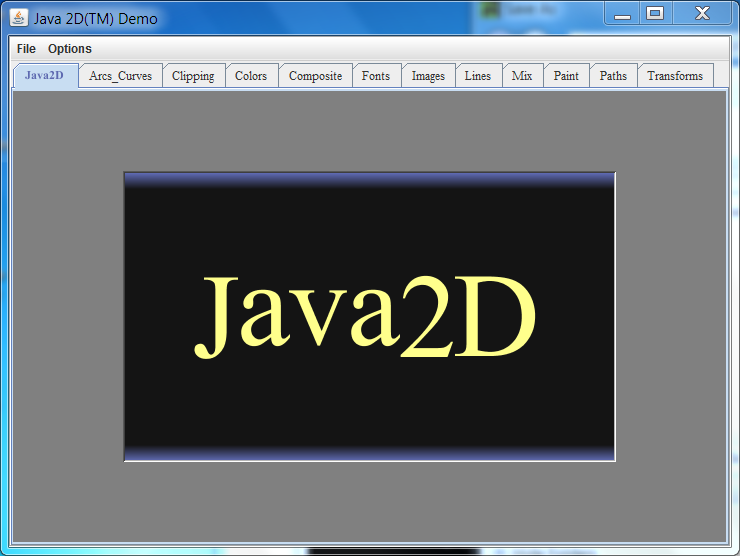

You can see a number of different tabs that demonstrate various Java graphics features.

Click on the Transforms tabs. You should see a new screen that looks like this:

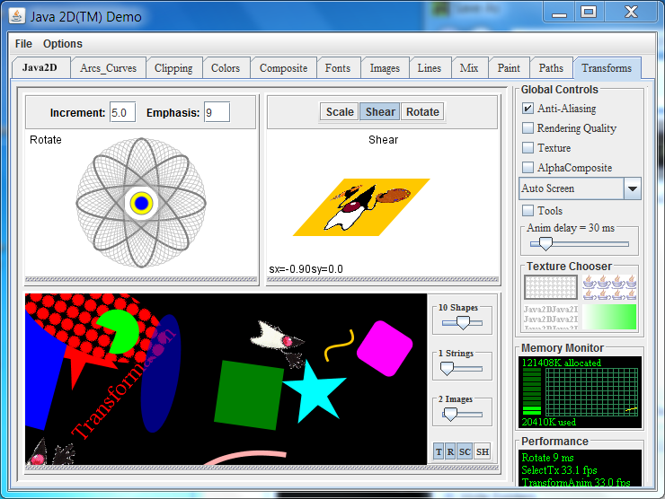

This part of the application creates some nice garbage collection behavior that we can observe. Leave the application running, we will return to it shortly.

#### Step 3: Start VisualVM

To start Visual VM, use the `jvisualvm` executable in the `C:\Program Files\Java\jdk1.7.0_XX\bin` directory. I recommend that you add this directory to you path. On Windows 7 the steps would be: **Start -> Computer -> System Properties -> Advanced System Settings -> Environment Variables**. Then under **System Variables** select `Path` and add` C:\Program Files\Java\jdk1.7.0_XX\bin;` to the `Path` (where XX is the current version of the JDK). Click `Ok` several times and then close the dialog.

Once this is done, you should be able to open a `Command Prompt` windows and type `jvisualvm`.

The first time Visual VM runs, it will do a calibration of your system. You will see messages like the following:

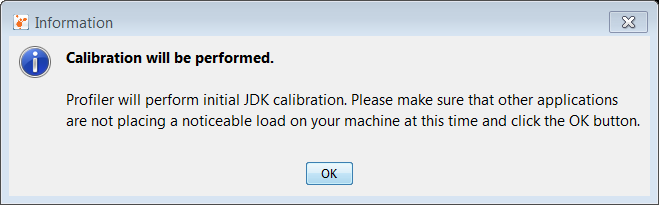

Then a message like this:

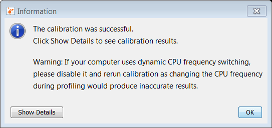

Finally the main user interface loads.

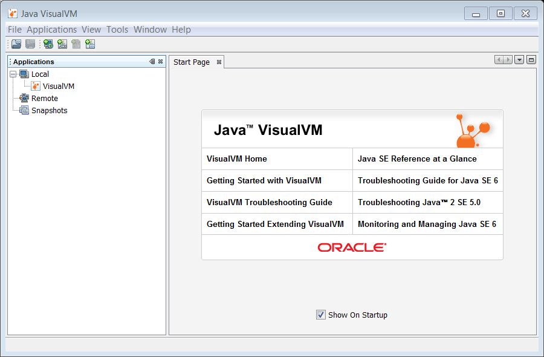

From here, we can monitor running JVMs. However, for this activty we need to add the VisualGC plugin.

#### Step 4: Install Visual GC

The Visual GC plugin for Visual VM provides a graphical representation of the garbage collectors activity in the JVM. It is free and can be added to your installation by following these steps.

**1.** To install Visual GC, from the menu select **Tools --> Plugins**. You should get the following dialog.

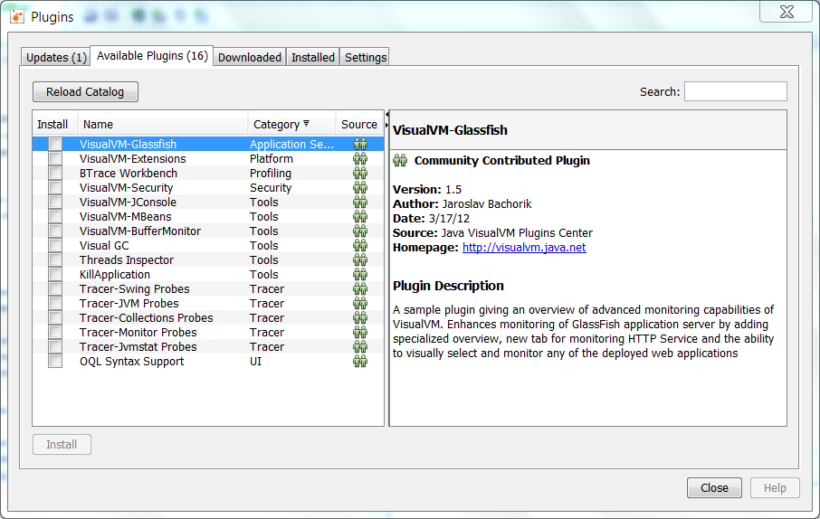

**2.** Select **Visual GC** and then select the **Install** button.

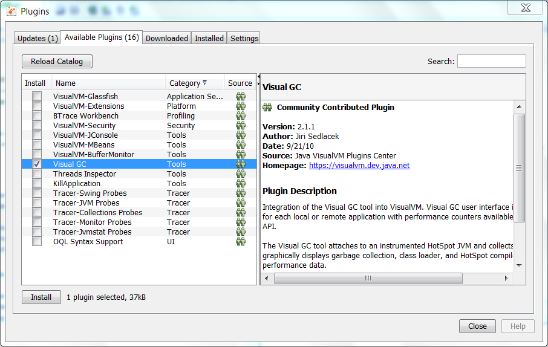

**3.** The plugin installer starts. Click** Next**.

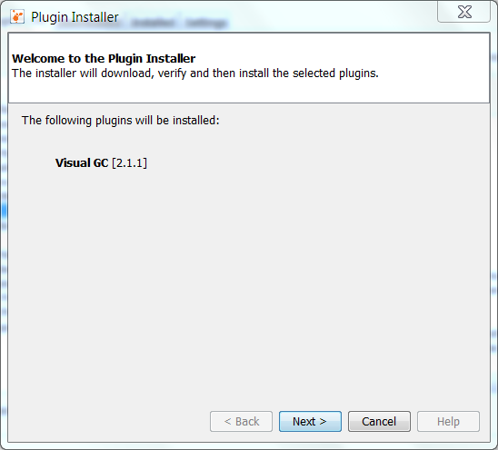

**4.** Read and accept the license agreement. Click **Install**. The plugin will now be installed.

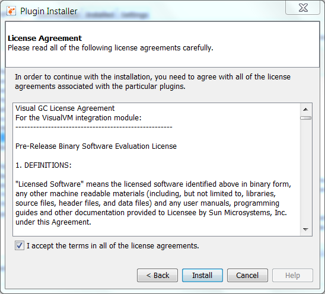

**5.** The plugin is now installed. Click **Finish** to complete the installation.

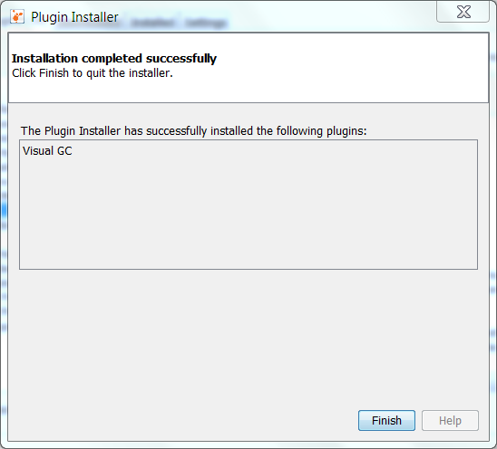

**6.** Click the **Close** button to close the Plugins dialog.

VisualGC is installed. Now we can examine the Java2Demo to see what sort of things are going on.

#### Step 5: Analyze the Java2Demo

Time to analyze the application we started in step 2.

**1.** First, right click the Java2Demo application in the Local applications list of the Applications tab. Select **Open**.

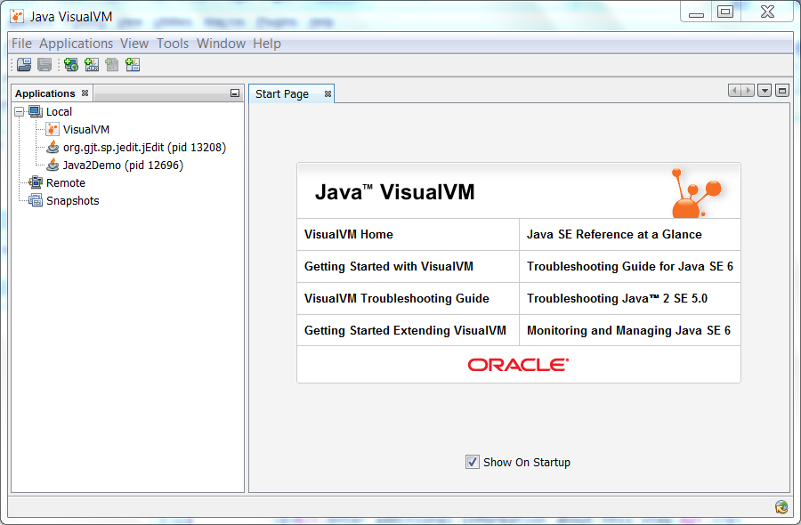

**2.** The application is loaded into Visual VM. Notice a number of tabs are loaded on the right side of the interface. Click the **Visual GC** tab.

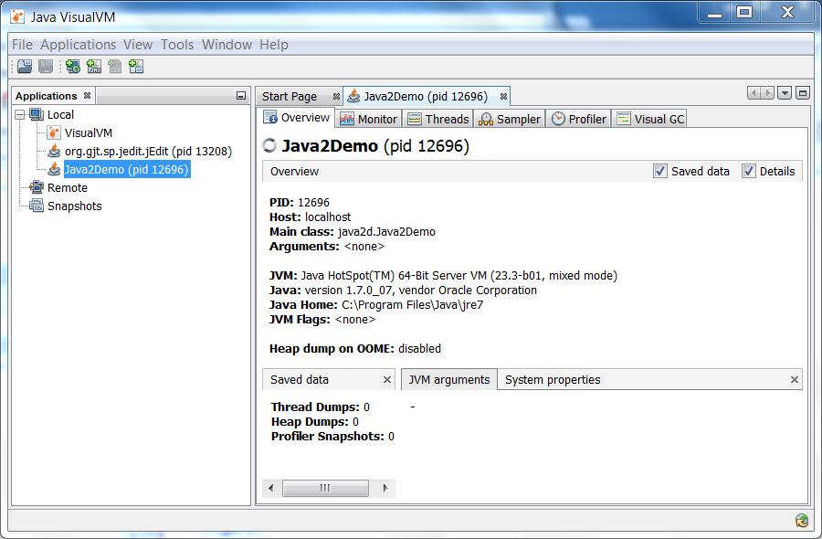

**3.** The Visual GC tab shows all the activity going on in the Garbage Collector. You can watch as the Eden space is filled up and data is moved between the two survivor spaces S1 and S0. In addition, graphs and stats of related to the garbage collector are shown at the right.

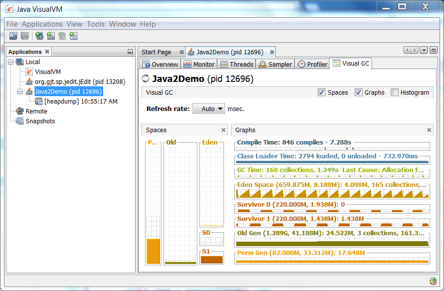

Feel free to try the other tabs and see what information is presented about the JVM. In addition, you can try changing the number of strings or images shown in our sample application to see how that affects the garbage collection process.

## Java Garbage Collectors

You now know the basics of garbage collection and have observed the garbage collector in action on a sample application. In this section, you will learn about the garbage collectors available for Java and the command line switches you need to select them.

### Common Heap Related Switches

There are many different command line switches that can be used with Java. This section describes some of the more commonly used switches that are also used in this OBE.

Switch | Description
--- | ---
-Xms | Sets the initial heap size for when the JVM starts.
-Xmx | Sets the maximum heap size.
-Xmn | Sets the size of the Young Generation.
-XX:PermSize | Sets the starting size of the Permanent Generation.
-XX:MaxPermSize | Sets the maximum size of the Permanent Generation

### The Serial GC

The serial collector is the default for client style machines in Java SE 5 and 6. With the serial collector, both minor and major garbage collections are done serially (using a single virtual CPU). In addition, it uses a mark-compact collection method. This method moves older memory to the beginning of the heap so that new memory allocations are made into a single continuous chunk of memory at the end of the heap. This compacting of memory makes it faster to allocate new chunks of memory to the heap.

#### Usage Cases

The Serial GC is the garbage collector of choice for most applications that do not have low pause time requirements and run on client-style machines. It takes advantage of only a single virtual processor for garbage collection work (therefore, its name). Still, on today's hardware, the Serial GC can efficiently manage a lot of non-trivial applications with a few hundred MBs of Java heap, with relatively short worst-case pauses (around a couple of seconds for full garbage collections).

Another popular use for the Serial GC is in environments where a high number of JVMs are run on the same machine (in some cases, more JVMs than available processors!). In such environments when a JVM does a garbage collection it is better to use only one processor to minimize the interference on the remaining JVMs, even if the garbage collection might last longer. And the Serial GC fits this trade-off nicely.

Finally, with the proliferation of embedded hardware with minimal memory and few cores, the Serial GC could make a comeback.

#### Command Line Switches

To enable the Serial Collector use:
 
`-XX:+UseSerialGC`

Here is a sample command line for starting the `Java2Demo`:
 
`java -Xmx12m -Xms3m -Xmn1m -XX:PermSize=20m -XX:MaxPermSize=20m -XX:+UseSerialGC -jar c:\javademos\demo\jfc\Java2D\Java2demo.jar`

#### The Parallel GC

The parallel garbage collector uses multiple threads to perform the young genertion garbage collection. By default on a host with N CPUs, the parallel garbage collector uses N garbage collector threads in the collection. The number of garbage collector threads can be controlled with command-line options:
 
`-XX:ParallelGCThreads=<desired number>`

On a host with a single CPU the default garbage collector is used even if the parallel garbage collector has been requested. On a host with two CPUs the parallel garbage collector generally performs as well as the default garbage collector and a reduction in the young generationgarbage collector pause times can be expected on hosts with more than two CPUs. The Parallel GC comes in two flavors.

#### Usage Cases

The Parallel collector is also called a throughput collector. Since it can use multilple CPUs to speed up application throughput. This collector should be used when a lot of work need to be done and long pauses are acceptable. For example, batch processing like printing reports or bills or performing a large number of database queries.

##### `-XX:+UseParallelGC`

With this command line option you get a multi-thread young generation collector with a single-threaded old generation collector. The option also does single-threaded compaction of old generation.

Here is a sample command line for starting the `Java2Demo`:
 
`java -Xmx12m -Xms3m -Xmn1m -XX:PermSize=20m -XX:MaxPermSize=20m -XX:+UseParallelGC -jar c:\javademos\demo\jfc\Java2D\Java2demo.jar`

##### `-XX:+UseParallelOldGC`

With the `-XX:+UseParallelOldGC` option, the GC is both a multithreaded young generation collector and multithreaded old generation collector. It is also a multithreaded compacting collector. HotSpot does compaction only in the old generation. Young generation in HotSpot is considered a copy collector; therefore, there is no need for compaction.

Compacting describes the act of moving objects in a way that there are no holes between objects. After a garbage collection sweep, there may be holes left between live objects. Compacting moves objects so that there are no remaining holes. It is possible that a garbage collector be a non-compacting collector. Therefore, the difference between a parallel collector and a parallel compacting collector could be the latter compacts the space after a garbage collection sweep. The former would not.

Here is a sample command line for starting the `Java2Demo`:
 
`java -Xmx12m -Xms3m -Xmn1m -XX:PermSize=20m -XX:MaxPermSize=20m -XX:+UseParallelOldGC -jar c:\javademos\demo\jfc\Java2D\Java2demo.jar`

### The Concurrent Mark Sweep (CMS) Collector

The Concurrent Mark Sweep (CMS) collector (also referred to as the concurrent low pause collector) collects the tenured generation. It attempts to minimize the pauses due to garbage collection by doing most of the garbage collection work concurrently with the application threads. Normally the concurrent low pause collector does not copy or compact the live objects. A garbage collection is done without moving the live objects. If fragmentation becomes a problem, allocate a larger heap.

**Note:** CMS collector on young generation uses the same algorithm as that of the parallel collector.

#### Usage Cases

The CMS collector should be used for applications that require low pause times and can share resources with the garbage collector. Examples include desktop UI application that respond to events, a webserver responding to a request or a database responding to queries.

#### Command Line Switches

To enable the CMS Collector use:
 
`-XX:+UseConcMarkSweepGC`
 
and to set the number of threads use:
 
`-XX:ParallelCMSThreads=<n>`

Here is a sample command line for starting the `Java2Demo`:
 
`java -Xmx12m -Xms3m -Xmn1m -XX:PermSize=20m -XX:MaxPermSize=20m -XX:+UseConcMarkSweepGC -XX:ParallelCMSThreads=2 -jar c:\javademos\demo\jfc\Java2D\Java2demo.jar`

### The G1 Garbage Collector

The Garbage First or G1 garbage collector is available in Java 7 and is designed to be the long term replacement for the CMS collector. The G1 collector is a parallel, concurrent, and incrementally compacting low-pause garbage collector that has quite a different layout from the other garbage collectors described previously. However, detailed discussion is beyond the scope of this OBE.

#### Command Line Switches

To enable the G1 Collector use:
 
`-XX:+UseG1GC`

Here is a sample command line for starting the `Java2Demo`:
 
`java -Xmx12m -Xms3m -XX:+UseG1GC -jar c:\javademos\demo\jfc\Java2D\Java2demo.jar`

## Summary

In this OBE, you have been given an overview of garbage collection system on the Java JVM. First you learned how the Heap and the Garbage Collector are key parts of any Java JVM. Automatic garbage collection is accomplished using generational garbage collection approach. Once you learned the process, you observed it using the Visual VM tool. Finally, you reviewed the garbage collectors that are available in the Java Hospot JVM.

In this tutorial, you have learned:

* The components of the Java JVM
* How automatic garbage collection works
* The generational garbage collection process
* How to monitor your JVM with Visual VM
* The types of garbage collectors available on the JVM

### Resources

For more information and related information please see these site and links.

* [Java SE 7: Develop Rich Client Applications](http://education.oracle.com/pls/web_prod-plq-dad/db_pages.getpage?page_id=609&p_org_id=1001&lang=US&get_params=dc:D67232GC10,p_preview:N)
* [Java Performance - Charlie Hunt and Binu John](http://www.amazon.com/Java-Performance-Charlie-Hunt/dp/0137142528/ref=sr_1_1)
* [Oracle Learning Library](http://www.oracle.com/oll)

### Credits

* Curriculum Developer: Michael J Williams
* QA: Krishnanjani Chitta
