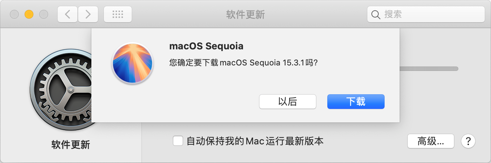
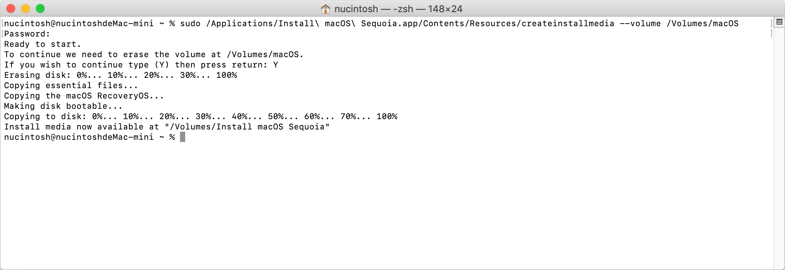

我们所有的操作在 macOS Catalina 10.15.7 下完成。

## 下载 macOS 安装程序

在*启动台*打开 *App Store* 应用，在左上角搜索 *sequoia*，点击搜索结果中的 *macOS Sequoia*


点击左上角的*获取*按钮，弹出*下载确认框*，当前要下载的是 macOS Sequoia 15.3.1



点击*下载*按钮，等待 *macOS Sequoia* 下载完成


下载完成后自动弹出*安装 macOS Sequoia* 窗口


此时我们不需要安装，在应用左上角的菜单中选择*退出安装 macOS* 操作


在弹出的确认对话框中点击*退出*按钮


在*访达*的*应用程序*中可以看到*安装 macOS Sequoia*应用程序


在*终端*应用中输入 `ll /Applications` 命令，在输出结果中可以看到 `Install macOS Sequoia.app` 应用程序

```shell
ll /Applications
total 0
drwxrwxr-x   3 nucintosh  admin   96  2  8 11:50 Firefox.app
drwxr-xr-x   3 nucintosh  admin   96 11 26  2022 GIMP.app
drwxr-xr-x   3 root       wheel   96  2 18 21:40 Install macOS Sequoia.app
drwxr-xr-x@  3 nucintosh  admin   96 11 21 02:34 JetBrains Toolbox.app
drwxr-xr-x   3 nucintosh  admin   96  9  5  2022 Keka.app
```

这种方式只能下载最新的安装程序，可以使用 [gibMacOS](https://github.com/corpnewt/gibMacOS) 来下载其他版本。

## 创建 DMG 磁盘镜像

在*启动台*打开*磁盘工具*应用


在应用左上角的菜单中选择 *文件 > 新建映像 > 空白映像...* 操作


在弹出的对话中依次填写*存储为*、*位置*、*名称*、*大小*、*格式*、*加密*、*分区*、*映像格式*各项，内容如下图所示。这里需要注意的是*大小*的内容，macOS Sequoia 15.3.1 的大小大概为 15G 多一点，需要在这个基础上多 2G 左右，所以这一项的内容为 18G


点击*存储*按钮弹出*正在创建磁盘镜像“macOS.dmg”...* 对话框


创建完成后点击*完成*按钮，此时*磁盘工具*左侧可以看到已经挂载好的*macOS*映像


在终端应用中输入 `ll /Volumes` 命令，在输出结果中可以看到 `macOS` 映像

```shell
ll /Volumes
total 0
drwxr-xr-x  7 root       wheel  306  1 16 20:45 Shared Support
drwxr-xr-x  6 nucintosh  staff  272  2 18 21:56 macOS
lrwxr-xr-x  1 root       wheel    1  2 18 19:36 nucintosh -> /
```

## 数据写入 DMG 磁盘

数据写入命令的格式为 `sudo /Applications/{ApplicationName}/Contents/Resources/createinstallmedia --volume /Volumes/{VolumeName}`。其中 `ApplicationName` 为应用的名称，当前为 `Install macOS Sequoia.app`；`VolumeName` 为磁盘的名称，当前为 `macOS`。因此完整的命令如下所示，因为应用名称中包含空格，所以需要使用反斜线 `\` 进行转义

```shell
sudo /Applications/Install\ macOS\ Sequoia.app/Contents/Resources/createinstallmedia --volume /Volumes/macOS
```

在*终端*应用输入上面的命令，输入输入当前系统的密码


在命令行上输入 `Y` 后等待数据写入完成




数据写入完成后在*磁盘工具*应用的*磁盘映像*中可以看到 *Install macOS Sequoia* 映像，此时可以*推出*该映像


在*访达*的*文稿*应用中可以看到创建好的 *macOS.dmg* 文件，我们可以使用它来创建 U 盘启动盘在其他电脑上安装系统


## 遇到的问题

>/Volumes/macOS is not large enough for install media. An additional 1.8 GB is needed.

这是由于在创建磁盘映像时设置的大小太小导致的。

## 参考资料

1. [图文教程：如何轻松制作 macOS 启动盘](https://www.sysgeek.cn/make-macos-usb-flash-drive/)
2. [制作macOS启动盘和dmg镜像](https://zahui.fan/posts/lrrec490/)
3. [自己动手制作MacOS系统DMG安装镜像 By:浪里个浪](https://www.fanoyi.com/2023/488.html)
