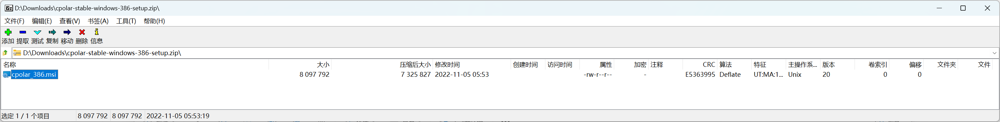
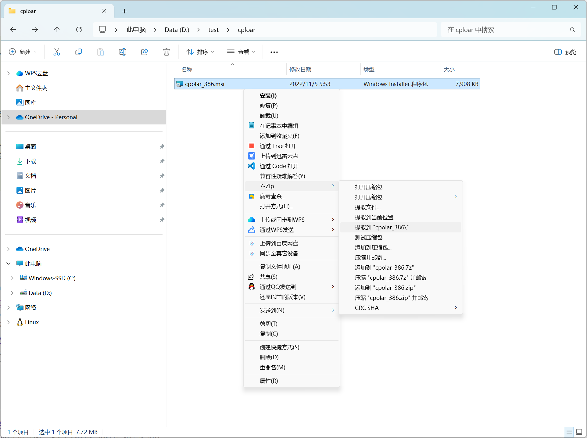
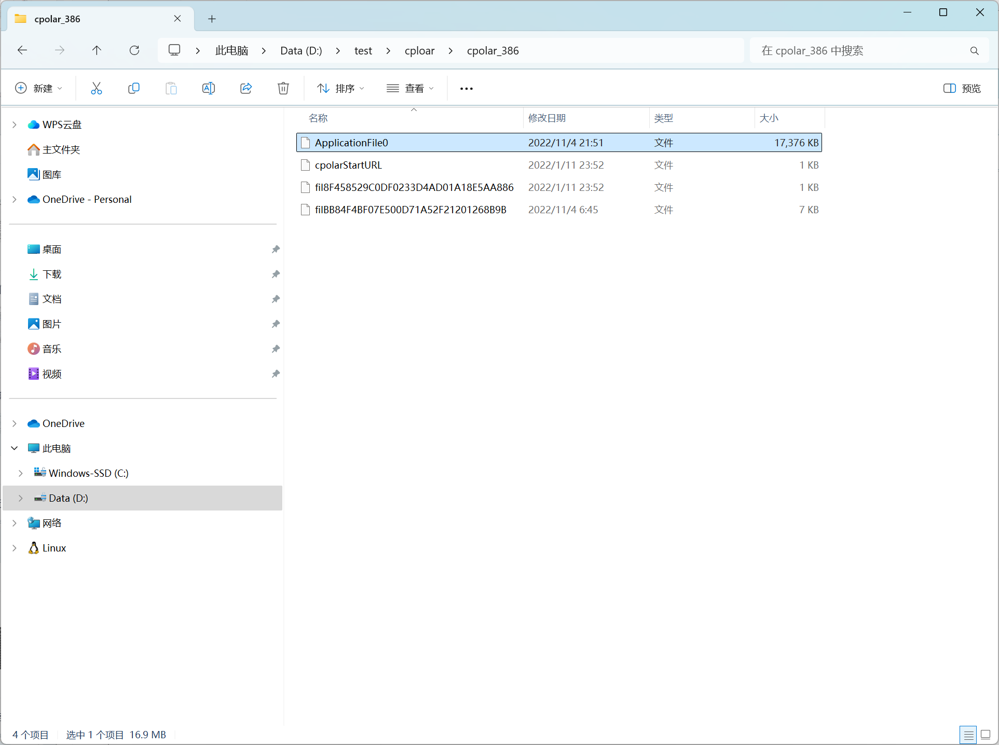
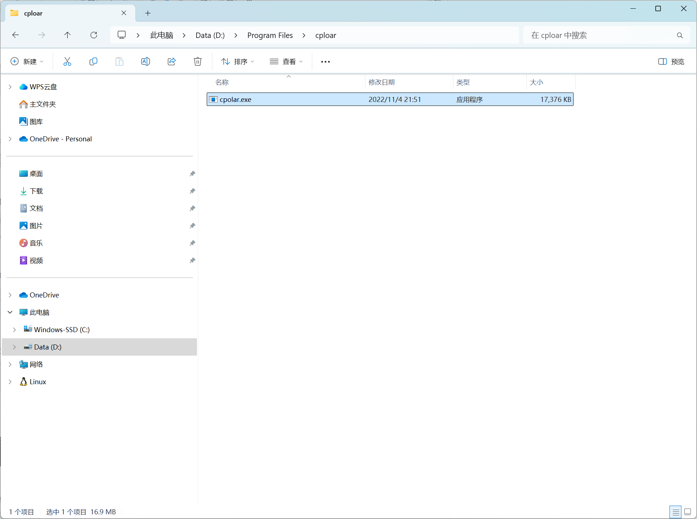

这篇文章只描述 Windows 下的安装方式。在[这里](https://www.cpolar.com/download)下载 [cpolar-stable-windows-amd64-setup.zip](https://www.cpolar.com/static/downloads/releases/3.3.12/cpolar-stable-windows-amd64-setup.zip) 或者 [cpolar-stable-windows-386-setup.zip](https://www.cpolar.com/static/downloads/releases/3.3.12/cpolar-stable-windows-386-setup.zip)。正常的安装方式参考[官方文档](https://www.cpolar.com/docs)，下面描述不正常的安装方式，这种方式不会启动 Web UI，因此不会占用 9200 端口。

第 1 步：使用 7-Zip 或其他解压缩软件打开 *cpolar-stable-windows-386-setup.zip*

把 *cpolar_386.msi* 提取到一个临时目录，比如 *D:\test\cploar*。

第 2 步：使用 7-Zip 或其他解压缩软件提取 *cpolar_386.msi*

第 3 步：在 *cpolar_386* 目录找到 *ApplicationFile0* 这个文件，并重命名为 *cploar.exe*

第 4 步：将 *cploar.exe* 复制到 *D:\Program Files\cploar*

然后就可以正常地使用 `cpolar.exe` 命令了。
